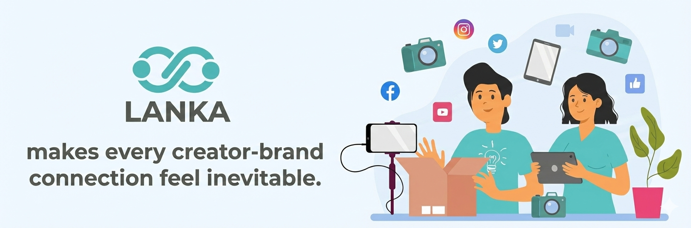

<div align="center">

# Lanka

### **A Diploma Project Exploring Modern .NET Architecture**

*Learning modular monoliths, DDD, CQRS, and event-driven patterns through building a social media campaign management platform*

[](https://dotnet.microsoft.com/)
[](https://www.docker.com/)
[](docs/architecture/README.md)



**[Quick Start](docs/development/quick-start.md) | [Documentation](docs/README.md) | [Architecture](docs/architecture/README.md) | [Contributing](CONTRIBUTING.md)**

</div>

---

## What is Lanka?

Lanka is my **diploma project** — a social media campaign management platform that I'm building primarily as a vehicle for learning and applying modern software architecture patterns in .NET.

This is not a production-ready product. It's an educational project where I experiment with technologies and patterns I find interesting. The domain (influencer marketing) was chosen because it provides enough complexity to justify the architectural decisions, not because I'm building a startup.

### What I'm Learning Through This Project

| Area | Technologies & Patterns |
|------|------------------------|
| **Architecture** | Modular Monolith, Clean Architecture, Vertical Slices |
| **Domain-Driven Design** | Aggregates, Value Objects, Domain Events, Rich Domain Models |
| **CQRS** | Command/Query separation, MediatR pipelines, read/write optimization |
| **Event-Driven** | Integration Events, Outbox/Inbox patterns, Saga orchestration |
| **Infrastructure** | PostgreSQL, MongoDB, Redis, RabbitMQ, Elasticsearch |
| **Identity** | Keycloak integration, JWT authentication, role-based access |
| **External APIs** | Instagram Graph API integration with OAuth2 |
| **DevOps** | .NET Aspire orchestration, health checks, OpenTelemetry observability |

### The Domain (briefly)

The platform connects influencers with brands for marketing campaigns. Core features:
- **Users Module** — Authentication, profiles, Instagram account linking
- **Analytics Module** — Instagram insights, audience demographics, engagement metrics
- **Campaigns Module** — Campaign creation, applications, contracts, tracking
- **Matching Module** — Search and discovery with Elasticsearch

---

## Technology Stack

### Backend
- **.NET 10** with **C# 14**
- **ASP.NET Core** for the API layer
- **Entity Framework Core 9** for PostgreSQL persistence
- **Dapper** for read-optimized queries

### Data Storage
- **PostgreSQL 15+** — Primary relational database (one schema per module)
- **MongoDB 7.0+** — Analytics time-series and document data
- **Redis 7.0+** — Caching and distributed locking

### Messaging & Search
- **RabbitMQ** with **MassTransit** — Event-driven communication between modules
- **Elasticsearch** — Full-text search for campaign/influencer discovery

### Infrastructure
- **Keycloak** — Identity provider and OAuth2/OIDC server
- **YARP** — Reverse proxy and API gateway
- **.NET Aspire** — Development orchestration and observability
- **OpenTelemetry** — Distributed tracing, metrics, and structured logging

---

## Project Status

This is an active diploma project. Some modules are more complete than others as I explore different aspects of the architecture.

| Module | Status | What I Learned |
|--------|--------|----------------|
| **Users** | Mostly complete | OAuth2 flows, Keycloak integration, Saga pattern for Instagram linking |
| **Analytics** | In progress | MongoDB integration, external API integration, mock services for development |
| **Campaigns** | In progress | Complex domain modeling, state machines, aggregate design |
| **Matching** | Basic | Elasticsearch indexing, search optimization |
| **Gateway** | Complete | YARP configuration, rate limiting, authentication forwarding |

---

## Getting Started

### Prerequisites

- [.NET 10 SDK](https://dotnet.microsoft.com/download)
- [Docker Desktop](https://www.docker.com/products/docker-desktop)
- Git

### Quick Start

```bash
# Clone the repository
git clone https://github.com/IIIA-KO/Lanka.git
cd Lanka

# Install the Aspire workload (one-time)
dotnet workload install aspire

# Start everything (infrastructure + API + Gateway)
dotnet run --project src/Api/Lanka.AppHost

# Access points:
# Aspire Dashboard: (URL shown in console output)
# API: http://localhost:4307
# Gateway: https://localhost:4308
# Health: http://localhost:4307/healthz
# Keycloak: http://localhost:18080
```

For detailed setup instructions, see the [Quick Start Guide](docs/development/quick-start.md).

### Development Seeding

In development mode, the application can seed fake data for testing:

```json
// appsettings.Development.json
{
  "Development": {
    "Seeding": {
      "Enabled": true,
      "FakeUserCount": 50,
      "FakeCampaignsPerBlogger": 3
    }
  }
}
```

---

## Documentation

The `/docs` folder contains extensive documentation that I maintain as both a learning exercise and a reference:

| Section | Description |
|---------|-------------|
| [Architecture Overview](docs/architecture/README.md) | High-level system design and patterns |
| [Architecture Decision Log](docs/architecture-decision-log/README.md) | Why I made specific technical choices (14 ADRs) |
| [Module Documentation](docs/modules/README.md) | Detailed docs for each business module |
| [Catalog of Terms](docs/catalog-of-terms/README.md) | Glossary of DDD, CQRS, and architectural concepts |
| [Walkthroughs](docs/walkthroughs/README.md) | Step-by-step guides through complex flows |
| [Lessons Learned](docs/learning/lessons-learned.md) | Reflections on what worked and what was difficult |
| [Resources](docs/learning/resources.md) | Books, articles, and projects that influenced the architecture |
| [Development Guides](docs/development/quick-start.md) | Setup, FAQ, and troubleshooting |

### For Academic Review

If you're reviewing this as a diploma project, I'd recommend:
1. **Start with** the [Architecture Decision Log](docs/architecture-decision-log/README.md) — it explains the reasoning behind each major technical decision
2. **Review** the [Module Structure](docs/modules/README.md) to understand how the codebase is organized
3. **Trace** the [Instagram Linking Walkthrough](docs/walkthroughs/instagram-linking.md) — see saga orchestration, cross-module events, and OAuth2 integration working together
4. **Read** the [Lessons Learned](docs/learning/lessons-learned.md) — honest reflection on what worked and what was difficult

### For Developers Learning .NET

If you're exploring this as a learning resource:
1. **Start with** the [Catalog of Terms](docs/catalog-of-terms/README.md) to understand the patterns used
2. **Follow** the [Instagram Linking Walkthrough](docs/walkthroughs/instagram-linking.md) to see patterns in action
3. **Explore** the [Resources](docs/learning/resources.md) for books and articles that influenced the architecture
4. **Read** the ADRs to understand trade-offs in architectural decisions

---

## Project Structure

```
Lanka/
├── src/
│   ├── Api/
│   │   ├── Lanka.AppHost/                # Aspire orchestration
│   │   ├── Lanka.ServiceDefaults/        # Shared OTel, health checks
│   │   ├── Lanka.Api/                    # Main API host
│   │   └── Lanka.Gateway/                # YARP reverse proxy
│   ├── Common/                           # Shared infrastructure
│   │   ├── Lanka.Common.Application/     # Base handlers, behaviors
│   │   ├── Lanka.Common.Domain/          # Base entities, value objects
│   │   ├── Lanka.Common.Infrastructure/  # EF, outbox, authentication
│   │   └── Lanka.Common.Presentation/    # Endpoint abstractions
│   └── Modules/                          # Business modules
│       ├── Analytics/                    # Instagram data & insights
│       ├── Campaigns/                    # Campaign lifecycle
│       ├── Matching/                     # Search & discovery
│       └── Users/                        # Identity & profiles
├── test/                                 # Integration & architecture tests
└── docs/                                 # Documentation
```

Each module follows Clean Architecture:
- **Domain** — Entities, value objects, domain events, repository interfaces
- **Application** — Commands, queries, handlers, validation
- **Infrastructure** — EF configurations, external services, background jobs
- **Presentation** — API endpoints, integration event handlers

---

## What's Not Here (Yet)

Being honest about limitations:

- **Frontend** — There's an Angular client in development, but it's minimal
- **Production deployment** — No Kubernetes manifests or cloud infrastructure
- **Comprehensive testing** — Unit tests exist but integration test coverage is limited
- **Performance optimization** — Haven't done serious load testing
- **Security audit** — Basic security practices but not production-hardened

---

## Contributing

This is a diploma project, but contributions and feedback are welcome! See [CONTRIBUTING.md](CONTRIBUTING.md) for guidelines.

If you're also learning .NET architecture patterns and want to discuss approaches, feel free to open a Discussion.

---

## License

MIT License — see [LICENSE](LICENSE) for details.

---

<div align="center">

**A diploma project by [IIIA-KO](https://github.com/IIIA-KO)**

*Learning by building, one architectural decision at a time*

</div>
