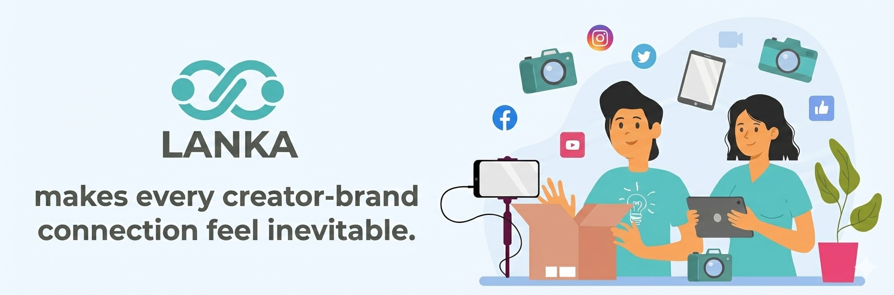

<div align="center">

# Lanka

### **Modular Monolith in .NET 10 — DDD, CQRS, Event-Driven**

*A social-media campaign management platform built to explore modern .NET architecture end-to-end.*

[](https://dotnet.microsoft.com/)
[](https://www.docker.com/)
[](docs/architecture/README.md)



**[Quick Start](docs/development/quick-start.md) | [Documentation](docs/README.md) | [Architecture](docs/architecture/README.md) | [ADRs](docs/architecture-decision-log/README.md) | [Contributing](CONTRIBUTING.md)**

</div>

---

## Overview

Lanka is a backend platform that connects influencers with brands for marketing campaigns. The codebase is structured as a **modular monolith** in .NET 10, with each business module owning its own domain, persistence, and integration events.

Architecturally it puts to work the patterns I find most relevant for modern .NET backends:

- **Modular Monolith** with strict module boundaries — each module is its own bounded context, communicating through integration events
- **Clean Architecture + DDD** — rich domain models, aggregates, value objects, domain events
- **CQRS** with MediatR pipelines — separate read/write paths, Dapper for queries, EF Core for commands
- **Event-Driven** — RabbitMQ + MassTransit, Outbox/Inbox patterns, Saga orchestration for distributed flows
- **Identity** — Keycloak as OAuth2/OIDC provider, JWT, role-based access
- **Observability** — .NET Aspire, OpenTelemetry distributed tracing, health checks, structured logging
- **API Gateway** — YARP reverse proxy with rate limiting and auth forwarding

## Modules

| Module | Responsibility | Status |
|--------|---------------|--------|
| **Users** | Authentication, profiles, Instagram account linking | Mostly complete — OAuth2, Keycloak, Saga for Instagram link |
| **Analytics** | Instagram insights, audience demographics, engagement metrics | In progress — MongoDB time-series, external API integration |
| **Campaigns** | Campaign creation, applications, contracts, tracking | In progress — complex state machines, aggregate design |
| **Matching** | Search and discovery via Elasticsearch | Basic — indexing and search optimization |
| **Gateway** | YARP reverse proxy, rate limiting, auth forwarding | Complete |

## Technology Stack

### Backend
- **.NET 10** with **C# 14**
- **ASP.NET Core** for the API layer
- **Entity Framework Core 9** for PostgreSQL persistence
- **Dapper** for read-optimized queries
- **MediatR** for CQRS pipelines

### Data Storage
- **PostgreSQL 15+** — primary relational database (one schema per module)
- **MongoDB 7.0+** — analytics time-series and document data
- **Redis 7.0+** — caching and distributed locking

### Messaging & Search
- **RabbitMQ** with **MassTransit** — event-driven communication between modules
- **Elasticsearch** — full-text search for campaign and influencer discovery

### Infrastructure
- **Keycloak** — identity provider (OAuth2 / OIDC)
- **YARP** — reverse proxy and API gateway
- **.NET Aspire** — development orchestration and observability
- **OpenTelemetry** — distributed tracing, metrics, structured logging

---

## Getting Started

### Prerequisites

- [.NET 10 SDK](https://dotnet.microsoft.com/download)
- [Docker Desktop](https://www.docker.com/products/docker-desktop)
- Git

### Quick Start

```bash
# Clone
git clone https://github.com/IIIA-KO/Lanka.git
cd Lanka

# Install Aspire workload (one-time)
dotnet workload install aspire

# Start everything (infrastructure + API + Gateway + frontend)
dotnet run --project src/Api/Lanka.AppHost

# Access points:
# Aspire Dashboard:  (URL shown in console output)
# API:               http://localhost:4307
# Gateway:           https://localhost:4308
# Frontend:          https://localhost:4200
# Health:            http://localhost:4307/healthz
# Keycloak:          http://localhost:18080
```

For detailed setup, see the [Quick Start Guide](docs/development/quick-start.md).

### Development Seeding

In development mode, the application can seed fake data for testing:

```json
// appsettings.Development.json
{
  "Development": {
    "Seeding": {
      "Enabled": true,
      "FakeUserCount": 50,
      "FakeCampaignsPerBlogger": 3
    }
  }
}
```

---

## Project Structure

```
Lanka/
├── src/
│   ├── Api/
│   │   ├── Lanka.AppHost/                # Aspire orchestration
│   │   ├── Lanka.ServiceDefaults/        # Shared OTel, health checks
│   │   ├── Lanka.Api/                    # Main API host
│   │   └── Lanka.Gateway/                # YARP reverse proxy
│   ├── Common/                           # Shared infrastructure
│   │   ├── Lanka.Common.Application/     # Base handlers, behaviors
│   │   ├── Lanka.Common.Domain/          # Base entities, value objects
│   │   ├── Lanka.Common.Infrastructure/  # EF, outbox, authentication
│   │   └── Lanka.Common.Presentation/    # Endpoint abstractions
│   └── Modules/                          # Business modules
│       ├── Analytics/                    # Instagram data & insights
│       ├── Campaigns/                    # Campaign lifecycle
│       ├── Matching/                     # Search & discovery
│       └── Users/                        # Identity & profiles
├── test/                                 # Integration & architecture tests
└── docs/                                 # Documentation
```

Each module follows Clean Architecture:
- **Domain** — entities, value objects, domain events, repository interfaces
- **Application** — commands, queries, handlers, validation
- **Infrastructure** — EF configurations, external services, background jobs
- **Presentation** — API endpoints, integration event handlers

---

## Documentation

The `/docs` folder is maintained as both reference and learning artifact:

| Section | Description |
|---------|-------------|
| [Architecture Overview](docs/architecture/README.md) | High-level system design and patterns |
| [Architecture Decision Log](docs/architecture-decision-log/README.md) | Reasoning behind 14 major technical decisions |
| [Module Documentation](docs/modules/README.md) | Detailed docs for each business module |
| [Catalog of Terms](docs/catalog-of-terms/README.md) | Glossary of DDD, CQRS, and architectural concepts |
| [Walkthroughs](docs/walkthroughs/README.md) | Step-by-step guides through complex flows |
| [Lessons Learned](docs/learning/lessons-learned.md) | Honest reflections on what worked and what didn't |
| [Resources](docs/learning/resources.md) | Books, articles, and projects that influenced the design |
| [Development Guides](docs/development/quick-start.md) | Setup, FAQ, and troubleshooting |

### Suggested Reading Path

1. **[Architecture Decision Log](docs/architecture-decision-log/README.md)** — the reasoning behind each major technical choice
2. **[Module Structure](docs/modules/README.md)** — how the codebase is organized
3. **[Instagram Linking Walkthrough](docs/walkthroughs/instagram-linking.md)** — saga orchestration, cross-module events, and OAuth2 integration in one flow
4. **[Lessons Learned](docs/learning/lessons-learned.md)** — what was difficult and why

---

## Project Context

Lanka is my **B.Sc. diploma project** at Zhytomyr Polytechnic State University. It is not a production product — the influencer-marketing domain was chosen because it's complex enough to justify the architectural patterns I wanted to learn, not because I'm building a startup.

That framing matters for a few reasons:
- The architecture is sometimes more elaborate than the current feature set demands — that's intentional, the goal is to apply the pattern correctly, not minimally
- Some modules are deliberately further along than others, depending on what I was exploring at the time
- ADRs document the *reasoning* I want to defend in a thesis review, not just the *decision*

Honest about current limits:

- **Frontend** — Angular client exists but is minimal
- **Production deployment** — no Kubernetes manifests or cloud infrastructure
- **Test coverage** — unit tests exist; integration coverage is limited
- **Performance** — no serious load testing yet
- **Security** — basic practices, not production-hardened

---

## Contributing

Feedback and discussion are welcome — see [CONTRIBUTING.md](CONTRIBUTING.md). If you're working through similar architecture patterns and want to compare notes, open a Discussion.

## License

MIT — see [LICENSE](LICENSE).

---

<div align="center">

**Built by [Illia Kotvitskyi](https://github.com/IIIA-KO)** — *learning modern .NET architecture by shipping it, one decision at a time.*

</div>
