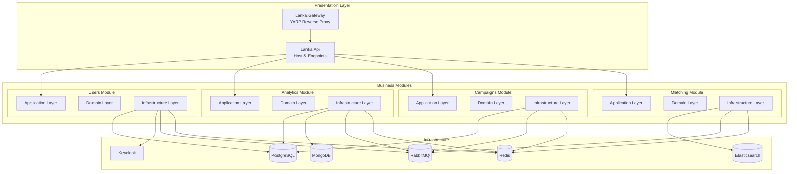

# Lanka Documentation

**Documentation for a Diploma Project in Modern .NET Architecture**

*This documentation serves as both a learning resource and a reference for the Lanka diploma project — exploring modular monolith architecture, DDD, CQRS, and event-driven patterns in .NET.*

---

## About This Documentation

This is the documentation hub for Lanka, a diploma project that explores modern .NET architecture patterns. The documentation is organized to be useful for:

- **Academic reviewers** evaluating the architectural decisions and implementation
- **Developers learning .NET** who want to see these patterns applied in practice
- **Myself** as a reference while building and maintaining the project

I've tried to document not just *what* was built, but *why* specific decisions were made. The [Architecture Decision Log](architecture-decision-log/README.md) is particularly important for understanding the reasoning behind the design.

---

## Quick Navigation

<table>
<tr>
<td width="50%">

### Getting Started
- [Quick Start Guide](development/quick-start.md) — Run the project locally
- [Development Setup](development/development-setup.md) — Full environment setup
- [FAQ & Troubleshooting](development/faq.md) — Common issues and solutions

### Architecture
- [Architecture Overview](architecture/README.md) — System design and patterns
- [Architecture Decision Log](architecture-decision-log/README.md) — 14 documented decisions
- [Module Documentation](modules/README.md) — Per-module details

</td>
<td width="50%">

### Learning Resources
- [Catalog of Terms](catalog-of-terms/README.md) — Glossary of DDD, CQRS, and architectural concepts
- [Lessons Learned](learning/lessons-learned.md) — What worked, what was difficult, what I'd do differently
- [Resources](learning/resources.md) — Books, articles, and projects that influenced the architecture
- [Tools & Infrastructure](tools/README.md) — Docker, messaging, telemetry

### Walkthroughs & Deep Dives
- [Instagram Linking Flow](walkthroughs/instagram-linking.md) — Complete saga walkthrough
- [Users Module](modules/users/README.md) — Most complete, good reference
- [Analytics Module](modules/analytics/README.md) — Instagram integration
- [Campaigns Module](modules/campaigns/README.md) — Complex domain modeling
- [Matching Module](modules/matching/README.md) — Elasticsearch search

</td>
</tr>
</table>

---

## System Architecture

Lanka is built as a **modular monolith** — a single deployable application with clear internal module boundaries. This approach was chosen to learn modular design principles without the operational complexity of microservices.

---

## What's Documented

### Architecture Decisions (ADRs)

The [Architecture Decision Log](architecture-decision-log/README.md) contains 14 documented decisions:

| ADR | Topic | Why It Matters |
|-----|-------|----------------|
| [001](architecture-decision-log/001-adoption-of-adl.md) | ADL Adoption | Establishing a record of decisions |
| [002](architecture-decision-log/002-technology-stack.md) | Technology Stack | .NET 10, PostgreSQL, MongoDB choices |
| [003](architecture-decision-log/003-modular-monolith-architecture.md) | Modular Monolith | Why not microservices |
| [004](architecture-decision-log/004-adoption-of-ddd.md) | DDD Adoption | Domain modeling approach |
| [005](architecture-decision-log/005-cqrs-implementation.md) | CQRS | Command/Query separation |
| [006](architecture-decision-log/006-mediatr-adoption.md) | MediatR | Pipeline behaviors |
| [007](architecture-decision-log/007-module-structure.md) | Module Structure | Clean Architecture layers |
| [008](architecture-decision-log/008-event-driven-architecture.md) | Event-Driven | Integration events, loose coupling |
| [009](architecture-decision-log/009-configuration-management.md) | Configuration | Settings organization |
| [010](architecture-decision-log/010-contract-projects.md) | Contract Projects | Shared DTOs and events |
| [011](architecture-decision-log/011-outbox-inbox-pattern.md) | Outbox/Inbox | Reliable messaging |
| [012](architecture-decision-log/012-reverse-proxy.md) | Reverse Proxy | YARP gateway |
| [013](architecture-decision-log/013-saga-orchestration.md) | Saga Pattern | Complex workflows |
| [014](architecture-decision-log/014-mongodb-adoption-analytics.md) | MongoDB | Analytics data storage |

### Catalog of Terms

The [Catalog of Terms](catalog-of-terms/README.md) explains the patterns and concepts used:

**Domain-Driven Design:**
- [Aggregate Root](catalog-of-terms/aggregate-root/README.md)
- [Entity](catalog-of-terms/entity/README.md)
- [Value Object](catalog-of-terms/value-object/README.md)
- [Domain Event](catalog-of-terms/domain-event/README.md)

**Application Patterns:**
- [CQRS](catalog-of-terms/cqrs/README.md)
- [Result Pattern](catalog-of-terms/result-pattern/README.md)
- [Unit of Work](catalog-of-terms/unit-of-work/README.md)

**Event-Driven:**
- [Integration Event](catalog-of-terms/integration-event/README.md)
- [Event Bus](catalog-of-terms/event-bus/README.md)
- [Outbox Pattern](catalog-of-terms/outbox-pattern/README.md)
- [Inbox Pattern](catalog-of-terms/inbox-pattern/README.md)
- [Saga Pattern](catalog-of-terms/saga-pattern/README.md)

---

## Technology Stack Summary

| Layer | Technology | Purpose |
|-------|------------|---------|
| **Runtime** | .NET 10, C# 14 | Application platform |
| **Web Framework** | ASP.NET Core | HTTP API |
| **ORM** | Entity Framework Core 9 | PostgreSQL persistence |
| **Query** | Dapper | Read-optimized queries |
| **Primary Database** | PostgreSQL 15+ | Relational data (one schema per module) |
| **Document Store** | MongoDB 7+ | Analytics time-series data |
| **Cache** | Redis 7+ | Caching and distributed locking |
| **Message Broker** | RabbitMQ + MassTransit | Event-driven communication |
| **Search** | Elasticsearch | Full-text search |
| **Identity** | Keycloak | OAuth2/OIDC provider |
| **Gateway** | YARP | Reverse proxy, rate limiting |
| **Logging** | Serilog + OpenTelemetry | Structured logging (via Aspire Dashboard) |
| **Frontend** | Angular 20 | SPA client (in development) |

---

## Reading Path Suggestions

### For Academic Reviewers

1. **Start here:** [Architecture Decision Log](architecture-decision-log/README.md) — understand the reasoning
2. **Then:** [Module Overview](modules/README.md) — see how modules interact
3. **Deep dive:** [Instagram Linking Walkthrough](walkthroughs/instagram-linking.md) — see patterns in action
4. **Reflection:** [Lessons Learned](learning/lessons-learned.md) — honest assessment of the project
5. **Patterns:** [Catalog of Terms](catalog-of-terms/README.md) — understand the concepts applied

### For .NET Developers Learning Patterns

1. **Start here:** [Catalog of Terms](catalog-of-terms/README.md) — learn the concepts
2. **Setup:** [Quick Start](development/quick-start.md) — get it running locally
3. **Walkthrough:** [Instagram Linking Flow](walkthroughs/instagram-linking.md) — trace a complex flow
4. **Explore:** Browse the codebase starting with `src/Modules/Users/`
5. **Resources:** [Resources](learning/resources.md) — books and articles for deeper learning

### For Contributors

1. **Setup:** [Development Setup](development/development-setup.md)
2. **Guidelines:** [Contributing Guide](../CONTRIBUTING.md)
3. **FAQ:** [Troubleshooting](development/faq.md)

---

## Documentation Gaps

Being honest about what's incomplete:

- **Frontend documentation** is minimal (Angular client is in early development)
- **Some images** referenced in docs may be missing
- **Deployment guides** are not written (no production deployment yet)
- **API documentation** is generated but not customized

---

## Contributing to Documentation

Found something unclear or incorrect? Documentation improvements are welcome:

1. **Typos/errors** — Submit a PR directly
2. **Missing information** — Open an issue describing what's needed
3. **Diagram improvements** — Mermaid diagrams are preferred

---

*Documentation for the Lanka diploma project*

**[Back to Project README](../README.md)**

