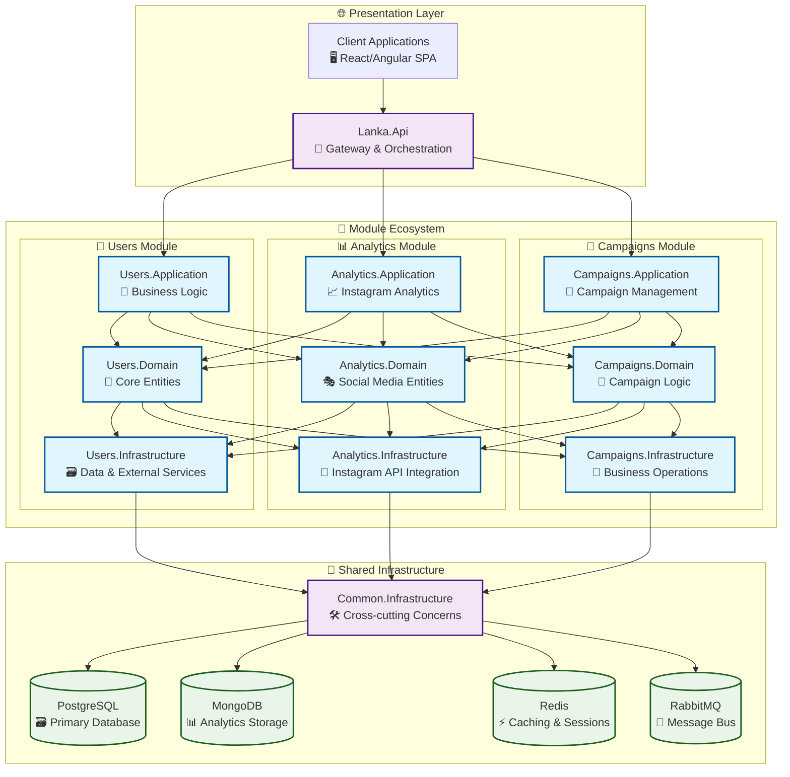

# 🌟 Lanka Documentation Wiki

**A Modern Modular Monolith for Social Media Campaign Management**

*Welcome to the Lanka project documentation - your comprehensive guide to understanding, developing, and extending the Lanka social media campaign management platform.*

---

## 🗺️ **Navigation Hub**

<table>
<tr>
<td width="50%">

### 🚀 **Getting Started**
- [🏗️ Project Architecture Overview](#-project-architecture)
- [⚡ Quick Start Guide](development/quick-start.md)
- [🛠️ Development Setup](development/development-setup.md)

### 🏛️ **Architecture & Design**
- [🏗️ Architecture Overview](architecture/README.md)

</td>
<td width="50%">

### 👨‍💻 **Developer Guides**
- [⚡ Quick Start](development/quick-start.md)
- [🛠️ Development Setup](development/development-setup.md)
- [❓ FAQ & Troubleshooting](development/faq.md)

### 📚 **Reference**
- [📖 Catalog of Terms](catalog-of-terms/README.md)
- [🎯 Architecture Decisions](architecure-decision-log/README.md)
- [🛠️ Tools & Utilities](tools/README.md)
- [❓ FAQ & Common Issues](development/faq.md)

</td>
</tr>
</table>

---

## 🏗️ **Project Architecture**

Lanka is built as a **modular monolith** that combines the simplicity of monolithic deployment with the clarity and maintainability of modular design.

---

## 🎯 **Core Modules**

| Module | Purpose | Key Features |
|--------|---------|--------------|
| 👥 **Users** | Identity & Access Management | Authentication, Authorization, User Profiles |
| 📊 **Analytics** | Social Media Intelligence | Instagram Analytics, Audience Insights, Performance Metrics |
| 🎪 **Campaigns** | Campaign Orchestration | Campaign Creation, Blogger Management, Content Planning |

---

## 🛠️ **Technology Stack**

### **Backend Stack**

### **Databases & Storage**

### **Architecture Patterns**

### **Infrastructure & DevOps**

---

## 🎨 **Design Principles**

> *"Good architecture makes the system easy to understand, develop, maintain, and deploy."*

### **🧩 Modular Design**
- **Clear boundaries** between business domains
- **Independent deployment** capabilities
- **Shared infrastructure** for cross-cutting concerns

### **💎 Domain-Driven Design**
- **Rich domain models** that reflect business rules
- **Ubiquitous language** shared between developers and domain experts
- **Bounded contexts** that encapsulate business logic

### **🔄 Event-Driven Architecture**
- **Loose coupling** between modules through events
- **Eventual consistency** for cross-module operations
- **Scalable communication** patterns

### **🎯 Clean Architecture**
- **Dependency inversion** at all levels
- **Testable business logic** isolated from infrastructure
- **Framework independence** where possible

---

## 🌟 **What Makes Lanka Special?**

<table>
<tr>
<td width="50%">

### **🚀 Developer Experience**
- **Modern C# 12** with latest language features
- **Hot reload** support for rapid development
- **Comprehensive testing** with clear patterns
- **Rich debugging** experience with detailed logging

### **🏗️ Architecture Benefits**
- **Easy to understand** modular structure
- **Simple deployment** as single application
- **Database per module** with shared infrastructure
- **Event-driven** communication between modules

</td>
<td width="50%">

### **📈 Business Value**
- **Instagram Analytics** for influencer marketing
- **Campaign Management** for brand partnerships
- **User Management** for multi-tenant scenarios
- **Real-time insights** for data-driven decisions

### **🔧 Technical Excellence**
- **Production-ready** patterns and practices
- **Observability** with OpenTelemetry
- **Resilience** with circuit breakers and retries
- **Security** with OAuth2 and JWT tokens

</td>
</tr>
</table>

---

## 📖 **Documentation Structure**

This documentation is organized into several key areas:

- **🏗️ [Architecture](architecture/)** - Deep dives into system design and patterns
- **👨‍💻 [Development](development/)** - Practical guides for building features
- **📚 [Reference](catalog-of-terms/)** - Terminology and concepts
- **🎯 [Decisions](architecure-decision-log/)** - Architecture decision records
- **🛠️ [Tools](tools/)** - Utilities and helper documentation

---

## 🤝 **Contributing to Documentation**

We believe great documentation is a team effort! Here's how you can help:

1. **📝 Found a typo?** Submit a quick PR
2. **💡 Missing information?** Open an issue with suggestions
3. **🎨 Visual improvements?** Add diagrams or improve formatting
4. **📚 New guides?** Write tutorials for common tasks

---

## 🎯 **Quick Links**

---

*Made with ❤️ by the Lanka Development Team*

**Happy Coding! 🎉**

