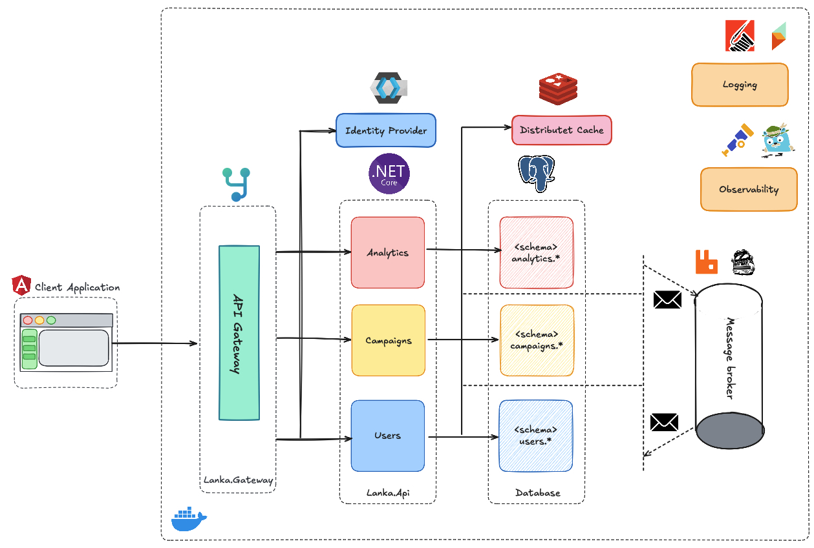

# 🏗️ Lanka Architecture Documentation

<div align="center">

*Understanding the architectural foundations that make Lanka scalable, maintainable, and delightful to work with*



</div>

---

## 📚 **Architecture Guide Index**

### **🎯 Core Concepts**
| Document | Description | Key Topics |
|----------|-------------|------------|
| [🧩 Modular Monolith](../architecure-decision-log/003-modular-monolith-architecture.md) | Architecture decision and rationale | Module boundaries, communication patterns |
| [💎 Domain-Driven Design](../architecure-decision-log/004-adoption-of-ddd.md) | DDD adoption decision | Aggregates, entities, value objects |
| [🔄 Event-Driven Architecture](../architecure-decision-log/008-event-driven-architecture.md) | Event-driven decision | Domain events, integration events |
| [🎪 CQRS & MediatR](../architecure-decision-log/005-cqrs-implementation.md) | CQRS decision and approach | Commands, queries, handlers |

### **🔧 Implementation Patterns**
| Document | Description | Key Topics |
|----------|-------------|------------|
| Data Architecture (planned) | Database design and data flow | Multi-database strategy, migrations |
| API Design (planned) | RESTful API patterns and conventions | Endpoints, versioning, documentation |
| Security Architecture (planned) | Authentication and authorization | OAuth2, JWT, permissions |
| Performance Patterns (planned) | Caching, optimization strategies | Redis, query optimization |

### **🌐 Infrastructure**
| Document | Description | Key Topics |
|----------|-------------|------------|
| Containerization (planned) | Docker setup and orchestration | Multi-stage builds, compose |
| Observability (see Tools/Telemetry) | Monitoring, logging, and tracing | OpenTelemetry, metrics |
| Message Bus (see Tools/Messaging) | Asynchronous messaging with RabbitMQ | Queues, exchanges, patterns |
| Deployment Architecture (planned) | Production deployment strategies | Blue-green, rolling updates |

---

## 🎨 **Architectural Principles**

### **1. 🧩 Modular Design**
```
┌─────────────────────────────────────────────────────────────┐
│                    Lanka.Api (Gateway)                      │
├─────────────────────────────────────────────────────────────┤
│  Users Module      │  Analytics Module  │ Campaigns Module  │
│  ┌───────────────┐ │  ┌───────────────┐ │ ┌───────────────┐ │
│  │ Application   │ │  │ Application   │ │ │ Application   │ │
│  │ Domain        │ │  │ Domain        │ │ │ Domain        │ │
│  │ Infrastructure│ │  │ Infrastructure│ │ │ Infrastructure│ │
│  └───────────────┘ │  └───────────────┘ │ └───────────────┘ │
├─────────────────────────────────────────────────────────────┤
│                     Common Infrastructure                   │
└─────────────────────────────────────────────────────────────┘
```

**Key Benefits:**

- 🎯 **Clear Separation** - Each module owns its data and business logic
- 🔄 **Independent Evolution** - Modules can evolve at different speeds
- 🧪 **Easier Testing** - Isolated modules are easier to test
- 📦 **Potential for Microservices** - Modules can be extracted later

### **2. 💎 Command Query Resposibility Segregation**


### **3. 🔄 Event-Driven Communication**


### **4. 🎯 Clean Architecture Layers**

```
┌──────────────────────────────────────────┐
│           🌐 Presentation Layer          │
│          (Controllers, DTOs)             │
├──────────────────────────────────────────┤
│          📋 Application Layer            │
│     (Use Cases, Command/Query)           │
├──────────────────────────────────────────┤
│            💎 Domain Layer               │
│      (Entities, Business Rules)          │
├──────────────────────────────────────────┤
│          🔧 Infrastructure Layer         │
│     (Database, External Services)        │
└──────────────────────────────────────────┘
```

---

## 🎪 **Module Deep Dive & Configuration**

### **👥 Users Module**

**Key Responsibilities:**
- 🔐 **Authentication & Authorization** - OAuth2, JWT tokens, role-based access
- 👤 **User Profile Management** - Personal information, preferences
- 🔗 **External Integrations** - Instagram account linking
- 📊 **User Analytics** - Activity tracking, engagement metrics

### **📊 Analytics Module**

**Key Responsibilities:**
- 📈 **Instagram Analytics** - Follower growth, engagement rates, reach metrics
- 👥 **Audience Insights** - Demographics, interests, engagement patterns
- 🔄 **Real-time Sync** - Automated data collection from Instagram API
- 📊 **Performance Tracking** - Content performance, optimal posting times

### **🎪 Campaigns Module**

**Key Responsibilities:**
- 🚀 **Campaign Management** - Creation, planning, execution
- 👥 **Blogger Network** - Influencer profiles, performance history
- 💼 **Business Logic** - Offer negotiations, contract management
- 📊 **ROI Tracking** - Campaign performance, conversion metrics

---

## 🔄 **Data Flow Architecture**

### **Cross-Module Communication**


### **Request Processing Pipeline**


---

## ⚙️ **Environment & Settings Overview**

- API (`Lanka.Api`) listens on `http://localhost:4307` in dev; health at `/healthz`. Health checks include Keycloak (`KeyCloak:HealthUrl`).
- Gateway (`Lanka.Gateway`) listens on `https://localhost:4308`. Reverse proxy routes are configured in `appsettings.json` (YARP).
- Logging uses Serilog → Seq sink at `http://lanka.seq:5341` (container), UI at `http://localhost:8081`.
- Migrations: each module applies EF Core migrations on startup (no manual apply required).
- Keycloak realm: imported from `test/Lanka.IntegrationTests/lanka-realm-export.json` via `--import-realm`.
- Data stores: PostgreSQL (5432), MongoDB (27017), Redis (6379), RabbitMQ (5672/15672).

---

## 🎯 **Quality Attributes**

### **📈 Scalability**
- **Horizontal scaling** through stateless design
- **Database per module** prevents bottlenecks
- **Asynchronous processing** for heavy operations
- **Caching strategies** for frequently accessed data

### **🔧 Maintainability**
- **Clear module boundaries** reduce cognitive load
- **Consistent patterns** across all modules
- **Comprehensive testing** at all levels
- **Living documentation** that evolves with code

### **🛡️ Reliability**
- **Circuit breaker patterns** for external services
- **Retry policies** with exponential backoff
- **Health checks** for all critical components
- **Graceful degradation** when services are unavailable

### **🔒 Security**
- **Authentication** via OAuth2 and JWT
- **Authorization** with role-based access control
- **Input validation** at all entry points
- **Audit logging** for compliance requirements

---

## 🚀 **Next Steps**

Ready to dive deeper? Check out these detailed guides:

1. **🏗️ Modular Monolith Deep Dive** - see ADR [003](../architecure-decision-log/003-modular-monolith-architecture.md)
2. **💎 Domain-Driven Design Guide** - see ADR [004](../architecure-decision-log/004-adoption-of-ddd.md)
3. **🔄 Event-Driven Patterns** - see ADR [008](../architecure-decision-log/008-event-driven-architecture.md)
4. **🗃️ Data Architecture** - planned

---

<div align="center">

*"Good architecture makes the system easy to understand, develop, maintain, and deploy."*

**- Uncle Bob Martin**

</div>