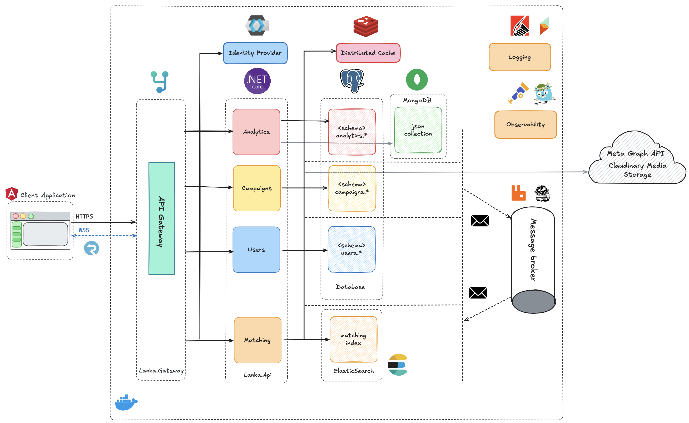
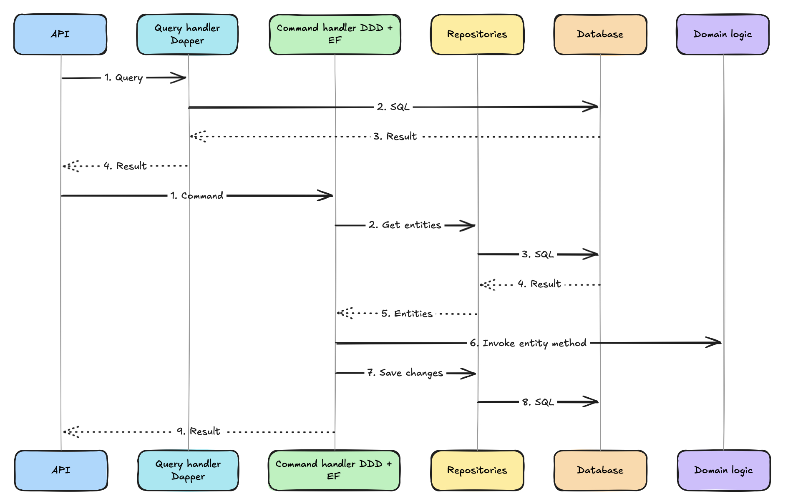
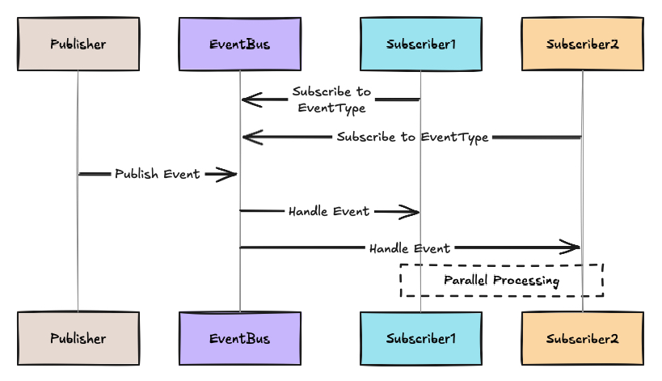
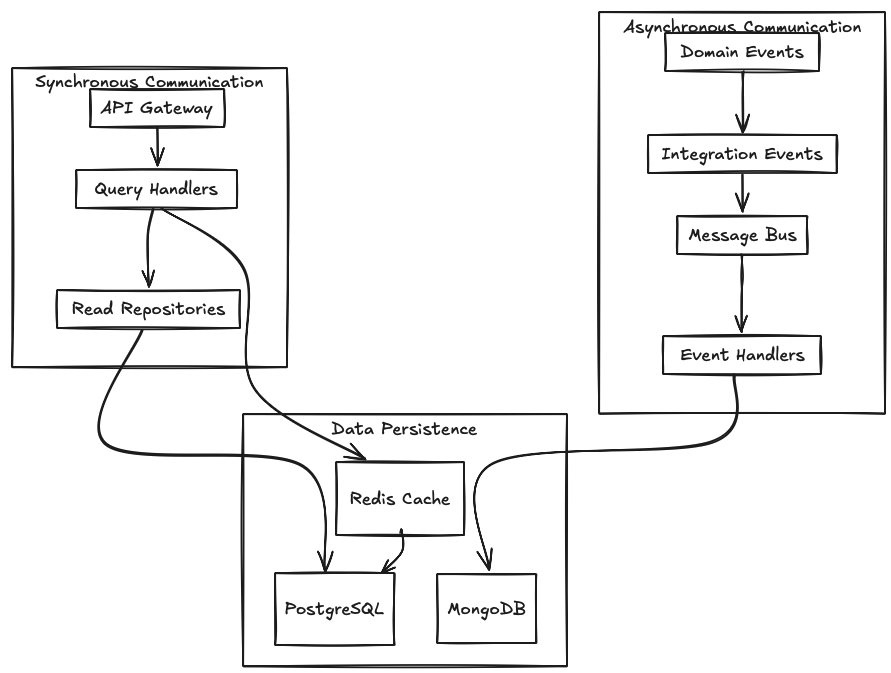
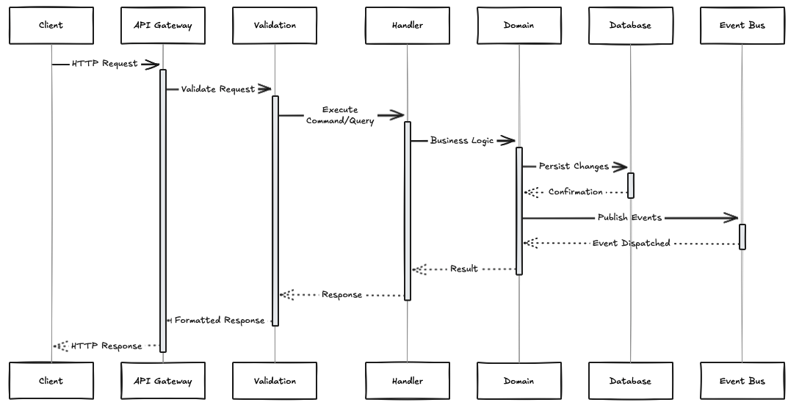

# Lanka Architecture Documentation

<div align="center">

*Exploring how modular monolith architecture works in practice*



</div>

---

## About This Section

This is where I document the architectural patterns I'm learning and applying in Lanka. If you're also exploring .NET architecture, I hope these docs help explain not just *what* patterns are used, but *why* they make sense (or sometimes don't).

---

## Architecture Guide Index

### Core Concepts
| Document | Description | What I Learned |
|----------|-------------|----------------|
| [Modular Monolith](../architecure-decision-log/003-modular-monolith-architecture.md) | Architecture decision and rationale | Module boundaries, why not microservices |
| [Domain-Driven Design](../architecure-decision-log/004-adoption-of-ddd.md) | DDD adoption decision | Aggregates, entities, value objects |
| [Event-Driven Architecture](../architecure-decision-log/008-event-driven-architecture.md) | Event-driven patterns | Domain events, integration events |
| [CQRS & MediatR](../architecure-decision-log/005-cqrs-implementation.md) | CQRS implementation | Commands, queries, handlers |

### Implementation Patterns
| Document | Description | Status |
|----------|-------------|--------|
| Data Architecture | Database design and data flow | Planned |
| API Design | RESTful API patterns | Planned |
| Security Architecture | Authentication and authorization | Partial |
| Performance Patterns | Caching, optimization | Planned |

### Infrastructure
| Document | Description | Where to Look |
|----------|-------------|---------------|
| Containerization | Docker setup | See [Aspire Orchestration](../walkthroughs/aspire-orchestration.md) |
| Observability | Monitoring, logging, tracing | [Tools/Telemetry](../tools/telemetry/) |
| Message Bus | Async messaging with RabbitMQ | [Tools/Messaging](../tools/messaging/) |
| Deployment | Production strategies | Not implemented yet |

---

## Architectural Principles

### 1. Modular Design

```
┌─────────────────────────────────────────────────────────────┐
│                    Lanka.Api (Host)                         │
├─────────────────────────────────────────────────────────────┤
│  Users Module      │  Analytics Module  │ Campaigns Module  │
│  ┌───────────────┐ │  ┌───────────────┐ │ ┌───────────────┐ │
│  │ Application   │ │  │ Application   │ │ │ Application   │ │
│  │ Domain        │ │  │ Domain        │ │ │ Domain        │ │
│  │ Infrastructure│ │  │ Infrastructure│ │ │ Infrastructure│ │
│  └───────────────┘ │  └───────────────┘ │ └───────────────┘ │
├─────────────────────────────────────────────────────────────┤
│                     Common Infrastructure                   │
└─────────────────────────────────────────────────────────────┘
```

**Why this matters:**

- **Clear Separation** — Each module owns its data and business logic
- **Independent Evolution** — Modules can change at different speeds
- **Easier Testing** — Isolated modules are simpler to test
- **Future Flexibility** — Modules can be extracted to microservices if needed

### 2. Command Query Responsibility Segregation (CQRS)



Separating reads from writes allows optimizing each path independently. In Lanka, commands go through validation pipelines while queries can use optimized read models.

### 3. Event-Driven Communication



Modules communicate through events rather than direct calls. This keeps them loosely coupled — the Users module doesn't need to know what Analytics does with user data.

### 4. Change Data Capture (CDC)

Keeping Elasticsearch in sync with PostgreSQL is a cross-cutting concern that spans multiple modules. Rather than requiring each entity to manually raise search-sync domain events (error-prone — easy to forget or duplicate), Lanka uses an automated CDC pipeline built on EF Core `SaveChangesInterceptor`.

```
Entity modified ──► EF SaveChanges ──► ChangeCaptureInterceptor
                                           │
                                    Detects IChangeCaptured entities
                                    Extracts search data from properties
                                    Writes OutboxMessage
                                           │
                                    ProcessOutboxJob ──► RabbitMQ ──► Matching Module ──► Elasticsearch
```

**How it works:**

- Entities opt in by implementing the empty `IChangeCaptured` marker interface (Domain layer — no search knowledge)
- Per-module interceptors in Infrastructure extract title, content, tags, and metadata from entity properties
- The interceptor writes directly to the outbox table in the same transaction as the entity change
- The outbox job dispatches the event to a handler that publishes a `SearchSyncIntegrationEvent` to RabbitMQ
- The Matching module consumes it and updates Elasticsearch

**Why this approach:**

- **Automatic** — impossible to forget raising an event; if the entity is saved, the change is captured
- **Transactional** — outbox message is committed with the entity change, so they're always consistent
- **Domain-clean** — entities only know about `IChangeCaptured`, not about search, Elasticsearch, or integration events
- **Low boilerplate** — adding a new entity to search requires 2 changes (marker + interceptor case)

See [ADL 016](../architecure-decision-log/016-change-data-capture.md) for the full decision record and alternatives considered.

### 5. Clean Architecture Layers

```
┌──────────────────────────────────────────┐
│           Presentation Layer             │
│          (Endpoints, DTOs)               │
├──────────────────────────────────────────┤
│           Application Layer              │
│     (Use Cases, Command/Query)           │
├──────────────────────────────────────────┤
│             Domain Layer                 │
│      (Entities, Business Rules)          │
├──────────────────────────────────────────┤
│          Infrastructure Layer            │
│     (Database, External Services)        │
└──────────────────────────────────────────┘
```

Dependencies point inward — outer layers depend on inner layers, never the reverse.

---

## Module Overview

### Users Module

**What it handles:**
- Authentication & Authorization via Keycloak
- User profile management
- Instagram account linking (via OAuth2)
- User activity tracking

### Analytics Module

**What it handles:**
- Instagram analytics data collection
- Audience demographics processing
- Performance metrics storage (MongoDB)
- Mock services for development without real Instagram access

### Campaigns Module

**What it handles:**
- Campaign creation and management
- Blogger profiles and applications
- Offer negotiations and contracts
- Campaign tracking

---

## Data Flow

### Cross-Module Communication



### Request Processing Pipeline



---

## Environment & Settings

- **API** (`Lanka.Api`) listens on `http://localhost:4307` in dev; health checks at `/healthz`
- **Gateway** (`Lanka.Gateway`) listens on `https://localhost:4308` with YARP reverse proxy
- **Logging** uses Serilog bridged to OpenTelemetry; visible in the Aspire Dashboard
- **Migrations** are applied automatically on startup (no manual step needed)
- **Keycloak** realm imported from `test/Lanka.IntegrationTests/lanka-realm-export.json`
- **Data stores**: PostgreSQL (5432), MongoDB (27017), Redis (6379), RabbitMQ (5672/15672)

---

## Quality Attributes

These are the non-functional requirements I'm trying to address:

### Scalability
- Stateless design for horizontal scaling
- Database-per-module prevents bottlenecks
- Asynchronous processing for heavy operations
- Caching for frequently accessed data

### Maintainability
- Clear module boundaries reduce cognitive load
- Consistent patterns across all modules
- Architecture tests enforce boundaries

### Reliability
- Circuit breaker patterns for external services
- Retry policies with exponential backoff
- Health checks for all critical components

### Security
- OAuth2/JWT authentication via Keycloak
- Role-based access control
- Input validation at all entry points

---

## What's Next?

Dive deeper into specific patterns:

1. **Modular Monolith** — see [ADR 003](../architecure-decision-log/003-modular-monolith-architecture.md)
2. **Domain-Driven Design** — see [ADR 004](../architecure-decision-log/004-adoption-of-ddd.md)
3. **Event-Driven Patterns** — see [ADR 008](../architecure-decision-log/008-event-driven-architecture.md)
4. **Module Details** — see [Modules Documentation](../modules/README.md)

---

<div align="center">

*"Good architecture makes the system easy to understand, develop, maintain, and deploy."*
— Uncle Bob Martin

</div>
