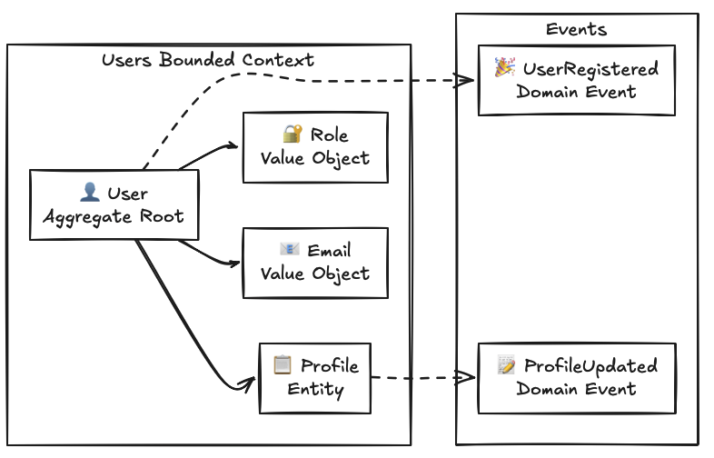
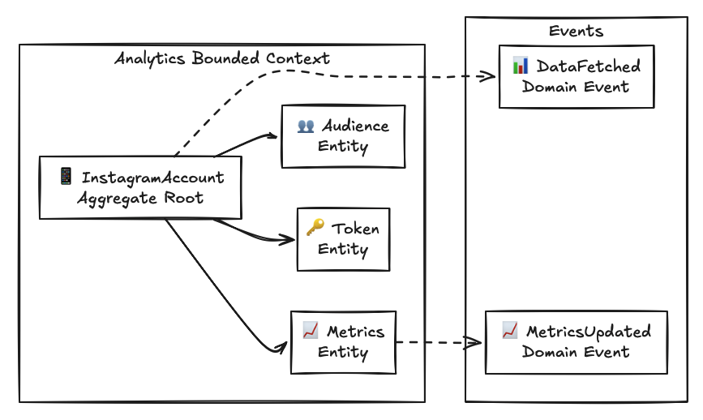
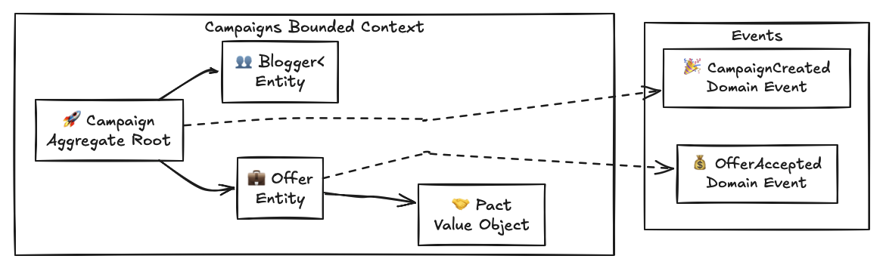
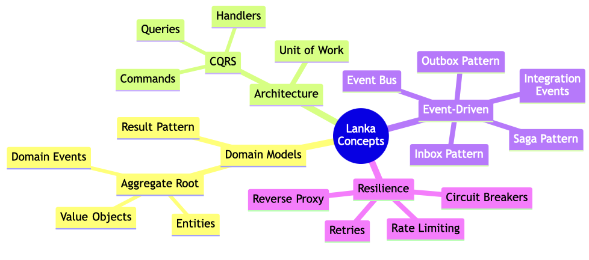
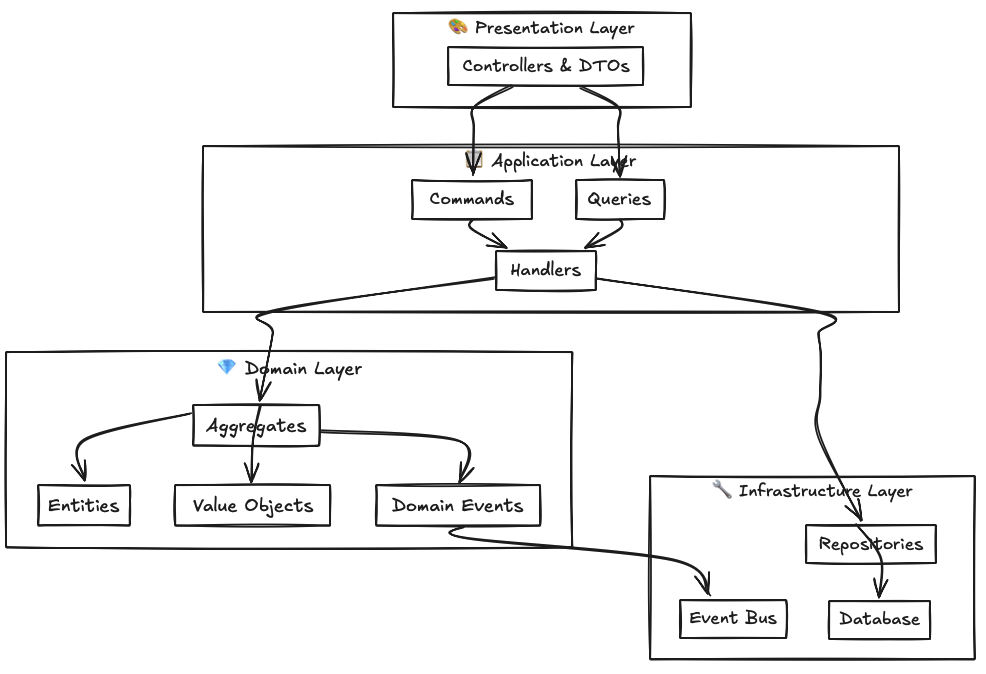

# Catalog of Terms

<div align="center">

*A glossary of DDD, CQRS, and architectural concepts used in Lanka*

</div>

---

## What's This For?

When I started this project, I kept running into unfamiliar terms — "aggregate root", "outbox pattern", "saga orchestration". This catalog is my attempt to explain these concepts in plain language, with examples from the Lanka codebase.

If you're learning these patterns too, I hope this helps. If you spot something wrong, please open an issue.

---

## Concept Categories

<table>
<tr>
<td width="50%">

### Domain-Driven Design
Building blocks for domain models

- [Aggregate Root](aggregate-root/) — Consistency boundaries
- [Entity](entity/) — Objects with identity
- [Value Object](value-object/) — Immutable descriptors
- [Domain Event](domain-event/) — Business occurrences
- [Result Pattern](result-pattern/) — Error handling

### Application Architecture
Patterns for organizing logic

- [CQRS](cqrs/) — Command/Query separation
- [Unit of Work](unit-of-work/) — Transactional operations

</td>
<td width="50%">

### Event-Driven Architecture
Asynchronous communication

- [Integration Event](integration-event/) — Cross-module messages
- [Event Bus](event-bus/) — Message routing
- [Outbox Pattern](outbox-pattern/) — Reliable publishing
- [Inbox Pattern](inbox-pattern/) — Idempotent processing
- [Saga Pattern](saga/) — Distributed transactions

### Resilience & Infrastructure
Building robust systems

- [Resilience](resilience/) — Circuit breakers, retries
- [Reverse Proxy](reverse-proxy/) — Load balancing
- [Rate Limiting](rate-limiting/) — Traffic control

</td>
</tr>
</table>

---

## Quick Reference

| If you want to... | Look at... |
|-------------------|------------|
| Model business entities | [Entity](entity/), [Aggregate Root](aggregate-root/) |
| Handle business rules | [Aggregate Root](aggregate-root/), [Value Object](value-object/) |
| Communicate between modules | [Integration Event](integration-event/), [Event Bus](event-bus/) |
| Handle errors gracefully | [Result Pattern](result-pattern/) |
| Ensure data consistency | [Outbox Pattern](outbox-pattern/), [Unit of Work](unit-of-work/) |
| Build resilient systems | [Resilience](resilience/), [Rate Limiting](rate-limiting/) |
| Organize application logic | [CQRS](cqrs/), [Saga Pattern](saga/) |

---

## Complexity Levels

| Level | Concepts | Notes |
|-------|----------|-------|
| **Beginner** | Entity, Value Object, Result Pattern | Start here if new to DDD |
| **Intermediate** | Aggregate Root, Domain Event, CQRS | Core patterns for domain modeling |
| **Advanced** | Saga, Outbox/Inbox, Event Bus | For distributed systems |

---

## Domain Concepts in Lanka

### Users Domain



### Analytics Domain



### Campaigns Domain



---

## Learning Paths

### New to Domain-Driven Design?

1. [Entity](entity/) — Understand objects with identity
2. [Value Object](value-object/) — Master immutable descriptors
3. [Aggregate Root](aggregate-root/) — Grasp consistency boundaries
4. [Domain Event](domain-event/) — Model business occurrences
5. [Result Pattern](result-pattern/) — Handle errors functionally

### Ready for Event-Driven Architecture?

1. [Integration Event](integration-event/) — Cross-module communication
2. [Event Bus](event-bus/) — Message routing
3. [Outbox Pattern](outbox-pattern/) — Reliable publishing
4. [Inbox Pattern](inbox-pattern/) — Idempotent processing
5. [Saga Pattern](saga/) — Distributed transactions

### Building Resilient Systems?

1. [Resilience](resilience/) — Circuit breakers and retries
2. [Rate Limiting](rate-limiting/) — Traffic control
3. [Reverse Proxy](reverse-proxy/) — Load balancing

---

## Visual Guides

### Concept Relationships



### Implementation Layers



---

## What Each Concept Page Includes

- **Definition** — Clear, concise explanation
- **Purpose** — Why we use this pattern
- **Implementation** — How it's built in Lanka
- **Benefits** — Advantages and trade-offs
- **Examples** — Real code from the project
- **Related Concepts** — What to explore next
- **Further Reading** — External resources

---

## Contributing

Found something unclear or incorrect?

### Adding New Terms

1. Create a new directory: `catalog-of-terms/your-concept/`
2. Add a `README.md` with definition, examples, and code
3. Update this index page

### Term Template

```markdown
# Concept Name

## Definition
Brief explanation of the concept.

## Purpose
Why we use this pattern and what problems it solves.

## Implementation in Lanka
How this concept is implemented in our codebase.

## Benefits
- Advantages of using this pattern
- Trade-offs to consider

## Code Examples
Real examples from the Lanka codebase.

## Related Concepts
- Links to related terms

## Further Reading
- External resources
```

---

<div align="center">

*"The limits of my language mean the limits of my world."*
— Ludwig Wittgenstein

</div>
