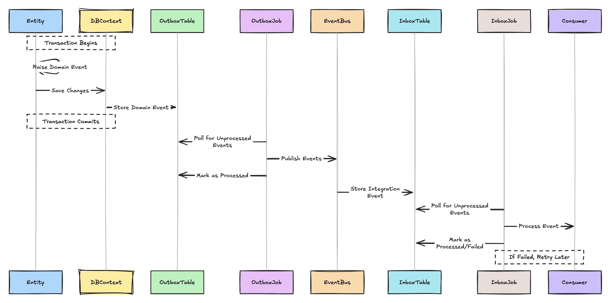

# 📚 Lanka Catalog of Terms

<div align="center">

*Your comprehensive dictionary for understanding Lanka's domain concepts and architectural patterns*

**"A shared language is the foundation of great software design"**

</div>

---

## 🌟 **Welcome to the Lanka Dictionary!**

This catalog provides detailed explanations of every core concept used in the Lanka project. Whether you're a new team member or an experienced developer, this guide will help you understand the **ubiquitous language** that drives our domain models and architectural decisions.

---

## 🗂️ **Concept Categories**

<table>
<tr>
<td width="50%">

### **💎 Domain-Driven Design**
Building blocks for rich domain models

- [🏛️ Aggregate Root](aggregate-root/) - Domain consistency boundaries
- [🎭 Entity](entity/) - Objects with identity and lifecycle  
- [💎 Value Object](value-object/) - Immutable descriptive objects
- [⚡ Domain Event](domain-event/) - Significant business occurrences
- [✅ Result Pattern](result-pattern/) - Error handling without exceptions

### **🎪 Application Architecture**
Patterns for organizing application logic

- [🔄 CQRS](cqrs/) - Command Query Responsibility Segregation
- [🗃️ Unit of Work](unit-of-work/) - Transactional data operations

</td>
<td width="50%">

### **🔄 Event-Driven Architecture**
Asynchronous communication patterns

- [📡 Integration Event](integration-event/) - Cross-module communication
- [🚌 Event Bus](event-bus/) - Message routing infrastructure  
- [📤 Outbox Pattern](outbox-pattern/) - Reliable event publishing
- [📥 Inbox Pattern](inbox-pattern/) - Idempotent event processing
- [🎭 Saga Pattern](saga/) - Distributed transaction coordination

### **🛡️ Resilience & Performance**
Patterns for robust, scalable systems

- [🛡️ Resilience](resilience/) - Circuit breakers and retries
- [🔀 Reverse Proxy](reverse-proxy/) - Load balancing and routing
- [⏱️ Rate Limiting](rate-limiting/) - Traffic control and protection

</td>
</tr>
</table>

---

## 🎯 **Quick Reference Guide**

### **🔍 Concept Finder**

Looking for something specific? Use this quick reference:

| If you want to... | Look at... | Why? |
|-------------------|------------|------|
| **Model business entities** | [🎭 Entity](entity/), [🏛️ Aggregate Root](aggregate-root/) | Core building blocks of domain models |
| **Handle business rules** | [🏛️ Aggregate Root](aggregate-root/), [💎 Value Object](value-object/) | Encapsulate invariants and validation |
| **Communicate between modules** | [📡 Integration Event](integration-event/), [🚌 Event Bus](event-bus/) | Loose coupling via events |
| **Handle errors gracefully** | [✅ Result Pattern](result-pattern/) | Functional error handling |
| **Ensure data consistency** | [📤 Outbox Pattern](outbox-pattern/), [🗃️ Unit of Work](unit-of-work/) | Transactional integrity |
| **Build resilient systems** | [🛡️ Resilience](resilience/), [⏱️ Rate Limiting](rate-limiting/) | Handle failures gracefully |
| **Organize application logic** | [🔄 CQRS](cqrs/), [🎭 Saga Pattern](saga/) | Separation of concerns |

### **📈 Complexity Levels**

| Level | Concepts | Best for... |
|-------|----------|-------------|
| **🟢 Beginner** | Entity, Value Object, Result Pattern | Getting started with DDD |
| **🟡 Intermediate** | Aggregate Root, Domain Event, CQRS | Building robust domain models |
| **🔴 Advanced** | Saga Pattern, Outbox/Inbox, Event Bus | Distributed systems and scaling |

---

## 🎭 **Domain Concepts in Lanka**

### **👥 Users Domain**


### **📊 Analytics Domain**


---

## 🔄 **Event Flow Patterns**

### **Cross-Module Communication**


### **Outbox/Inbox Pattern Flow**



---

## 📖 **Learning Paths**

### **🌱 New to Domain-Driven Design?**

1. Start with [🎭 Entity](entity/) - Understand objects with identity
2. Learn [💎 Value Object](value-object/) - Master immutable descriptors  
3. Study [🏛️ Aggregate Root](aggregate-root/) - Grasp consistency boundaries
4. Explore [⚡ Domain Event](domain-event/) - Model business occurrences
5. Apply [✅ Result Pattern](result-pattern/) - Handle errors functionally

### **🔄 Ready for Event-Driven Architecture?**

1. Understand [📡 Integration Event](integration-event/) - Cross-module communication
2. Learn [🚌 Event Bus](event-bus/) - Message routing
3. Implement [📤 Outbox Pattern](outbox-pattern/) - Reliable publishing
4. Add [📥 Inbox Pattern](inbox-pattern/) - Idempotent processing
5. Orchestrate [🎭 Saga Pattern](saga/) - Distributed transactions

### **🛡️ Building Resilient Systems?**

1. Study [🛡️ Resilience](resilience/) - Circuit breakers and retries
2. Implement [⏱️ Rate Limiting](rate-limiting/) - Traffic control
3. Configure [🔀 Reverse Proxy](reverse-proxy/) - Load balancing
4. Combine patterns for maximum robustness

---

## 🎨 **Visual Learning**

### **Concept Relationships**


### **Implementation Layers**


---

## 🔍 **Detailed Concept Guides**

Each concept in our catalog includes:

- **📖 Definition** - Clear, concise explanation
- **🎯 Purpose** - Why we use this pattern
- **🏗️ Implementation** - How it's built in Lanka
- **✅ Benefits** - Advantages and trade-offs
- **🧪 Examples** - Real code from the project
- **🔗 Related Concepts** - What to explore next
- **📚 Further Reading** - External resources

---

## 🤝 **Contributing to the Catalog**

Help us keep this catalog comprehensive and up-to-date:

### **Adding New Terms**

1. Create a new directory: `catalog-of-terms/your-concept/`
2. Add a `README.md` using our template
3. Include code examples from Lanka
4. Update this index page

### **Improving Existing Terms**

1. Add clarifications or examples
2. Include diagrams or visualizations  
3. Link to related concepts
4. Update based on implementation changes

### **Term Template**

```markdown
# 🎯 Concept Name

## Definition
Brief, clear explanation of the concept.

## Purpose
Why we use this pattern and what problems it solves.

## Implementation in Lanka
How this concept is implemented in our codebase.

## Benefits
- Advantages of using this pattern
- Trade-offs to consider

## Code Examples
Real examples from the Lanka codebase.

## Related Concepts
- Links to related terms in the catalog
- How concepts work together

## Further Reading
- External resources
- Books, articles, documentation
```

---

<div align="center">

*"The limits of my language mean the limits of my world."*

**- Ludwig Wittgenstein**

**Happy Learning! 📚**

</div>