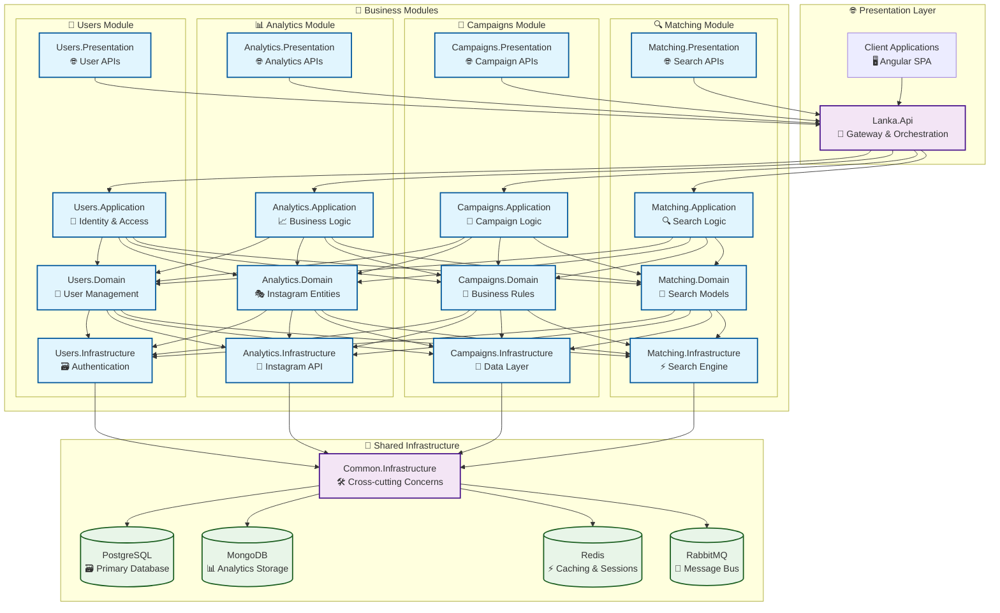

# 🧩 Lanka Modules Documentation

<div align="center">

*Deep dive into the modular architecture that powers Lanka's social media campaign management platform*

**"Good architecture makes the system easy to understand, develop, maintain, and deploy."**

[](.)
[](../architecture/)
[](../catalog-of-terms/)

</div>

---

## 🗺️ **Module Ecosystem Overview**

Lanka's modular monolith is built around **four core modules**, each responsible for a specific business domain. This structure provides clear boundaries, independent evolution, and maintainable code organization.



---

## 🎯 **Core Modules Overview**

<table>
<tr>
<td width="25%">

### **👥 [Users Module](users/)**
*Identity & Access Management*

**Key Features:**
- 🔐 Authentication & Authorization
- 👤 User Profile Management  
- 🔗 Instagram Account Linking
- 📊 User Activity Tracking

**Core Entities:**
- User (Aggregate Root)
- Role, Permission
- Email, BirthDate

</td>
<td width="25%">

### **📊 [Analytics Module](analytics/)**
*Social Media Intelligence*

**Key Features:**
- 📈 Instagram Analytics
- 👥 Audience Insights
- 📊 Performance Metrics
- 🔄 Real-time Data Sync

**Core Entities:**
- InstagramAccount (Entity)
- Statistics, Audience
- Token, Metadata

</td>
<td width="25%">

### **🎪 [Campaigns Module](campaigns/)**
*Campaign Orchestration*

**Key Features:**
- 🚀 Campaign Management
- 👥 Blogger Network
- 💼 Offer Management
- 📋 Contract & Review System

**Core Entities:**
- Campaign (Entity)
- Blogger, Offer
- Pact, Review

</td>
<td width="25%">

### **🔍 [Matching Module](matching/)**
*Search & Discovery*

**Key Features:**
- 🔍 Advanced Search
- 🎯 Content Matching
- 📊 Relevance Scoring
- ⚡ Fast Indexing

**Core Entities:**
- SearchableItem
- MatchingCriteria
- MatchResult

</td>
</tr>
</table>

---

## 🏗️ **Module Architecture Patterns**

### **📐 Clean Architecture Layers**

Each module follows the **Clean Architecture** pattern with consistent layer organization:

```
📁 Lanka.Modules.{Module}.Domain/
   ├── 🎭 Entities & Aggregates
   ├── 💎 Value Objects  
   ├── ⚡ Domain Events
   ├── 🔍 Domain Services
   └── 📋 Repository Interfaces

📁 Lanka.Modules.{Module}.Application/
   ├── 🎯 Use Cases (Commands/Queries)
   ├── 🔄 Event Handlers
   ├── 📝 DTOs & Contracts
   ├── 🧩 Application Services
   └── 🔧 Abstractions

📁 Lanka.Modules.{Module}.Infrastructure/
   ├── 🗃️ Repository Implementations
   ├── 🔗 External Service Integrations
   ├── 📤 Outbox Pattern
   ├── 📥 Inbox Pattern
   └── 🗄️ Database Configuration

📁 Lanka.Modules.{Module}.Presentation/
   ├── 🌐 API Endpoints
   ├── 🔒 Permission Definitions
   ├── 📊 Response Models
   └── 🏷️ API Tags

📁 Lanka.Modules.{Module}.IntegrationEvents/
   ├── 📡 Integration Events
   ├── 🔄 Event Handlers
   └── 📮 Cross-Module Communication
```

### **🔄 Communication Patterns**

<table>
<tr>
<td width="50%">

#### **🔗 Intra-Module Communication**
- **Direct method calls** within the same module
- **Domain events** for internal business logic
- **Repository pattern** for data access
- **Mediator pattern** for use case orchestration

</td>
<td width="50%">

#### **📡 Inter-Module Communication**
- **Integration events** via RabbitMQ
- **Outbox/Inbox patterns** for reliability
- **Eventual consistency** for cross-module data
- **API calls** for synchronous operations

</td>
</tr>
</table>

---

## 📊 **Module Dependencies & Integration**

### **🔗 Module Interaction Matrix**

| From → To | 👥 Users | 📊 Analytics | 🎪 Campaigns | 🔍 Matching |
|-----------|----------|--------------|---------------|-------------|
| **👥 Users** | - | ✅ Account Linked | ✅ User Created | ✅ User Profile |
| **📊 Analytics** | ✅ User Activity | - | ✅ Data Updated | ✅ Content Indexed |
| **🎪 Campaigns** | ✅ Blogger Actions | ✅ Performance Data | - | ✅ Campaign Indexed |
| **🔍 Matching** | ❌ Read-only | ❌ Read-only | ❌ Read-only | - |

**Legend:**
- ✅ **Publishes events to**
- ❌ **No direct dependency** 

### **📮 Key Integration Events**

<table>
<tr>
<td width="33%">

#### **👥 Users Module Events**
- `UserCreatedIntegrationEvent`
- `UserDeletedIntegrationEvent` 
- `UserLoggedInIntegrationEvent`
- `InstagramAccountLinkedIntegrationEvent`

</td>
<td width="33%">

#### **📊 Analytics Module Events**
- `InstagramAccountDataFetchedIntegrationEvent`
- `InstagramAccountDataRenewedIntegrationEvent`
- `AnalyticsDataUpdatedIntegrationEvent`

</td>
<td width="33%">

#### **🎪 Campaigns Module Events**
- `CampaignCreatedIntegrationEvent`
- `CampaignCompletedIntegrationEvent`
- `BloggerJoinedIntegrationEvent`
- `ReviewSubmittedIntegrationEvent`

</td>
</tr>
</table>

---

## 🎨 **Design Principles & Best Practices**

### **💎 Domain-Driven Design**

<table>
<tr>
<td width="50%">

#### **🏛️ Aggregate Design**
- **Small aggregates** focused on business invariants
- **Eventual consistency** between aggregates
- **Rich domain models** with business logic
- **Domain events** for significant changes

#### **📝 Ubiquitous Language**
- **Shared vocabulary** between developers and domain experts
- **Consistent naming** across all layers
- **Business-focused** entity and method names

</td>
<td width="50%">

#### **🔒 Encapsulation & Validation**
- **Private setters** to control state changes
- **Factory methods** for object creation
- **Guard clauses** for input validation
- **Immutable value objects** where appropriate

#### **⚡ Event-Driven Architecture**
- **Domain events** for internal module communication
- **Integration events** for cross-module communication
- **Eventual consistency** for distributed operations

</td>
</tr>
</table>

### **🔧 Technical Excellence**

#### **📏 Code Quality Standards**
- **SOLID principles** in all implementations
- **Repository pattern** for data access abstraction
- **CQRS pattern** for command/query separation
- **Result pattern** for error handling

#### **🧪 Testing Strategy**
- **Unit tests** for domain logic
- **Integration tests** for full workflows
- **Architecture tests** to enforce design rules
- **Contract tests** for API consistency

---

## 🚀 **Getting Started with Modules**

### **📖 Learning Path**

1. **🎯 Start Here**: [Architecture Overview](../architecture/) - Understand the big picture
2. **👥 Begin with Users**: [Users Module](users/) - Authentication and identity
3. **📊 Add Analytics**: [Analytics Module](analytics/) - Social media intelligence  
4. **🎪 Build Campaigns**: [Campaigns Module](campaigns/) - Campaign management
5. **🔍 Implement Search**: [Matching Module](matching/) - Advanced search capabilities

### **🛠️ Development Workflow**

<table>
<tr>
<td width="50%">

#### **🆕 Adding New Features**
1. **Define domain model** in Domain layer
2. **Create use cases** in Application layer
3. **Implement data access** in Infrastructure layer
4. **Expose APIs** in Presentation layer
5. **Add integration events** if needed

</td>
<td width="50%">

#### **🔄 Modifying Existing Features**
1. **Start with domain model** changes
2. **Update use cases** accordingly
3. **Modify repository** implementations
4. **Update API contracts** if needed
5. **Handle backward compatibility**

</td>
</tr>
</table>

---

## 📚 **Module Documentation Index**

<div align="center">

| Module | Status | Documentation | Key Features |
|--------|--------|---------------|-------------|
| 👥 **[Users](users/)** | ✅ Active | [📖 Complete](users/) | Authentication, Profiles, Instagram Linking |
| 📊 **[Analytics](analytics/)** | ✅ Active | [📖 Complete](analytics/) | Instagram Analytics, Audience Insights |  
| 🎪 **[Campaigns](campaigns/)** | ✅ Active | [📖 Complete](campaigns/) | Campaign Management, Blogger Network |
| 🔍 **[Matching](matching/)** | 🚧 Development | [📖 In Progress](matching/) | Search, Content Discovery |

</div>

---

## 🎯 **Quick Links**

<div align="center">

[](users/)
[](analytics/)
[](campaigns/)
[](matching/)

[](../architecture/)
[](../catalog-of-terms/)
[](../architecure-decision-log/)

</div>

---

<div align="center">

*"A well-designed module is like a well-written book chapter - it tells a complete story while being part of a larger narrative."*

**Happy Coding! 🚀**

</div>

