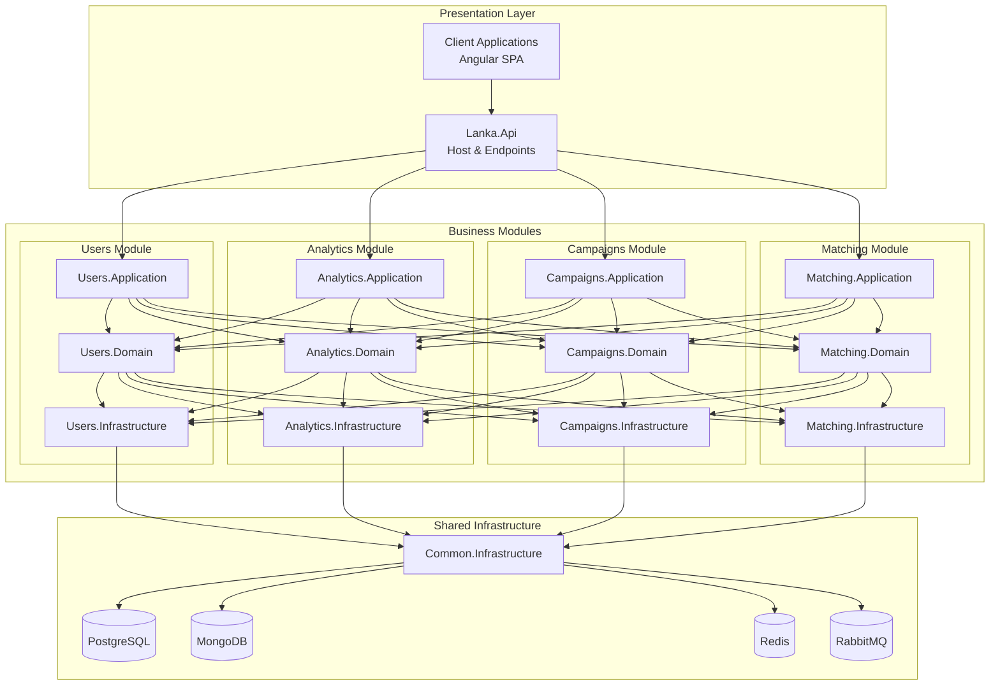

# Lanka Modules Documentation

<div align="center">

*How the modular monolith is organized*

[](.)
[](../architecture/)

</div>

---

## What's a Module?

In Lanka, a **module** is a self-contained business domain with its own domain model, application logic, and data storage. Modules communicate through events, not direct calls — this keeps them loosely coupled and independently evolvable.

Think of each module as a mini-application that could theoretically be extracted into a microservice (though that's not planned).

---

## Module Ecosystem



---

## The Four Modules

<table>
<tr>
<td width="50%">

### Users Module
*Identity & Access Management*

**Handles:**
- Authentication via Keycloak
- User profiles and settings
- Instagram account linking (OAuth2 flow)
- Role-based permissions

**Key entities:** User, Role, Email (value object)

**Status:** Most complete — good reference for patterns

</td>
<td width="50%">

### Analytics Module
*Instagram Data Processing*

**Handles:**
- Fetching Instagram insights
- Audience demographics
- Engagement metrics
- Mock services for development

**Key entities:** InstagramAccount, Statistics, Audience

**Status:** In progress — learning MongoDB integration

</td>
</tr>
<tr>
<td width="50%">

### Campaigns Module
*Campaign Lifecycle*

**Handles:**
- Campaign creation and management
- Blogger applications
- Offer negotiations
- Contract management

**Key entities:** Campaign, Blogger, Offer, Pact

**Status:** In progress — complex domain modeling

</td>
<td width="50%">

### Matching Module
*Search & Discovery*

**Handles:**
- Full-text search with Elasticsearch
- Influencer-brand matching
- Search result ranking

**Key entities:** SearchableItem, MatchResult

**Status:** Basic implementation

</td>
</tr>
</table>

---

## Module Structure

Each module follows Clean Architecture with consistent organization:

```
Lanka.Modules.{Module}.Domain/
   ├── Entities & Aggregates
   ├── Value Objects
   ├── Domain Events
   ├── Domain Services
   └── Repository Interfaces

Lanka.Modules.{Module}.Application/
   ├── Commands & Queries (CQRS)
   ├── Event Handlers
   ├── DTOs & Contracts
   └── Abstractions

Lanka.Modules.{Module}.Infrastructure/
   ├── Repository Implementations
   ├── External Service Integrations
   ├── Outbox/Inbox Pattern
   └── Database Configuration

Lanka.Modules.{Module}.Presentation/
   ├── API Endpoints
   ├── Permission Definitions
   └── Response Models

Lanka.Modules.{Module}.IntegrationEvents/
   ├── Integration Event Definitions
   └── Cross-Module Communication
```

---

## How Modules Communicate

### Within a Module
- Direct method calls
- Domain events for internal logic
- Repository pattern for data access
- MediatR for use case orchestration

### Between Modules
- **Integration events** via RabbitMQ
- **Outbox/Inbox patterns** for reliability
- **Eventual consistency** — not immediate
- No direct database access across modules

### Integration Events

| From | Event | Consumed By |
|------|-------|-------------|
| Users | `UserCreatedIntegrationEvent` | Analytics, Campaigns |
| Users | `InstagramAccountLinkedIntegrationEvent` | Analytics |
| Analytics | `InstagramDataFetchedIntegrationEvent` | Matching |
| Campaigns | `CampaignCreatedIntegrationEvent` | Matching |

---

## Design Patterns Used

### Domain-Driven Design
- **Small aggregates** focused on invariants
- **Rich domain models** with behavior, not just data
- **Ubiquitous language** — names match business concepts
- **Value objects** for immutable data (Email, Money, etc.)

### Technical Patterns
- **SOLID principles** throughout
- **Repository pattern** for data access abstraction
- **CQRS** — separate read and write paths
- **Result pattern** — no exceptions for business errors

---

## Adding a New Module

If you're extending Lanka with a new module:

1. **Create the folder structure** under `src/Modules/YourModule/`
2. **Define the domain** — entities, value objects, events
3. **Implement use cases** — commands, queries, handlers
4. **Add infrastructure** — repositories, EF configurations
5. **Expose endpoints** — API controllers in Presentation
6. **Wire up DI** — register services in the module's extension method
7. **Add integration events** if other modules need to react

---

## Learning Path

If you're exploring the codebase:

1. **Start with Users Module** — it's the most complete and demonstrates all patterns
2. **Follow the Instagram Linking Walkthrough** — see [detailed flow documentation](../walkthroughs/instagram-linking.md)
3. **Read the domain layer first** — understand the business model
4. **Follow a request** — trace a command from endpoint to database
5. **Check the events** — see how modules communicate
6. **Look at tests** — understand expected behavior

---

## Module Documentation

| Module | Docs | What to Learn |
|--------|------|---------------|
| [Users](users/) | Complete | OAuth2, Sagas, Keycloak |
| [Analytics](analytics/) | Complete | MongoDB, External APIs, Mocking |
| [Campaigns](campaigns/) | Complete | Complex domain, State machines |
| [Matching](matching/) | Complete | Elasticsearch, Search patterns |

---

## Related Documentation

- **[Instagram Linking Walkthrough](../walkthroughs/instagram-linking.md)** — Detailed trace of the saga orchestration between Users and Analytics modules
- **[Lessons Learned](../learning/lessons-learned.md)** — Reflections on module development challenges
- **[Resources](../learning/resources.md)** — Books and articles on modular architecture

---

<div align="center">

*Each module tells its own story while contributing to the larger narrative.*

</div>
