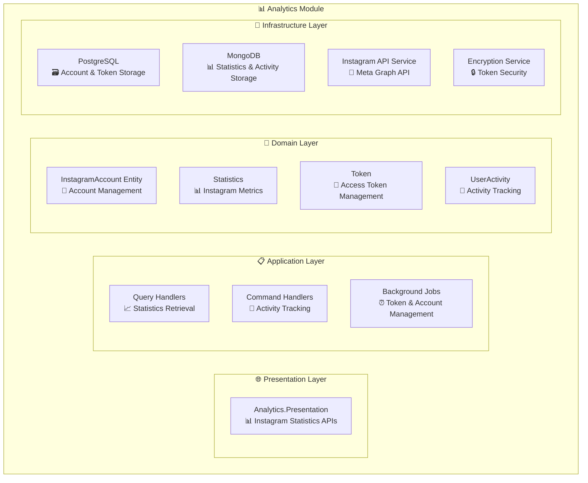

# 📊 Analytics Module

<div align="center">

*Instagram Analytics and User Activity Tracking for Lanka Platform*

**"Data-driven insights for influencer marketing success"**

[](.)
[](.)
[](.)

</div>

---

## 🎯 **Module Overview**

The Analytics Module provides **Instagram analytics integration** and **user activity tracking** for the Lanka platform. It handles Instagram account linking, statistics collection, and user behavior analysis to support the influencer marketing ecosystem.

### **🏗️ Current Architecture**



---

## 🎯 **Currently Implemented Features**

### **📱 Instagram Integration**
- ✅ **Account Linking**: Connect Instagram accounts via Facebook OAuth
- ✅ **Token Management**: Secure access token storage and refresh
- ✅ **Data Fetching**: Retrieve account data and statistics from Instagram API

> **Deep Dive:** See the [Instagram Linking Walkthrough](../../walkthroughs/instagram-linking.md) for a complete trace of the OAuth flow, token exchange, and how this module coordinates with Users module via integration events.

### **📊 Statistics Collection**
- ✅ **Overview Statistics**: Basic account metrics (followers, media count)
- ✅ **Engagement Statistics**: Likes, comments, shares, saves
- ✅ **Interaction Statistics**: Detailed engagement breakdowns
- ✅ **Metrics Statistics**: Time-series performance data
- ✅ **Audience Statistics**: Demographics and location data

### **👤 User Activity Tracking**
- ✅ **Login Tracking**: Monitor user login patterns
- ✅ **Campaign Activity**: Track campaign completions
- ✅ **Review Activity**: Monitor review creation
- ✅ **Activity Scoring**: Calculate user engagement levels

---

## 🏛️ **Domain Model**

### **🎯 Core Entities**

#### **InstagramAccount**
```csharp
public class InstagramAccount : Entity<InstagramAccountId>
{
    public UserId UserId { get; private set; }
    public InstagramAccountMetadata Metadata { get; private set; }
    public Token? Token { get; private set; }
}
```

#### **Token**
```csharp
public class Token : Entity<TokenId>
{
    public AccessToken AccessToken { get; private set; }
    public DateTimeOffset ExpiresAt { get; private set; }
    public InstagramAccountId InstagramAccountId { get; private set; }
}
```

#### **UserActivity** (MongoDB Document)
```csharp
public sealed class UserActivity
{
    public Guid UserId { get; set; }
    public DateTimeOffset LastLoginAt { get; set; }
    public List<DateTimeOffset> CampaignsCompletedAsClient { get; set; }
    public List<DateTimeOffset> CampaignsCompletedCreator { get; set; }
    public List<ReviewActivity> ReviewsWritten { get; set; }
    public double ActivityScore { get; set; }
    public string ActivityLevel { get; set; }
}
```

---

## 📨 **Domain Events**

### **🎯 Currently Implemented**

| Event | Trigger | Purpose |
|-------|---------|---------|
| `InstagramAccountDataFetchedDomainEvent` | Account data retrieved | Search sync & notifications |
| `InstagramAccountDataRenewedDomainEvent` | Token refreshed | Search sync update |
| `InstagramAccountDeletedDomainEvent` | Account removed | Cleanup & search removal |

---

## 🚀 **Application Layer**

### **📋 Commands**

#### **Instagram Account Management**
- ✅ `FetchInstagramAccountDataCommand` - Initial account data retrieval

#### **User Activity Tracking**
- ✅ `TrackUserLoginCommand` - Record user login
- ✅ `TrackCampaignCompletedCommand` - Record campaign completion
- ✅ `TrackReviewCreatedCommand` - Record review creation

### **🔍 Queries**

#### **Instagram Statistics**
- ✅ `GetOverviewStatisticsQuery` - Basic account metrics
- ✅ `GetEngagementStatisticsQuery` - Engagement data
- ✅ `GetInteractionStatisticsQuery` - Interaction breakdowns
- ✅ `GetMetricsStatisticsQuery` - Time-series metrics

#### **Instagram Content**
- ✅ `GetPostsQuery` - Retrieve user posts with insights

#### **Audience Analytics**
- ✅ `GetAgeDistributionQuery` - Age demographics
- ✅ `GetGenderDistributionQuery` - Gender breakdown
- ✅ `GetLocationDistributionQuery` - Geographic distribution
- ✅ `GetReachDistributionQuery` - Reach statistics

---

## 🔧 **Infrastructure**

### **🗄️ Data Storage**

#### **PostgreSQL (Transactional Data)**
- `instagram_accounts` - Account information
- `tokens` - Encrypted access tokens
- Standard outbox/inbox tables for event processing

#### **MongoDB (Analytics Data)**
Collections with TTL based on user activity level:
- `overview-statistics`
- `engagement-statistics`
- `interaction-statistics`
- `metrics-statistics`
- `audience-age-distribution`
- `audience-gender-distribution`
- `audience-location-distribution`
- `audience-reach-distribution`
- `user-activity`

### **🔗 External Integrations**

#### **Meta Graph API**
- **Facebook Login**: OAuth flow for Instagram access
- **Instagram Business API**: Statistics and media data
- **Token Management**: Automatic refresh and validation

### **⚙️ Background Jobs**

- ✅ **Check Tokens Job**: Validate and refresh expiring tokens
- ✅ **Update Account Job**: Periodic account data refresh
- ✅ **Cleanup Expired Analytics Job**: Remove TTL-expired data

---

## 🔄 **Integration Events**

### **📥 Consumed Events**

| Event | Source | Purpose |
|-------|--------|---------|
| `InstagramAccountLinkingStartedIntegrationEvent` | Users | Initialize Instagram connection |
| `InstagramAccessRenewalStartedIntegrationEvent` | Users | Renew access tokens |
| `UserDeletedIntegrationEvent` | Users | Remove user analytics data |

### **📤 Published Events**

| Event | Trigger | Consumers |
|-------|---------|-----------|
| Search sync events | Account updates | Matching module |

---

## 📊 **Data Flow**

### **🔄 Instagram Account Linking**
1. User initiates Instagram linking in Users module
2. `InstagramAccountLinkingStartedIntegrationEvent` received
3. Facebook OAuth flow initiated
4. Account data fetched and stored
5. `InstagramAccountDataFetchedDomainEvent` published
6. Search sync updated in Matching module

### **📈 Statistics Collection**
1. Background job triggers statistics update
2. Instagram API called with valid token
3. Statistics processed and stored in MongoDB with TTL
4. Data available via query endpoints

---

## 📋 **API Endpoints**

### **Instagram Statistics**
- `GET /analytics/instagram/overview` - Overview statistics
- `GET /analytics/instagram/engagement` - Engagement metrics
- `GET /analytics/instagram/interactions` - Interaction data
- `GET /analytics/instagram/metrics` - Time-series metrics
- `GET /analytics/instagram/posts` - User posts with insights

### **Audience Analytics**
- `GET /analytics/audience/age` - Age distribution
- `GET /analytics/audience/gender` - Gender breakdown
- `GET /analytics/audience/location` - Geographic data
- `GET /analytics/audience/reach` - Reach statistics

---

## 🚀 **Future Enhancements**

*The following features are planned but not yet implemented:*

### **📊 Advanced Analytics**
- **Growth Trends**: Follower growth analysis over time
- **Content Performance**: Post-level performance metrics
- **Optimal Posting Times**: Best posting schedule recommendations
- **Hashtag Analysis**: Hashtag performance tracking
- **Competitor Analysis**: Benchmarking against similar accounts

### **🤖 AI-Powered Insights**
- **Engagement Predictions**: ML-based engagement forecasting
- **Content Recommendations**: AI-suggested content strategies
- **Audience Insights**: Advanced demographic analysis

### **📱 Real-time Features**
- **Live Notifications**: Real-time engagement alerts
- **Dashboard Updates**: Live statistics streaming
- **Trend Detection**: Automatic trend identification
