# 📊 Analytics Module

<div align="center">

*Social Media Intelligence and Instagram Analytics for Lanka Platform*

**"Data is the new oil, but analytics is the refinery."**

[](.)
[](.)
[](.)

</div>

---

## 🎯 **Module Overview**

The Analytics Module is the data intelligence heart of the Lanka platform, responsible for **Instagram analytics**, **audience insights**, **performance metrics**, and **real-time social media data collection**. It transforms raw Instagram data into actionable insights for influencers and brands to optimize their social media strategies.

### **🏗️ Architecture**

```mermaid
graph TB
    subgraph "📊 Analytics Module"
        subgraph "🌐 Presentation Layer"
            AP[Analytics.Presentation<br/>📊 Analytics APIs & Reports]
        end
        
        subgraph "📋 Application Layer"
            AA[Analytics.Application<br/>🎯 Business Logic & Use Cases]
            AQ[Query Handlers<br/>📈 Data Retrieval]
            AC[Command Handlers<br/>🔄 Data Processing]
            BJ[Background Jobs<br/>⏰ Scheduled Tasks]
        end
        
        subgraph "💎 Domain Layer"
            IA[InstagramAccount Entity<br/>📱 Account Information]
            STATS[Statistics<br/>📊 Metrics & KPIs]
            AUD[Audience<br/>👥 Follower Insights]
            TOKEN[Token<br/>🔑 Access Management]
            REPO[Repositories<br/>🔍 Data Access Interfaces]
        end
        
        subgraph "🔧 Infrastructure Layer"
            IMPL[Repository Implementation<br/>🗃️ MongoDB & PostgreSQL]
            IGAPI[Instagram API Service<br/>🔗 External Integration]
            JOBS[Background Job Processing<br/>⚙️ Hangfire Integration]
            ENCRYPT[Encryption Service<br/>🔒 Token Security]
            INBOX[Inbox Pattern<br/>📥 Event Processing]
            OUTBOX[Outbox Pattern<br/>📤 Event Publishing]
        end
    end
    
    subgraph "🌐 External Systems"
        IG[Instagram Graph API<br/>📱 Data Source]
        MONGO[(MongoDB<br/>📊 Analytics Data)]
        POSTGRES[(PostgreSQL<br/>🗃️ Relational Data)]
        REDIS[(Redis<br/>⚡ Caching)]
        MB[(RabbitMQ<br/>📮 Message Bus)]
        HANGFIRE[Hangfire<br/>⏰ Job Scheduler]
    end
    
    AP --> AA
    AA --> AQ & AC & BJ
    AQ & AC --> IA & STATS & AUD & TOKEN
    IA & STATS & AUD & TOKEN --> REPO
    REPO --> IMPL
    IMPL --> MONGO & POSTGRES
    IGAPI --> IG
    BJ --> JOBS
    JOBS --> HANGFIRE
    ENCRYPT --> REDIS
    OUTBOX --> MB
    MB --> INBOX
    
    classDef moduleStyle fill:#e1f5fe,stroke:#01579b,stroke-width:2px
    classDef infraStyle fill:#f3e5f5,stroke:#4a148c,stroke-width:2px
    classDef dataStyle fill:#e8f5e8,stroke:#1b5e20,stroke-width:2px
    
    class AP,AA,AQ,AC,BJ,IA,STATS,AUD,TOKEN,REPO,IMPL,IGAPI,JOBS,ENCRYPT,INBOX,OUTBOX moduleStyle
    class IG,HANGFIRE,MB infraStyle
    class MONGO,POSTGRES,REDIS dataStyle
```



---

## 🎭 **Domain Model**

### **🏛️ Core Entities & Aggregates**

<table>
<tr>
<td width="50%">

#### **📱 InstagramAccount (Entity)**
The primary entity representing an Instagram business account.

**Key Properties:**
- `InstagramAccountId` - Unique identifier
- `UserId` - Owner reference
- `FacebookPageId` - Facebook page connection
- `AdvertisementAccountId` - Ad account reference
- `Category` - Business category
- `Metadata` - Account information
- `LastUpdatedAtUtc` - Data freshness
- `Token` - Access token information

**Key Operations:**
- `Create()` - Factory method for account creation
- `UpdateMetadata()` - Refresh account information
- `RenewToken()` - Update access token
- `MarkAsUpdated()` - Track data refresh

</td>
<td width="50%">

#### **📊 Core Value Objects**

**📈 Statistics**
- Follower metrics and growth
- Engagement rates and trends
- Reach and impression data
- Performance analytics

**👥 Audience**
- Demographic breakdowns
- Geographic distribution
- Interest categories
- Engagement patterns

**🔑 Token**
- Encrypted access tokens
- Expiration management
- Scope and permissions
- Refresh capabilities

**📊 Metadata**
- Account basic information
- Profile statistics
- Business category data
- Verification status

</td>
</tr>
</table>

### **⚡ Domain Events**

The Analytics module publishes domain events for data synchronization and business logic coordination:

| Event | Purpose | Triggered By |
|-------|---------|--------------|
| `InstagramAccountDataFetchedDomainEvent` | Fresh data retrieved | Data sync jobs |
| `InstagramAccountDataRenewedDomainEvent` | Token refreshed | Token renewal |
| `AnalyticsDataUpdatedDomainEvent` | Metrics calculated | Statistics processing |
| `AudienceInsightsGeneratedDomainEvent` | Audience analysis | Insight generation |

---

## 🎯 **Use Cases & Features**

### **📊 Analytics Intelligence**

<table>
<tr>
<td width="50%">

#### **📈 Performance Analytics**
1. **Follower Growth** tracking and trends
2. **Engagement Rate** calculations and optimization
3. **Content Performance** analysis
4. **Optimal Posting Times** identification
5. **Hashtag Performance** metrics

#### **🔑 Key Commands**
- `SyncInstagramDataCommand` - Data synchronization
- `CalculateStatisticsCommand` - Metrics processing
- `GenerateInsightsCommand` - Insight creation
- `RefreshTokenCommand` - Token renewal

</td>
<td width="50%">

#### **👥 Audience Intelligence**
1. **Demographic Analysis** by age, gender, location
2. **Interest Profiling** based on engagement
3. **Geographic Distribution** mapping
4. **Engagement Patterns** analysis
5. **Audience Growth** tracking

#### **📊 Key Queries**
- `GetInstagramStatisticsQuery` - Retrieve analytics
- `GetAudienceInsightsQuery` - Audience data
- `GetPerformanceMetricsQuery` - Performance data
- `GetGrowthTrendsQuery` - Growth analysis

</td>
</tr>
</table>

### **🔄 Data Synchronization Flow**


---

## 🔧 **Technical Implementation**

### **🗃️ Database Schema**

<table>
<tr>
<td width="50%">

#### **📊 PostgreSQL (Relational Data)**

```sql
-- Instagram Accounts
CREATE TABLE InstagramAccounts (
    Id UUID PRIMARY KEY,
    UserId UUID NOT NULL,
    FacebookPageId VARCHAR(255) NOT NULL,
    AdvertisementAccountId VARCHAR(255),
    Category VARCHAR(100),
    LastUpdatedAtUtc TIMESTAMPTZ,
    CreatedOnUtc TIMESTAMPTZ NOT NULL,
    ModifiedOnUtc TIMESTAMPTZ
);

-- Encrypted Tokens
CREATE TABLE Tokens (
    Id UUID PRIMARY KEY,
    InstagramAccountId UUID NOT NULL 
        REFERENCES InstagramAccounts(Id),
    EncryptedValue TEXT NOT NULL,
    TokenType VARCHAR(50) NOT NULL,
    ExpiresAtUtc TIMESTAMPTZ,
    CreatedOnUtc TIMESTAMPTZ NOT NULL
);

-- User Activities
CREATE TABLE UserActivities (
    Id UUID PRIMARY KEY,
    UserId UUID NOT NULL,
    ActivityType VARCHAR(100) NOT NULL,
    Metadata JSONB,
    OccurredOnUtc TIMESTAMPTZ NOT NULL
);
```

</td>
<td width="50%">

#### **📊 MongoDB (Analytics Data)**

```javascript
// Instagram Account Metadata
{
  "_id": ObjectId,
  "instagramAccountId": UUID,
  "accountData": {
    "username": String,
    "name": String,
    "biography": String,
    "followersCount": Number,
    "followingCount": Number,
    "mediaCount": Number,
    "profilePictureUrl": String,
    "website": String,
    "category": String,
    "isVerified": Boolean
  },
  "lastUpdated": ISODate,
  "ttl": ISODate
}

// Statistics Collection
{
  "_id": ObjectId,
  "instagramAccountId": UUID,
  "period": {
    "start": ISODate,
    "end": ISODate
  },
  "metrics": {
    "engagement": {
      "rate": Number,
      "totalLikes": Number,
      "totalComments": Number,
      "totalShares": Number
    },
    "reach": {
      "totalReach": Number,
      "totalImpressions": Number,
      "uniqueAccounts": Number
    },
    "growth": {
      "followersGained": Number,
      "followersLost": Number,
      "netGrowth": Number,
      "growthRate": Number
    }
  },
  "lastUpdated": ISODate,
  "ttl": ISODate
}

// Audience Insights
{
  "_id": ObjectId,
  "instagramAccountId": UUID,
  "demographics": {
    "ageGroups": [
      {
        "range": "18-24",
        "percentage": Number
      }
    ],
    "genderDistribution": {
      "male": Number,
      "female": Number,
      "other": Number
    }
  },
  "geographic": {
    "topCountries": Array,
    "topCities": Array
  },
  "interests": Array,
  "onlineHours": Array,
  "lastUpdated": ISODate,
  "ttl": ISODate
}
```

</td>
</tr>
</table>

---

## 🔄 **Integration & Communication**

### **📤 Published Events**

The Analytics module publishes these integration events:

<table>
<tr>
<td width="50%">

#### **Data Synchronization Events**
- `InstagramAccountDataFetchedIntegrationEvent`
  - Fresh analytics data available
  - Triggers campaign optimization recommendations
  
- `InstagramAccountDataRenewedIntegrationEvent`
  - Token refreshed successfully
  - Maintains continuous data flow

</td>
<td width="50%">

#### **Business Intelligence Events**
- `AnalyticsInsightGeneratedIntegrationEvent`
  - New insights calculated
  - Triggers notification to users
  
- `PerformanceAlertIntegrationEvent`
  - Significant performance changes
  - Alerts campaign managers

</td>
</tr>
</table>

### **📥 Consumed Events**

<table>
<tr>
<td width="50%">

#### **From Users Module**
- `InstagramAccountLinkedIntegrationEvent`
  - Starts analytics data collection
  - Creates Instagram account entity

- `UserDeletedIntegrationEvent`
  - Cleanup analytics data
  - Removes Instagram account connections

</td>
<td width="50%">

#### **From Campaigns Module**
- `CampaignStartedIntegrationEvent`
  - Track campaign performance
  - Create performance baselines

- `BloggerJoinedCampaignIntegrationEvent`
  - Monitor blogger performance
  - Track campaign analytics

</td>
</tr>
</table>

---

## 🛡️ **Security & Privacy**

### **🔐 Data Protection**

<table>
<tr>
<td width="50%">

#### **Token Security**
- **AES-256 encryption** for access tokens
- **Secure key management** with Azure Key Vault
- **Token rotation** for security
- **Scope limitation** to required permissions

#### **API Security**
- **Rate limiting** for Instagram API calls
- **Request signing** for webhook verification
- **IP whitelisting** for webhook endpoints
- **HTTPS enforcement** for all communications

</td>
<td width="50%">

#### **Data Privacy**
- **GDPR compliance** with data retention policies
- **Data minimization** - only collect necessary data
- **User consent** for data collection
- **Right to deletion** implementation

#### **Monitoring & Auditing**
- **API usage tracking** and alerting
- **Data access logging** for compliance
- **Anomaly detection** for suspicious activity
- **Compliance reporting** for audits

</td>
</tr>
</table>

### **🔄 Data Lifecycle Management**


---

## ⚡ **Performance & Scalability**

### **📊 Performance Characteristics**

<table>
<tr>
<td width="50%">

#### **🚀 Query Performance**
- **Analytics queries**: < 500ms response time
- **Audience insights**: < 300ms response time
- **Growth trends**: < 200ms response time
- **Real-time metrics**: < 100ms response time

#### **⏰ Background Jobs**
- **Data sync**: Every 6 hours per account
- **Statistics calculation**: Every 4 hours
- **Token renewal**: 24 hours before expiry
- **Data cleanup**: Daily at 2 AM UTC

</td>
<td width="50%">

#### **📈 Scalability Features**
- **Horizontal scaling** through job distribution
- **Database sharding** by Instagram account
- **Read replicas** for query optimization
- **CDN caching** for static analytics

#### **⚡ Optimization Strategies**
- **Data aggregation** for faster queries
- **Intelligent caching** with TTL policies
- **Connection pooling** for databases
- **Batch processing** for bulk operations

</td>
</tr>
</table>

### **📊 Monitoring & Observability**

<table>
<tr>
<td width="50%">

#### **📈 Business Metrics**
- **Data freshness** tracking
- **API quota utilization**
- **Sync success rates**
- **User engagement** with analytics

#### **🔧 Technical Metrics**
- **Database performance** monitoring
- **Background job** execution times
- **Memory usage** tracking
- **Error rates** and alerting

</td>
<td width="50%">

#### **🚨 Alert Conditions**
- **Instagram API** rate limit approaching
- **Data sync failures** for > 2 cycles
- **Database connection** pool exhaustion
- **Job processing** delays > 30 minutes

#### **📊 Dashboards**
- **Real-time analytics** overview
- **System health** monitoring
- **Business KPI** tracking
- **Performance trends** analysis

</td>
</tr>
</table>

---

## 🧪 **Testing Strategy**

### **📊 Test Coverage**

<table>
<tr>
<td width="33%">

#### **🔬 Unit Tests**
- **Domain model** behavior testing
- **Analytics calculations** validation
- **Business rules** enforcement
- **Error handling** scenarios
- **Value object** validation

**Coverage:** 95%+

</td>
<td width="33%">

#### **🔗 Integration Tests**
- **Instagram API** integration
- **Database operations** testing
- **Background job** execution
- **Event publishing/consuming**
- **End-to-end workflows**

**Coverage:** 90%+

</td>
<td width="33%">

#### **🏗️ Architecture Tests**
- **Layer dependencies** validation
- **Module boundaries** enforcement
- **Performance requirements**
- **Security constraints**
- **API contract** compliance

**Coverage:** 100%

</td>
</tr>
</table>

### **🎯 Key Test Scenarios**

```csharp
// Domain Model Testing
[Test]
public void InstagramAccount_UpdateMetadata_ShouldRaiseDataUpdatedEvent()
{
    // Arrange
    var account = InstagramAccount.Create(/* parameters */);
    var newMetadata = new Metadata(/* updated data */);
    
    // Act
    account.UpdateMetadata(newMetadata);
    
    // Assert
    account.GetDomainEvents()
        .Should().ContainSingle()
        .Which.Should().BeOfType<InstagramAccountDataFetchedDomainEvent>();
}

// Integration Testing
[Test]
public async Task SyncInstagramData_ShouldFetchAndStoreAnalytics()
{
    // Arrange
    var command = new SyncInstagramDataCommand(instagramAccountId);
    SetupInstagramApiMock();
    
    // Act
    var result = await Sender.Send(command);
    
    // Assert
    result.IsSuccess.Should().BeTrue();
    // Verify data stored in database
    // Verify events published
}

// Performance Testing
[Test]
public async Task GetAnalytics_ShouldReturnWithin500Ms()
{
    // Arrange
    var query = new GetInstagramStatisticsQuery(accountId, period);
    var stopwatch = Stopwatch.StartNew();
    
    // Act
    var result = await Sender.Send(query);
    stopwatch.Stop();
    
    // Assert
    stopwatch.ElapsedMilliseconds.Should().BeLessThan(500);
    result.IsSuccess.Should().BeTrue();
}
```

---

## 🚀 **Development Guidelines**

### **📝 Adding New Analytics Features**

1. **Define Domain Model** - Create entities and value objects for new metrics
2. **Add Background Jobs** - Implement data collection and processing
3. **Create Use Cases** - Add commands/queries for the new feature
4. **Implement Infrastructure** - Add repository and external service integrations
5. **Expose APIs** - Create endpoints for accessing the analytics
6. **Add Caching** - Implement appropriate caching strategies
7. **Add Tests** - Comprehensive testing at all levels
8. **Update Documentation** - Keep this guide current

### **🔄 Common Patterns**

<table>
<tr>
<td width="50%">

#### **Analytics Query Pattern**
```csharp
public sealed record GetInstagramStatisticsQuery(
    InstagramAccountId AccountId,
    DateTimeOffset StartDate,
    DateTimeOffset EndDate) : ICachedQuery<StatisticsResponse>
{
    public string CacheKey => 
        $"statistics:{AccountId}:{StartDate:yyyyMMdd}:{EndDate:yyyyMMdd}";
    
    public TimeSpan? Expiration => TimeSpan.FromHours(1);
}
```

#### **Background Job Pattern**
```csharp
[AutomaticRetry(Attempts = 3)]
public async Task SyncInstagramDataAsync(
    InstagramAccountId accountId,
    CancellationToken cancellationToken = default)
{
    // Implementation
}
```

</td>
<td width="50%">

#### **Domain Event Pattern**
```csharp
public sealed record InstagramAccountDataFetchedDomainEvent(
    InstagramAccountId AccountId,
    DateTimeOffset SyncedAt,
    int MetricsCount) : DomainEvent;
```

#### **Analytics Value Object Pattern**
```csharp
public sealed class EngagementMetrics : ValueObject
{
    public double Rate { get; }
    public int TotalLikes { get; }
    public int TotalComments { get; }
    public int TotalShares { get; }
    
    // Calculations and business logic
    protected override IEnumerable<object> GetEqualityComponents()
    {
        yield return Rate;
        yield return TotalLikes;
        yield return TotalComments;
        yield return TotalShares;
    }
}
```

</td>
</tr>
</table>

---

## 🔗 **Related Documentation**

<table>
<tr>
<td width="50%">

### **📚 Core Concepts**
- [🎭 Entity](../../catalog-of-terms/entity/) - Entity design patterns
- [💎 Value Object](../../catalog-of-terms/value-object/) - Immutable descriptors
- [⚡ Domain Event](../../catalog-of-terms/domain-event/) - Event modeling
- [🔄 CQRS](../../catalog-of-terms/cqrs/) - Command Query separation

</td>
<td width="50%">

### **🔧 Implementation Guides**
- [📤 Outbox Pattern](../../catalog-of-terms/outbox-pattern/) - Reliable event publishing
- [📥 Inbox Pattern](../../catalog-of-terms/inbox-pattern/) - Idempotent processing
- [✅ Result Pattern](../../catalog-of-terms/result-pattern/) - Error handling
- [🛡️ Resilience](../../catalog-of-terms/resilience/) - Circuit breakers

</td>
</tr>
</table>

---

## 🎯 **Quick Actions**

<div align="center">

[](../../../src/Modules/Analytics/)
[](../../../src/Modules/Analytics/Lanka.Modules.Analytics.Presentation/)
[](../../../src/Modules/Analytics/Lanka.Modules.Analytics.Infrastructure/BackgroundJobs/)
[](../../../src/Modules/Analytics/Lanka.Modules.Analytics.Infrastructure/Instagram/)

</div>

---

<div align="center">

*"In God we trust. All others must bring data."*

**- W. Edwards Deming**

**Analyze with confidence! 📊**

</div>

