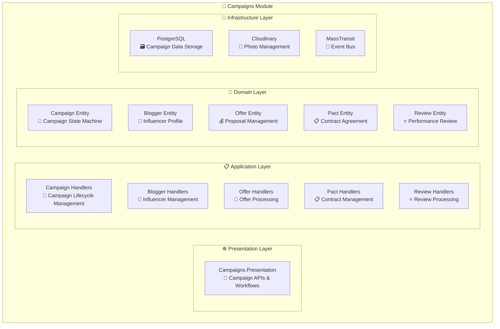

# 🎪 Campaigns Module

<div align="center">

*Campaign Orchestration and Influencer Marketing Management for Lanka Platform*

**"Great campaigns don't just happen, they are orchestrated."**

[](.)
[](.)
[](.)

</div>

---

## 🎯 **Module Overview**

The Campaigns Module handles **campaign lifecycle management**, **influencer collaboration**, **offer management**, and **review systems** for the Lanka platform. It provides the core business logic for connecting brands with influencers through campaigns, offers, and pacts.

### **🏗️ Current Architecture**



---

## 🎯 **Currently Implemented Features**

### **🎪 Campaign Lifecycle Management**
- ✅ **Campaign Creation**: `PendCampaignCommand` - Create campaigns in pending state
- ✅ **Campaign Confirmation**: `ConfirmCampaignCommand` - Accept campaign proposals
- ✅ **Campaign Rejection**: `RejectCampaignCommand` - Decline campaign proposals
- ✅ **Campaign Completion**: `MarkCampaignAsDoneCommand` → `CompleteCampaignCommand`
- ✅ **Campaign Cancellation**: `CancelCampaignCommand` - Cancel confirmed campaigns
- ✅ **Campaign Retrieval**: `GetCampaignQuery` - Get campaign details

### **👤 Blogger Management**
- ✅ **Blogger Registration**: `CreateBloggerCommand` - Register new influencers
- ✅ **Profile Management**: `UpdateBloggerCommand` - Update blogger profiles
- ✅ **Photo Management**: `SetProfilePhotoCommand`, `DeleteProfilePhotoCommand`
- ✅ **Account Deletion**: `DeleteBloggerCommand` - Remove blogger accounts
- ✅ **Instagram Integration**: Automatic metadata sync from Users module
- ✅ **Blogger Retrieval**: `GetBloggerQuery` - Get blogger profiles

### **💼 Offer Management**
- ✅ **Offer Creation**: `CreateOfferCommand` - Create new offers
- ✅ **Offer Updates**: `EditOfferCommand` - Modify existing offers
- ✅ **Offer Deletion**: `DeleteOfferCommand` - Remove offers
- ✅ **Offer Retrieval**: `GetOfferQuery` - Get offer details
- ✅ **Price Analytics**: `GetBloggerAverageOfferPricesQuery` - Pricing insights

### **📋 Pact (Contract) Management**
- ✅ **Pact Creation**: `CreatePactCommand` - Create blogger contracts
- ✅ **Pact Updates**: `EditPactCommand` - Modify contract terms
- ✅ **Pact Retrieval**: `GetBloggerPactQuery` - Get blogger contracts

### **⭐ Review System**
- ✅ **Review Creation**: `CreateReviewCommand` - Create campaign reviews
- ✅ **Review Updates**: `EditReviewCommand` - Modify reviews
- ✅ **Review Deletion**: `DeleteReviewCommand` - Remove reviews
- ✅ **Review Retrieval**: `GetReviewQuery`, `GetBloggerReviewQuery`

---

## 🏛️ **Domain Model**

### **🎯 Core Entities**

#### **Campaign (Aggregate Root)**
```csharp
public class Campaign : Entity<CampaignId>
{
    public Name Name { get; private set; }
    public Description Description { get; private set; }
    public Money Price { get; init; }
    public OfferId OfferId { get; init; }
    public BloggerId ClientId { get; init; }
    public BloggerId CreatorId { get; init; }
    public CampaignStatus Status { get; private set; }
    
    // Lifecycle methods: Confirm, Reject, MarkAsDone, Complete, Cancel
}
```

**Campaign Status Flow:**
```
Pending → Confirmed → Done → Completed
   ↓         ↓
Rejected   Cancelled
```

#### **Blogger**
```csharp
public class Blogger : Entity<BloggerId>
{
    public FirstName FirstName { get; private set; }
    public LastName LastName { get; private set; }
    public Email Email { get; private set; }
    public BirthDate BirthDate { get; private set; }
    public Bio Bio { get; private set; }
    public Photo? ProfilePhoto { get; private set; }
    public InstagramMetadata InstagramMetadata { get; private set; }
    public Pact? Pact { get; init; }
}
```

#### **Offer**
```csharp
public class Offer : Entity<OfferId>
{
    public PactId PactId { get; init; }
    public Name Name { get; private set; }
    public Description Description { get; private set; }
    public Money Price { get; private set; }
    public DateTimeOffset? LastCooperatedOnUtc { get; private set; }
}
```

#### **Pact**
```csharp
public sealed class Pact : Entity<PactId>
{
    public BloggerId BloggerId { get; init; }
    public Content Content { get; private set; }
    public DateTimeOffset LastUpdatedOnUtc { get; private set; }
    public IReadOnlyCollection<Offer> Offers { get; }
}
```

#### **Review**
```csharp
public sealed class Review : Entity<ReviewId>
{
    public BloggerId ClientId { get; init; }
    public BloggerId CreatorId { get; init; }
    public OfferId OfferId { get; init; }
    public CampaignId CampaignId { get; init; }
    public Rating Rating { get; private set; }
    public Comment Comment { get; private set; }
    public DateTimeOffset CreatedOnUtc { get; private set; }
}
```

---

## 📨 **Domain Events**

### **🎯 Campaign Events**
| Event | Trigger | Purpose |
|-------|---------|---------|
| `CampaignPendedDomainEvent` | Campaign created | Notify stakeholders of new campaign |
| `CampaignConfirmedDomainEvent` | Campaign accepted | Start campaign execution |
| `CampaignRejectedDomainEvent` | Campaign declined | Handle rejection workflow |
| `CampaignMarkedAsDoneDomainEvent` | Work completed | Mark campaign as finished |
| `CampaignCompletedDomainEvent` | Campaign finalized | Trigger completion processes |
| `CampaignCancelledDomainEvent` | Campaign cancelled | Handle cancellation cleanup |

### **🎯 Other Entity Events**
- `BloggerCreatedDomainEvent`, `BloggerUpdatedDomainEvent`, `BloggerDeletedDomainEvent`
- `OfferCreatedDomainEvent`, `OfferUpdatedDomainEvent`, `OfferDeletedDomainEvent`
- `PactCreatedDomainEvent`, `PactUpdatedDomainEvent`, `PactDeletedDomainEvent`
- `ReviewCreatedDomainEvent`, `ReviewUpdatedDomainEvent`, `ReviewDeletedDomainEvent`

---

## 🚀 **Application Layer**

### **📋 Campaign Commands**
- ✅ `PendCampaignCommand` - Create new campaign (pending state)
- ✅ `ConfirmCampaignCommand` - Accept campaign proposal
- ✅ `RejectCampaignCommand` - Decline campaign proposal
- ✅ `MarkCampaignAsDoneCommand` - Mark work as completed
- ✅ `CompleteCampaignCommand` - Finalize campaign
- ✅ `CancelCampaignCommand` - Cancel confirmed campaign

### **📋 Blogger Commands**
- ✅ `CreateBloggerCommand` - Register new blogger
- ✅ `UpdateBloggerCommand` - Update blogger profile
- ✅ `DeleteBloggerCommand` - Remove blogger account
- ✅ `SetProfilePhotoCommand` - Upload profile photo
- ✅ `DeleteProfilePhotoCommand` - Remove profile photo
- ✅ `UpdateInstagramDataCommand` - Sync Instagram metadata

### **📋 Offer Commands**
- ✅ `CreateOfferCommand` - Create new offer
- ✅ `EditOfferCommand` - Update existing offer
- ✅ `DeleteOfferCommand` - Remove offer

### **📋 Pact Commands**
- ✅ `CreatePactCommand` - Create blogger contract
- ✅ `EditPactCommand` - Update contract terms

### **📋 Review Commands**
- ✅ `CreateReviewCommand` - Create campaign review
- ✅ `EditReviewCommand` - Update review
- ✅ `DeleteReviewCommand` - Remove review

### **🔍 Queries**
- ✅ `GetCampaignQuery` - Retrieve campaign details
- ✅ `GetBloggerQuery` - Retrieve blogger profile
- ✅ `GetOfferQuery` - Retrieve offer details
- ✅ `GetBloggerPactQuery` - Retrieve blogger contract
- ✅ `GetReviewQuery` - Retrieve review details
- ✅ `GetBloggerReviewQuery` - Retrieve blogger reviews
- ✅ `GetBloggerAverageOfferPricesQuery` - Get pricing analytics

---

## 🔄 **Integration Events**

### **📤 Published Events**

| Event | Trigger | Consumers |
|-------|---------|-----------|
| `CampaignPendedIntegrationEvent` | Campaign created | Analytics (tracking) |
| `CampaignConfirmedIntegrationEvent` | Campaign accepted | Analytics (metrics) |
| `CampaignRejectedIntegrationEvent` | Campaign declined | Analytics (metrics) |
| `CampaignMarkedAsDoneIntegrationEvent` | Work completed | Analytics (completion) |
| `CampaignCompletedIntegrationEvent` | Campaign finalized | Analytics (final metrics) |
| `CampaignSearchSyncIntegrationEvent` | Campaign changes | Matching (search sync) |
| `BloggerUpdatedIntegrationEvent` | Blogger profile updated | Users (profile sync) |

### **📥 Consumed Events**

| Event | Source | Purpose |
|-------|--------|---------|
| `UserRegisteredIntegrationEvent` | Users | Create blogger profile |
| `UserDeletedIntegrationEvent` | Users | Clean up blogger data |
| `InstagramAccountDataRenewedIntegrationEvent` | Users | Update Instagram metadata |

---

## 🔧 **Infrastructure**

### **🗄️ Data Storage**

#### **PostgreSQL Schema: `campaigns`**
- `campaigns` - Campaign data and lifecycle
- `bloggers` - Influencer profiles and metadata
- `offers` - Pricing and service offerings
- `pacts` - Contract agreements
- `reviews` - Rating and feedback system
- Standard outbox/inbox tables for event processing

### **🔗 External Integrations**

#### **Cloudinary (Photo Management)**
- **Profile Photo Upload**: Secure image storage
- **Image Transformation**: Automatic resizing and optimization
- **CDN Delivery**: Fast global image delivery

#### **Instagram Integration**
- **Metadata Sync**: Automatic profile data updates
- **Account Linking**: Integration with Users module OAuth flow

---

## 📊 **Data Flow Examples**

### **🎪 Campaign Creation Flow**
1. User creates campaign via `PendCampaignCommand`
2. Campaign entity created with `Pending` status
3. `CampaignPendedDomainEvent` raised
4. `CampaignPendedIntegrationEvent` published
5. Analytics module tracks new campaign

### **👤 Blogger Registration Flow**
1. User registers via Users module
2. `UserRegisteredIntegrationEvent` consumed
3. `CreateBloggerCommand` automatically triggered
4. Blogger profile created
5. `BloggerCreatedDomainEvent` raised

### **⭐ Review Creation Flow**
1. Campaign completed successfully
2. Client creates review via `CreateReviewCommand`
3. Review entity created with rating and comment
4. `ReviewCreatedDomainEvent` raised
5. Analytics tracks review metrics

---

## 🛡️ **Security & Authorization**

### **🔒 Access Control**
- **Campaign Access**: Only clients and creators can modify their campaigns
- **Blogger Profiles**: Users can only modify their own profiles
- **Review System**: Only campaign participants can create reviews

### **🔑 Data Validation**
- **Input Validation**: Comprehensive validation for all commands
- **Business Rules**: Domain-driven validation (e.g., campaign status transitions)
- **Authorization Checks**: User context validation for all operations

---

## 📋 **API Endpoints**

### **Campaign Management**
- `POST /campaigns` - Create new campaign (pend)
- `GET /campaigns/{id}` - Get campaign details
- `PUT /campaigns/{id}/confirm` - Confirm campaign
- `PUT /campaigns/{id}/reject` - Reject campaign
- `PUT /campaigns/{id}/mark-done` - Mark as done
- `PUT /campaigns/{id}/complete` - Complete campaign
- `PUT /campaigns/{id}/cancel` - Cancel campaign

### **Blogger Management**
- `POST /bloggers` - Create blogger profile
- `GET /bloggers/{id}` - Get blogger profile
- `PUT /bloggers/{id}` - Update blogger profile
- `DELETE /bloggers/{id}` - Delete blogger account
- `POST /bloggers/{id}/photos` - Upload profile photo
- `DELETE /bloggers/{id}/photos` - Delete profile photo

### **Offer Management**
- `POST /offers` - Create new offer
- `GET /offers/{id}` - Get offer details
- `PUT /offers/{id}` - Update offer
- `DELETE /offers/{id}` - Delete offer
- `GET /bloggers/{id}/offers/average-prices` - Get pricing analytics

### **Pact Management**
- `POST /pacts` - Create new pact
- `GET /bloggers/{id}/pact` - Get blogger pact
- `PUT /pacts/{id}` - Update pact

### **Review Management**
- `POST /reviews` - Create review
- `GET /reviews/{id}` - Get review details
- `PUT /reviews/{id}` - Update review
- `DELETE /reviews/{id}` - Delete review
- `GET /bloggers/{id}/reviews` - Get blogger reviews

---

## 🚀 **Future Enhancements**

*The following features are planned but not yet implemented:*

### **📊 Advanced Queries**
- **Campaign Lists**: `GetCampaignsQuery` with pagination and filtering
- **Search Functionality**: `SearchCampaignsQuery`, `SearchBloggersQuery`
- **Bulk Operations**: Multi-campaign management

### **🎯 Campaign Features**
- **Campaign Templates**: Reusable campaign configurations
- **Campaign Analytics**: Advanced performance metrics
- **Campaign Scheduling**: Future-dated campaign execution

### **👥 Social Features**
- **Blogger Discovery**: Advanced search and matching
- **Collaboration Tools**: Enhanced communication features
- **Portfolio Management**: Showcase past campaigns

### **📈 Analytics Integration**
- **Performance Tracking**: Detailed campaign metrics
- **ROI Analysis**: Return on investment calculations
- **Trend Analysis**: Market insights and recommendations

---

## 🔧 **Configuration**

### **Cloudinary Settings**
```json
{
  "Campaigns": {
    "Cloudinary": {
      "CloudName": "your-cloud-name",
      "ApiKey": "your-api-key",
      "ApiSecret": "your-api-secret"
    }
  }
}
```

### **Database Configuration**
```json
{
  "Campaigns": {
    "Database": {
      "ConnectionString": "Host=localhost;Database=lanka_campaigns;Username=postgres;Password=password"
    }
  }
}
```

