# 🎪 Campaigns Module

<div align="center">

*Campaign Orchestration and Influencer Marketing Management for Lanka Platform*

**"Great campaigns don't just happen, they are orchestrated."**

[](.)
[](.)
[](.)

</div>

---

## 🎯 **Module Overview**

The Campaigns Module is the business orchestration heart of the Lanka platform, responsible for **campaign management**, **influencer collaboration**, **offer negotiations**, **contract management**, and **performance tracking**. It connects brands with influencers through a sophisticated workflow that ensures successful campaign execution and measurable results.

### **🏗️ Architecture**

```mermaid
graph TB
    subgraph "🎪 Campaigns Module"
        subgraph "🌐 Presentation Layer"
            CP[Campaigns.Presentation<br/>🚪 Campaign APIs & Workflows]
        end
        
        subgraph "📋 Application Layer"
            CA[Campaigns.Application<br/>🎯 Business Logic & Use Cases]
            CCH[Campaign Handlers<br/>🚀 Campaign Management]
            OCH[Offer Handlers<br/>💼 Offer Processing]
            PCH[Pact Handlers<br/>📋 Contract Management]
            RCH[Review Handlers<br/>⭐ Review Processing]
            BCH[Blogger Handlers<br/>👥 Influencer Management]
        end
        
        subgraph "💎 Domain Layer"
            CAMP[Campaign Entity<br/>🎪 Campaign Aggregate]
            BLOG[Blogger Entity<br/>👤 Influencer Profile]
            OFFER[Offer Entity<br/>💰 Proposal Management]
            PACT[Pact Entity<br/>📋 Contract Agreement]
            REV[Review Entity<br/>⭐ Performance Review]
            REPO[Repositories<br/>🔍 Data Access Interfaces]
        end
        
        subgraph "🔧 Infrastructure Layer"
            IMPL[Repository Implementation<br/>🗃️ PostgreSQL]
            PHOTO[Photo Service<br/>📸 Media Management]
            INBOX[Inbox Pattern<br/>📥 Event Processing]
            OUTBOX[Outbox Pattern<br/>📤 Event Publishing]
        end
    end
    
    subgraph "🌐 External Systems"
        POSTGRES[(PostgreSQL<br/>🗃️ Campaign Data)]
        BLOB[Azure Blob Storage<br/>📸 Media Files]
        MB[(RabbitMQ<br/>📮 Message Bus)]
        ANALYTICS[Analytics Module<br/>📊 Performance Data]
        USERS[Users Module<br/>👥 User Management]
    end
    
    CP --> CA
    CA --> CCH & OCH & PCH & RCH & BCH
    CCH & OCH & PCH & RCH & BCH --> CAMP & BLOG & OFFER & PACT & REV
    CAMP & BLOG & OFFER & PACT & REV --> REPO
    REPO --> IMPL
    IMPL --> POSTGRES
    PHOTO --> BLOB
    OUTBOX --> MB
    MB --> INBOX
    MB --> ANALYTICS & USERS
    
    classDef moduleStyle fill:#e1f5fe,stroke:#01579b,stroke-width:2px
    classDef infraStyle fill:#f3e5f5,stroke:#4a148c,stroke-width:2px
    classDef dataStyle fill:#e8f5e8,stroke:#1b5e20,stroke-width:2px
    
    class CP,CA,CCH,OCH,PCH,RCH,BCH,CAMP,BLOG,OFFER,PACT,REV,REPO,IMPL,PHOTO,INBOX,OUTBOX moduleStyle
    class BLOB,MB,ANALYTICS,USERS infraStyle
    class POSTGRES dataStyle
```



---

## 🎭 **Domain Model**

### **🏛️ Core Aggregates & Entities**

<table>
<tr>
<td width="50%">

#### **🎪 Campaign (Entity)**
The central entity representing a marketing campaign.

**Key Properties:**
- `CampaignId` - Unique identifier
- `Name` - Campaign title
- `Description` - Campaign details
- `Price` - Campaign budget
- `OfferId` - Associated offer reference
- `ClientId` - Campaign owner (brand)
- `Status` - Current campaign state
- `CreatedOnUtc` - Creation timestamp
- `StartOnUtc` / `EndOnUtc` - Campaign timeline

**Key Operations:**
- `Create()` - Factory method for campaign creation
- `Start()` - Begin campaign execution
- `Complete()` - Mark campaign as finished
- `Cancel()` - Cancel active campaign
- `UpdateDetails()` - Modify campaign information

#### **👤 Blogger (Entity)**
Represents an influencer in the platform.

**Key Properties:**
- `BloggerId` - Unique identifier
- `UserId` - Platform user reference
- `Name` - Display name
- `Bio` - Profile description
- `InstagramHandle` - Social media handle
- `FollowersCount` - Audience size
- `EngagementRate` - Performance metric
- `Categories` - Content niches

</td>
<td width="50%">

#### **💰 Offer (Entity)**
Represents a campaign proposal.

**Key Properties:**
- `OfferId` - Unique identifier
- `Name` - Offer title
- `Description` - Offer details
- `Price` - Compensation amount
- `Currency` - Payment currency
- `Status` - Current offer state
- `ExpiresOnUtc` - Offer validity
- `ClientId` - Offer creator

#### **📋 Pact (Entity)**
Represents a contractual agreement.

**Key Properties:**
- `PactId` - Unique identifier
- `CampaignId` - Associated campaign
- `BloggerId` - Contracted influencer
- `Terms` - Agreement terms
- `Status` - Contract state
- `SignedOnUtc` - Agreement timestamp

#### **⭐ Review (Entity)**
Represents campaign performance evaluation.

**Key Properties:**
- `ReviewId` - Unique identifier
- `CampaignId` - Reviewed campaign
- `BloggerId` - Reviewed influencer
- `Rating` - Performance score
- `Comment` - Detailed feedback
- `Status` - Review state

</td>
</tr>
</table>

### **⚡ Domain Events**

The Campaigns module publishes comprehensive domain events for workflow coordination:

| Event | Purpose | Triggered By |
|-------|---------|--------------|
| `CampaignCreatedDomainEvent` | New campaign registered | Campaign creation |
| `CampaignStartedDomainEvent` | Campaign execution begins | Campaign activation |
| `CampaignCompletedDomainEvent` | Campaign finished | Campaign completion |
| `OfferCreatedDomainEvent` | New offer published | Offer creation |
| `OfferAcceptedDomainEvent` | Offer accepted by influencer | Offer acceptance |
| `PactSignedDomainEvent` | Contract agreement finalized | Pact signing |
| `ReviewSubmittedDomainEvent` | Performance review added | Review submission |
| `BloggerJoinedDomainEvent` | Influencer joined platform | Blogger registration |

---

## 🎯 **Use Cases & Features**

### **🚀 Campaign Management**

<table>
<tr>
<td width="50%">

#### **📋 Campaign Lifecycle**
1. **Campaign Creation** with goals and budget
2. **Influencer Discovery** and selection
3. **Offer Management** and negotiations
4. **Contract Finalization** with legal terms
5. **Execution Monitoring** and tracking
6. **Performance Review** and evaluation
7. **Payment Processing** and completion

#### **🔑 Key Commands**
- `CreateCampaignCommand` - New campaign creation
- `StartCampaignCommand` - Campaign activation
- `CompleteCampaignCommand` - Campaign finalization
- `CancelCampaignCommand` - Campaign termination
- `UpdateCampaignCommand` - Campaign modification

</td>
<td width="50%">

#### **💼 Business Operations**
1. **Offer Negotiations** between brands and influencers
2. **Contract Management** with legal compliance
3. **Performance Tracking** with KPI monitoring
4. **Quality Assurance** through review system
5. **Payment Coordination** with financial tracking
6. **Relationship Management** for long-term partnerships

#### **📊 Key Queries**
- `GetCampaignDetailsQuery` - Campaign information
- `GetCampaignsByStatusQuery` - Status-based filtering
- `GetCampaignPerformanceQuery` - Performance metrics
- `GetBloggerCampaignsQuery` - Influencer campaigns
- `GetCampaignAnalyticsQuery` - Business intelligence

</td>
</tr>
</table>

### **🔄 Campaign Workflow**


---

## 🔧 **Technical Implementation**

### **🗃️ Database Schema**

```sql
-- Campaigns table (Entity)
CREATE TABLE Campaigns (
    Id UUID PRIMARY KEY,
    Name VARCHAR(200) NOT NULL,
    Description TEXT,
    Price DECIMAL(18,2) NOT NULL,
    Currency VARCHAR(3) NOT NULL,
    OfferId UUID NOT NULL,
    ClientId UUID NOT NULL,
    Status VARCHAR(50) NOT NULL,
    StartOnUtc TIMESTAMPTZ,
    EndOnUtc TIMESTAMPTZ,
    CreatedOnUtc TIMESTAMPTZ NOT NULL,
    ModifiedOnUtc TIMESTAMPTZ
);

-- Bloggers table (Entity)
CREATE TABLE Bloggers (
    Id UUID PRIMARY KEY,
    UserId UUID NOT NULL,
    Name VARCHAR(200) NOT NULL,
    Bio TEXT,
    InstagramHandle VARCHAR(100),
    FollowersCount INTEGER DEFAULT 0,
    EngagementRate DECIMAL(5,2) DEFAULT 0,
    Status VARCHAR(50) NOT NULL,
    CreatedOnUtc TIMESTAMPTZ NOT NULL,
    ModifiedOnUtc TIMESTAMPTZ
);

-- Blogger Categories (Many-to-Many)
CREATE TABLE BloggerCategories (
    BloggerId UUID NOT NULL REFERENCES Bloggers(Id),
    Category VARCHAR(100) NOT NULL,
    PRIMARY KEY (BloggerId, Category)
);

-- Offers table (Entity)
CREATE TABLE Offers (
    Id UUID PRIMARY KEY,
    Name VARCHAR(200) NOT NULL,
    Description TEXT,
    Price DECIMAL(18,2) NOT NULL,
    Currency VARCHAR(3) NOT NULL,
    Status VARCHAR(50) NOT NULL,
    ClientId UUID NOT NULL,
    ExpiresOnUtc TIMESTAMPTZ,
    CreatedOnUtc TIMESTAMPTZ NOT NULL,
    ModifiedOnUtc TIMESTAMPTZ
);

-- Pacts table (Entity)
CREATE TABLE Pacts (
    Id UUID PRIMARY KEY,
    CampaignId UUID NOT NULL REFERENCES Campaigns(Id),
    BloggerId UUID NOT NULL REFERENCES Bloggers(Id),
    Terms TEXT NOT NULL,
    Status VARCHAR(50) NOT NULL,
    SignedOnUtc TIMESTAMPTZ,
    CreatedOnUtc TIMESTAMPTZ NOT NULL,
    ModifiedOnUtc TIMESTAMPTZ
);

-- Reviews table (Entity)
CREATE TABLE Reviews (
    Id UUID PRIMARY KEY,
    CampaignId UUID NOT NULL REFERENCES Campaigns(Id),
    BloggerId UUID NOT NULL REFERENCES Bloggers(Id),
    Rating INTEGER NOT NULL CHECK (Rating >= 1 AND Rating <= 5),
    Comment TEXT,
    Status VARCHAR(50) NOT NULL,
    CreatedOnUtc TIMESTAMPTZ NOT NULL,
    ModifiedOnUtc TIMESTAMPTZ
);

-- Outbox Events
CREATE TABLE CampaignsModuleOutboxMessages (
    Id UUID PRIMARY KEY,
    Type VARCHAR(255) NOT NULL,
    Content JSONB NOT NULL,
    OccurredOnUtc TIMESTAMPTZ NOT NULL,
    ProcessedOnUtc TIMESTAMPTZ,
    Error TEXT
);

-- Inbox Events  
CREATE TABLE CampaignsModuleInboxMessages (
    Id UUID PRIMARY KEY,
    Type VARCHAR(255) NOT NULL,
    Content JSONB NOT NULL,
    OccurredOnUtc TIMESTAMPTZ NOT NULL,
    ProcessedOnUtc TIMESTAMPTZ,
    Error TEXT
);
```

---

## 🔄 **Integration & Communication**

### **📤 Published Events**

The Campaigns module publishes comprehensive integration events:

<table>
<tr>
<td width="50%">

#### **Campaign Lifecycle Events**
- `CampaignCreatedIntegrationEvent`
  - New campaign registered
  - Triggers analytics baseline creation
  
- `CampaignStartedIntegrationEvent`
  - Campaign execution begins
  - Initiates performance monitoring

- `CampaignCompletedIntegrationEvent`
  - Campaign finished successfully
  - Triggers final analytics calculation

#### **Business Process Events**
- `OfferCreatedIntegrationEvent`
  - New offer published
  - Notifies matching system

- `OfferAcceptedIntegrationEvent`
  - Influencer accepted offer
  - Triggers contract generation

</td>
<td width="50%">

#### **Collaboration Events**
- `BloggerJoinedIntegrationEvent`
  - New influencer registered
  - Updates search index

- `PactSignedIntegrationEvent`
  - Contract finalized
  - Legal compliance tracking

- `ReviewSubmittedIntegrationEvent`
  - Performance review added
  - Reputation system update

#### **Performance Events**
- `CampaignPerformanceIntegrationEvent`
  - Performance metrics updated
  - Analytics dashboard refresh

</td>
</tr>
</table>

### **📥 Consumed Events**

<table>
<tr>
<td width="50%">

#### **From Users Module**
- `UserCreatedIntegrationEvent`
  - Creates blogger profile eligibility
  - Initializes campaign access

- `UserDeletedIntegrationEvent`
  - Cleanup campaign associations
  - Archive blogger data

- `InstagramAccountLinkedIntegrationEvent`
  - Enable influencer features
  - Update blogger metrics

</td>
<td width="50%">

#### **From Analytics Module**
- `InstagramAccountDataFetchedIntegrationEvent`
  - Update blogger performance metrics
  - Refresh influencer statistics

- `AnalyticsInsightGeneratedIntegrationEvent`
  - Update campaign recommendations
  - Optimize targeting strategies

</td>
</tr>
</table>

---

## 🛡️ **Business Rules & Compliance**

### **💼 Business Logic Enforcement**

<table>
<tr>
<td width="50%">

#### **Campaign Rules**
- **Budget validation** against offer amounts
- **Timeline consistency** checks
- **Status transition** validation
- **Completion criteria** enforcement
- **Cancellation policies** application

#### **Offer Management**
- **Price negotiation** limits
- **Expiration handling** automation
- **Counter-offer** validation
- **Acceptance workflows** enforcement
- **Competition rules** compliance

</td>
<td width="50%">

#### **Contract Management**
- **Legal terms** validation
- **Signature requirements** enforcement
- **Compliance tracking** automation
- **Dispute resolution** workflows
- **Payment terms** management

#### **Performance Standards**
- **Quality metrics** enforcement
- **Delivery timelines** monitoring
- **Review criteria** validation
- **Rating consistency** checks
- **Reputation system** maintenance

</td>
</tr>
</table>

### **🔒 Security & Privacy**

<table>
<tr>
<td width="50%">

#### **Data Protection**
- **Campaign confidentiality** maintenance
- **Influencer privacy** protection
- **Financial data** encryption
- **Contract security** enforcement
- **Audit trail** maintenance

#### **Access Control**
- **Role-based permissions** for campaign access
- **Influencer verification** requirements
- **Brand authentication** validation
- **Data sharing** consent management

</td>
<td width="50%">

#### **Compliance Features**
- **GDPR compliance** with data portability
- **Contract law** compliance checking
- **Tax reporting** data collection
- **Industry regulations** adherence
- **International law** considerations

#### **Audit & Monitoring**
- **Complete activity logging** for compliance
- **Financial transaction** tracking
- **Performance metrics** validation
- **Dispute documentation** management

</td>
</tr>
</table>

---

## ⚡ **Performance & Scalability**

### **📊 Performance Characteristics**

<table>
<tr>
<td width="50%">

#### **🚀 Query Performance**
- **Campaign queries**: < 300ms response time
- **Blogger search**: < 200ms response time
- **Offer processing**: < 500ms response time
- **Performance analytics**: < 1s response time

#### **💼 Business Metrics**
- **Campaign creation**: < 2s end-to-end
- **Offer negotiations**: Real-time updates
- **Contract generation**: < 5s processing
- **Review submission**: < 1s response

</td>
<td width="50%">

#### **📈 Scalability Features**
- **Horizontal scaling** through stateless design
- **Database partitioning** by campaign status
- **Read replicas** for analytics queries
- **Caching strategies** for frequent data

#### **⚡ Optimization Strategies**
- **Query optimization** with proper indexing
- **Batch processing** for bulk operations
- **Asynchronous workflows** for long operations
- **CDN caching** for static content

</td>
</tr>
</table>

### **📊 Monitoring & Observability**

<table>
<tr>
<td width="50%">

#### **📈 Business Metrics**
- **Campaign success rates**
- **Offer acceptance rates**
- **Contract completion rates**
- **Review satisfaction scores**
- **Revenue per campaign**

#### **🔧 Technical Metrics**
- **API response times**
- **Database query performance**
- **Event processing latency**
- **Error rates and patterns**

</td>
<td width="50%">

#### **🚨 Alert Conditions**
- **Campaign deadline** approaching
- **Offer expiration** warnings
- **Contract signing** delays
- **Performance degradation** alerts
- **System failure** notifications

#### **📊 Dashboards**
- **Campaign performance** overview
- **Influencer network** health
- **Business KPI** tracking
- **System health** monitoring

</td>
</tr>
</table>

---

## 🧪 **Testing Strategy**

### **📊 Test Coverage**

<table>
<tr>
<td width="33%">

#### **🔬 Unit Tests**
- **Domain model** behavior validation
- **Business rules** enforcement testing
- **Workflow logic** verification
- **Error handling** scenarios
- **Value object** validation

**Coverage:** 95%+

</td>
<td width="33%">

#### **🔗 Integration Tests**
- **End-to-end workflows** testing
- **Database operations** validation
- **Event publishing/consuming**
- **API contract** compliance
- **External service** integration

**Coverage:** 90%+

</td>
<td width="33%">

#### **🏗️ Architecture Tests**
- **Module boundaries** enforcement
- **Dependency rules** validation
- **Performance requirements**
- **Security constraints**
- **Design pattern** compliance

**Coverage:** 100%

</td>
</tr>
</table>

### **🎯 Key Test Scenarios**

```csharp
// Domain Model Testing
[Test]
public void Campaign_Start_ShouldRaiseCampaignStartedEvent()
{
    // Arrange
    var campaign = Campaign.Create(/* parameters */);
    
    // Act
    var result = campaign.Start();
    
    // Assert
    result.IsSuccess.Should().BeTrue();
    campaign.GetDomainEvents()
        .Should().ContainSingle()
        .Which.Should().BeOfType<CampaignStartedDomainEvent>();
}

// Workflow Testing
[Test]
public async Task CompleteOfferWorkflow_ShouldCreatePactWhenAccepted()
{
    // Arrange
    var createOfferCommand = new CreateOfferCommand(/* parameters */);
    var acceptOfferCommand = new AcceptOfferCommand(offerId, bloggerId);
    
    // Act
    var offerResult = await Sender.Send(createOfferCommand);
    var acceptResult = await Sender.Send(acceptOfferCommand);
    
    // Assert
    offerResult.IsSuccess.Should().BeTrue();
    acceptResult.IsSuccess.Should().BeTrue();
    
    // Verify pact created
    var pact = await GetPactByOfferIdAsync(offerResult.Value);
    pact.Should().NotBeNull();
    pact.Status.Should().Be(PactStatus.Pending);
}

// Performance Testing
[Test]
public async Task SearchBloggers_ShouldReturnResultsWithin200Ms()
{
    // Arrange
    var query = new SearchBloggersQuery("fashion", categories: ["lifestyle"]);
    var stopwatch = Stopwatch.StartNew();
    
    // Act
    var result = await Sender.Send(query);
    stopwatch.Stop();
    
    // Assert
    stopwatch.ElapsedMilliseconds.Should().BeLessThan(200);
    result.IsSuccess.Should().BeTrue();
    result.Value.Should().NotBeEmpty();
}
```

---

## 🚀 **Development Guidelines**

### **📝 Adding New Campaign Features**

1. **Define Domain Model** - Create entities and value objects for new concepts
2. **Add Business Rules** - Implement domain logic and validation
3. **Create Use Cases** - Add commands/queries for the new feature
4. **Implement Workflows** - Add event handlers for process coordination
5. **Expose APIs** - Create endpoints for external access
6. **Add Integration Events** - Enable cross-module communication
7. **Add Tests** - Comprehensive testing at all levels
8. **Update Documentation** - Keep this guide current

### **🔄 Common Patterns**

<table>
<tr>
<td width="50%">

#### **Campaign Command Pattern**
```csharp
public sealed record CreateCampaignCommand(
    string Name,
    string Description,
    Money Price,
    OfferId OfferId,
    BloggerId ClientId,
    DateTimeOffset? StartOnUtc,
    DateTimeOffset? EndOnUtc) : ICommand<CampaignId>;
```

#### **Domain Event Pattern**
```csharp
public sealed record CampaignCreatedDomainEvent(
    CampaignId CampaignId,
    string Name,
    Money Price,
    DateTimeOffset OccurredOnUtc) : DomainEvent;
```

</td>
<td width="50%">

#### **Business Workflow Pattern**
```csharp
public class OfferAcceptedEventHandler 
    : INotificationHandler<OfferAcceptedDomainEvent>
{
    public async Task Handle(
        OfferAcceptedDomainEvent notification,
        CancellationToken cancellationToken)
    {
        // Create pact from accepted offer
        // Update campaign status
        // Publish integration event
    }
}
```

#### **Repository Pattern**
```csharp
public interface ICampaignRepository
{
    Task<Campaign?> GetByIdAsync(
        CampaignId id, 
        CancellationToken cancellationToken = default);
    
    Task<Result<CampaignId>> AddAsync(
        Campaign campaign,
        CancellationToken cancellationToken = default);
}
```

</td>
</tr>
</table>

---

## 🔗 **Related Documentation**

<table>
<tr>
<td width="50%">

### **📚 Core Concepts**
- [🎭 Entity](../../catalog-of-terms/entity/) - Entity design patterns
- [💎 Value Object](../../catalog-of-terms/value-object/) - Immutable descriptors
- [⚡ Domain Event](../../catalog-of-terms/domain-event/) - Event modeling
- [🏛️ Aggregate Root](../../catalog-of-terms/aggregate-root/) - Consistency boundaries

</td>
<td width="50%">

### **🔧 Implementation Guides**
- [🔄 CQRS](../../catalog-of-terms/cqrs/) - Command Query separation
- [📤 Outbox Pattern](../../catalog-of-terms/outbox-pattern/) - Reliable event publishing
- [📥 Inbox Pattern](../../catalog-of-terms/inbox-pattern/) - Idempotent processing
- [✅ Result Pattern](../../catalog-of-terms/result-pattern/) - Error handling

</td>
</tr>
</table>

---

## 🎯 **Quick Actions**

<div align="center">

[](../../../src/Modules/Campaigns/)
[](../../../src/Modules/Campaigns/Lanka.Modules.Campaigns.Presentation/)
[](../../../src/Modules/Campaigns/Lanka.Modules.Campaigns.Domain/)
[](../../../src/Modules/Campaigns/Lanka.Modules.Campaigns.Application/)

</div>

---

<div align="center">

*"A campaign is not about winning a battle, it's about orchestrating victory."*

**Campaign with confidence! 🎪**

</div>

