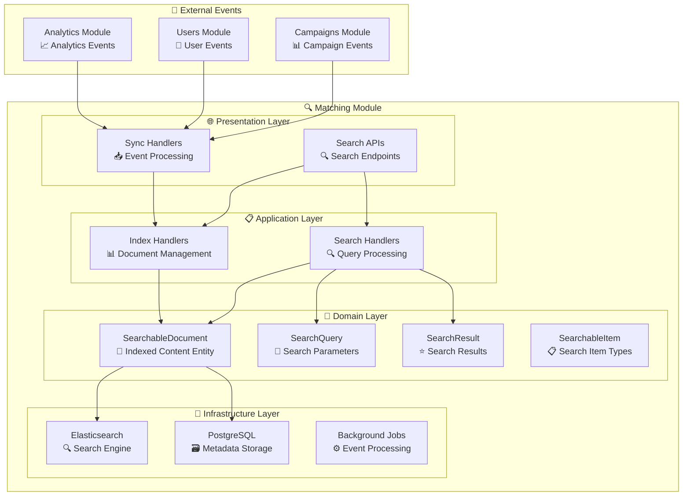

# 🔍 Matching Module

<div align="center">

*Advanced Search and Content Discovery Engine for Lanka Platform*

**"The right search at the right time creates discovery."**

[](.)
[](.)
[](.)

</div>

---

## 🎯 **Module Overview**

The Matching Module provides **search and indexing capabilities** for the Lanka platform. It handles document indexing, search queries, and content discovery across all platform entities. The module integrates with Elasticsearch for powerful full-text search functionality and automatically synchronizes with other modules through integration events.

### **🏗️ Current Architecture**


```mermaid
graph TB
    subgraph "🔍 Matching Module"
        subgraph "🌐 Presentation Layer"
            MP[Search APIs<br/>🔍 Search Endpoints]
            SYNC[Sync Handlers<br/>📥 Event Processing]
        end
        
        subgraph "📋 Application Layer"
            SCH[Search Handlers<br/>🔍 Query Processing]
            ICH[Index Handlers<br/>📊 Document Management]
        end
        
        subgraph "💎 Domain Layer"
            SD[SearchableDocument<br/>📄 Indexed Content Entity]
            SQ[SearchQuery<br/>🎯 Search Parameters]
            SR[SearchResult<br/>⭐ Search Results]
            SI[SearchableItem<br/>📋 Search Item Types]
        end
        
        subgraph "🔧 Infrastructure Layer"
            ES[Elasticsearch<br/>🔍 Search Engine]
            PG[PostgreSQL<br/>🗃️ Metadata Storage]
            JOBS[Background Jobs<br/>⚙️ Event Processing]
        end
    end
    
    subgraph "📡 External Events"
        CAMPAIGNS[Campaigns Module<br/>📊 Campaign Events]
        USERS[Users Module<br/>👥 User Events]
        ANALYTICS[Analytics Module<br/>📈 Analytics Events]
    end
    
    MP --> SCH & ICH
    SCH --> SD & SQ & SR
    ICH --> SD
    SD --> ES & PG
    SYNC --> ICH
    CAMPAIGNS --> SYNC
    USERS --> SYNC
    ANALYTICS --> SYNC
```

---

## 🎯 **Currently Implemented Features**

### **🔍 Advanced Search Capabilities**
- ✅ **Full-Text Search**: Multi-field search across title, content, and tags
- ✅ **Fuzzy Search**: Configurable distance matching for typo tolerance
- ✅ **Faceted Search**: Multi-dimensional filtering by type, date, metadata
- ✅ **Numeric Filters**: Range-based filtering (followers, engagement rate, price)
- ✅ **Audience Filters**: Country, gender, and age group facet filters
- ✅ **Date Range Filtering**: Time-based content filtering
- ✅ **Search Highlighting**: Automatic highlighting of matching terms
- ✅ **Pagination**: Efficient result pagination with configurable page sizes
- ✅ **Similarity Search**: More Like This (MLT) query for content discovery
- ✅ **Autocomplete Suggestions**: Prefix + wildcard title matching with debounce
- ✅ **Self-Exclusion**: Exclude specific items from results (e.g., current user)
- ✅ **Synonym Support**: Query expansion with synonyms
- ✅ **Client-Side Sorting**: PrimeNG table sorting on numeric and text columns

### **📊 Document Management**
- ✅ **Document Indexing**: `IndexDocumentCommand` - Add content to search index
- ✅ **Content Updates**: `UpdateSearchableDocumentContentCommand` - Modify indexed content
- ✅ **Document Removal**: `RemoveDocumentCommand` - Remove from search index
- ✅ **Document Activation/Deactivation**: Control document visibility in search
- ✅ **Bulk Operations**: Efficient batch processing of multiple documents

### **🔄 Event-Driven Synchronization**
- ✅ **Automatic Sync**: Real-time updates from all other modules
- ✅ **Blogger Sync**: Profile and content updates from Campaigns module
- ✅ **Campaign Sync**: Campaign data indexing for search
- ✅ **Review Sync**: Review content indexing
- ✅ **Offer Sync**: Service offering search integration
- ✅ **Pact Sync**: Contract content indexing
- ✅ **Instagram Sync**: Instagram account data from Analytics module

### **⚡ Performance & Caching**
- ✅ **Query Caching**: 3-minute cache for search results
- ✅ **Idempotent Processing**: Duplicate event handling prevention
- ✅ **Background Processing**: Asynchronous event processing
- ✅ **Outbox/Inbox Pattern**: Reliable event processing

---

## 🏛️ **Domain Model**

### **🎯 Core Entities**

#### **SearchableDocument (Entity)**
```csharp
public sealed class SearchableDocument : Entity<SearchableDocumentId>
{
    public SearchableItemType Type { get; private set; }
    public Title Title { get; private set; }
    public Content Content { get; private set; }
    public IReadOnlyCollection<string> Tags { get; private set; }
    public IReadOnlyDictionary<string, object> Metadata { get; private set; }
    public DateTimeOffset LastUpdated { get; private set; }
    public bool IsActive { get; private set; }
    public Guid SourceEntityId { get; private set; }
    
    // Methods: Create, Update, Activate, Deactivate
}
```

#### **SearchQuery (Value Object)**
```csharp
public sealed class SearchQuery
{
    public SearchText Text { get; }
    public bool EnableFuzzySearch { get; }
    public bool EnableSynonyms { get; }
    public double FuzzyDistance { get; }
    public IReadOnlyCollection<SearchableItemType> ItemTypes { get; }
    public IDictionary<string, object> NumericFilters { get; }
    public IDictionary<string, IReadOnlyCollection<string>> FacetFilters { get; }
    public DateRange? DateRange { get; }
    public bool OnlyActive { get; }
    public Pagination Pagination { get; }
    
    // Factory methods with validation
}
```

#### **SearchResult (Value Object)**
```csharp
public sealed class SearchResult
{
    public IReadOnlyCollection<SearchResultItem> Items { get; }
    public IReadOnlyDictionary<string, IReadOnlyCollection<string>> Facets { get; }
    public long TotalCount { get; }
    public int Page { get; }
    public int Size { get; }
    public TimeSpan ExecutionTime { get; }
}
```

### **🏷️ Searchable Item Types**
```csharp
public enum SearchableItemType
{
    Unknown = 0,
    Blogger = 1,           // Influencer profiles
    Campaign = 2,          // Marketing campaigns
    Offer = 3,             // Service offerings
    Review = 4,            // Campaign reviews
    Pact = 5,              // Contracts
    InstagramAccount = 6   // Instagram profiles
}
```

---

## 🚀 **Application Layer**

### **📋 Document Management Commands**
- ✅ `IndexDocumentCommand` - Index new document in search engine
- ✅ `UpdateSearchableDocumentContentCommand` - Update existing document content
- ✅ `RemoveDocumentCommand` - Remove document from search index
- ✅ `ActivateSearchableDocumentCommand` - Make document searchable
- ✅ `DeactivateSearchableDocumentCommand` - Hide document from search

### **🔍 Search Queries**
- ✅ `SearchDocumentsQuery` - Main search functionality with all advanced features
- ✅ `SearchSimilarQuery` - Find similar content based on source item (MLT)
- ✅ `GetSearchSuggestionsQuery` - Autocomplete suggestions from indexed titles

### **🎯 Search Features**

#### **SearchDocumentsQuery Parameters**
```csharp
public sealed record SearchDocumentsQuery(
    string Query,                                                    // Search text
    bool EnableFuzzySearch = true,                                  // Typo tolerance
    bool EnableSynonyms = true,                                     // Synonym expansion
    double FuzzyDistance = 0.8,                                     // Fuzzy matching threshold
    string? ItemTypes = null,                                       // Filter by content types
    double? PriceAmountMin = null,                                  // Price range filters
    double? PriceAmountMax = null,
    double? FollowersCountMin = null,                               // Follower count range
    double? FollowersCountMax = null,
    double? EngagementRateMin = null,                               // Engagement rate range
    double? EngagementRateMax = null,
    string? Category = null,                                        // Category facet filter
    string? AudienceCountry = null,                                 // Top audience country
    string? AudienceGender = null,                                  // Top audience gender
    string? AudienceAgeGroup = null,                                // Top audience age group
    DateTimeOffset? CreatedAfter = null,                           // Date range start
    DateTimeOffset? CreatedBefore = null,                          // Date range end
    bool OnlyActive = true,                                        // Include only active content
    int Page = 1,                                                  // Pagination page
    int Size = 20,                                                 // Results per page
    Guid? ExcludeItemId = null                                     // Exclude specific item
) : ICachedQuery<SearchDocumentsResponse>;
```

#### **Metadata Fields Used for Filtering**

| Field | Filter Type | Description |
|-------|-------------|-------------|
| `metadata.FollowersCount` | Numeric range | Instagram follower count |
| `metadata.EngagementRate` | Numeric range | Engagement rate percentage |
| `metadata.PriceAmount` | Numeric range | Offer price |
| `metadata.Category.keyword` | Facet (term) | Blogger category |
| `metadata.AudienceTopCountry.keyword` | Facet (term) | Top audience country |
| `metadata.AudienceTopGender.keyword` | Facet (term) | Top audience gender |
| `metadata.AudienceTopAgeGroup.keyword` | Facet (term) | Top audience age group |
| `metadata.InstagramUsername` | Display only | Instagram handle |
| `metadata.MediaCount` | Display only | Number of posts |

---

## 🔄 **Integration Events**

### **📥 Consumed Events (Auto-Sync)**

| Event | Source | Purpose |
|-------|--------|---------|
| `SearchSyncIntegrationEvent` | Campaigns, Analytics | Unified event for all entity changes (create/update/delete) |

A single `SearchSyncIntegrationEvent` carries an `ItemType` field that identifies the entity kind (Blogger, Campaign, Offer, Pact, Review, InstagramAccount). The handler maps it to the appropriate `SearchableItemType` and delegates to `SearchSyncIntegrationEventService`.

### **📤 Published Events**
*The Matching module is primarily a read-side projection and does not publish domain events. It only consumes events from other modules to maintain its search index.*

---

## 🔧 **Infrastructure**

### **🔍 Elasticsearch Integration**

#### **Modern .NET Client**
- **Elastic.Clients.Elasticsearch**: Latest official client
- **Automatic Index Management**: Schema creation and mapping
- **Complex Query Building**: Multi-field search with boosting
- **Aggregations**: Facet computation and analytics
- **Highlighting**: Search term highlighting with customizable tags

#### **Search Configuration**
```json
{
  "Matching": {
    "ElasticSearch": {
      "BaseUrl": "http://localhost:9200",
      "DefaultIndex": "lanka-search",
      "Username": "elastic",
      "Password": "password"
    }
  }
}
```

### **🗄️ Data Storage**

#### **PostgreSQL Schema: `matching`**
- `searchable_documents` - Document metadata (minimal, mainly for tracking)
- Standard outbox/inbox tables for event processing
- **Note**: Primary search data is stored in Elasticsearch

#### **Elasticsearch Index Structure**
```json
{
  "mappings": {
    "properties": {
      "sourceEntityId": { "type": "keyword" },
      "type": { "type": "keyword" },
      "title": {
        "type": "text",
        "analyzer": "standard",
        "fields": { "keyword": { "type": "keyword" } }
      },
      "content": {
        "type": "text",
        "analyzer": "standard"
      },
      "tags": { 
        "type": "keyword" 
      },
      "metadata": { 
        "type": "object", 
        "dynamic": true 
      },
      "lastUpdated": { "type": "date" },
      "isActive": { "type": "boolean" }
    }
  }
}
```

---

## 📊 **Data Flow**

### **🔄 How Elasticsearch Gets Updated (Change Data Capture)**

Elasticsearch stays in sync with the source data automatically via a Change Data Capture (CDC) pipeline built on EF Core interceptors. No manual domain event raising is required — any entity marked with `IChangeCaptured` is tracked automatically.

```
┌──────────────────────────────────────────────────────────────────────┐
│  Source Module (Campaigns / Analytics)                                │
│                                                                      │
│  1. Entity modified (create/update/delete)                           │
│     │                                                                │
│  2. DbContext.SaveChangesAsync() called                              │
│     │                                                                │
│  3. ChangeCaptureInterceptor detects IChangeCaptured entities        │
│     ├─ Reads entity properties directly from ChangeTracker           │
│     ├─ Extracts title, content, tags, metadata                       │
│     └─ Creates OutboxMessage with EntityChangeCapturedDomainEvent     │
│     │                                                                │
│  4. InsertOutboxMessagesInterceptor runs (existing domain events)     │
│     │                                                                │
│  5. SaveChanges commits entity + outbox messages in one transaction   │
│                                                                      │
└──────────────────────────────────────────────────────────────────────┘
                              │
                    ┌─────────▼──────────┐
                    │  ProcessOutboxJob   │
                    │  (Quartz, periodic) │
                    └─────────┬──────────┘
                              │
                    ┌─────────▼──────────────────────────────┐
                    │  EntityChangeCapturedDomainEventHandler  │
                    │  Converts domain event →                │
                    │  SearchSyncIntegrationEvent              │
                    │  Publishes to IEventBus (RabbitMQ)       │
                    └─────────┬──────────────────────────────┘
                              │
              ┌───────────────▼───────────────┐
              │  Matching Module               │
              │                                │
              │  ProcessInboxJob picks up event │
              │         │                      │
              │  SearchSyncIntegrationHandler   │
              │  Maps ItemType → SearchableItem │
              │         │                      │
              │  SearchSyncIntegrationService   │
              │  ├─ Create → IndexDocument     │
              │  ├─ Update → UpdateDocument    │
              │  └─ Delete → RemoveDocument    │
              │         │                      │
              │  Elasticsearch updated         │
              └────────────────────────────────┘
```

**Key files in the pipeline:**

| Step | File | Layer |
|------|------|-------|
| Marker interface | `IChangeCaptured` | Common.Domain |
| Base interceptor | `ChangeCaptureInterceptorBase` | Common.Infrastructure |
| Campaigns interceptor | `CampaignsChangeCaptureInterceptor` | Campaigns.Infrastructure |
| Analytics interceptor | `AnalyticsChangeCaptureInterceptor` | Analytics.Infrastructure |
| Domain event | `EntityChangeCapturedDomainEvent` | Common.Domain |
| Domain event handler | `EntityChangeCapturedDomainEventHandler` | Campaigns/Analytics.Application |
| Integration event | `SearchSyncIntegrationEvent` | Common.IntegrationEvents |
| Matching handler | `SearchSyncIntegrationEventHandler` | Matching.Presentation |
| Index service | `SearchSyncIntegrationEventService` | Matching.Presentation |

**Adding a new entity to search:**

1. Add `IChangeCaptured` to the entity class
2. Add a case to the module's `ChangeCaptureInterceptor` to extract search data
3. Done — no domain events, no integration event subclasses, no per-entity handlers

### **🔍 Search Query Flow**

1. User submits search via `SearchDocumentsQuery`
2. `SearchDocumentsQueryHandler` validates and processes query
3. Query converted to Elasticsearch DSL
4. Elasticsearch executes search with highlighting and facets
5. Results converted to domain objects
6. Response cached for 3 minutes
7. Structured results returned to client

---

## 🛡️ **Performance & Reliability**

### **⚡ Performance Features**
- **Query Caching**: 3-minute cache for identical search queries
- **Elasticsearch Optimization**: Proper index mapping and query optimization
- **Pagination**: Efficient result pagination to handle large datasets
- **Background Processing**: Asynchronous event processing to avoid blocking

### **🔒 Reliability Features**
- **Idempotent Processing**: Prevents duplicate event processing
- **Outbox/Inbox Pattern**: Ensures reliable event delivery
- **Error Handling**: Graceful degradation when Elasticsearch is unavailable
- **Retry Logic**: Automatic retry for failed operations

---

## 📋 **API Endpoints**

### **Search Operations**

#### `GET /search` — Full-text search with filters
| Parameter | Type | Default | Description |
|---|---|---|---|
| `q` | `string?` | `""` | Free-text search query |
| `fuzzy` | `bool?` | `true` | Enable fuzzy matching |
| `synonyms` | `bool?` | `true` | Enable synonym expansion |
| `fuzzyDistance` | `double?` | `0.8` | Fuzzy distance threshold |
| `itemTypes` | `string?` | — | Comma-separated item type IDs |
| `followersMin` / `followersMax` | `double?` | — | Follower count range |
| `engagementRateMin` / `engagementRateMax` | `double?` | — | Engagement rate range |
| `category` | `string?` | — | Category facet filter |
| `audienceCountry` | `string?` | — | Top audience country |
| `audienceGender` | `string?` | — | Top audience gender |
| `audienceAgeGroup` | `string?` | — | Top audience age group |
| `createdAfter` / `createdBefore` | `DateTimeOffset?` | — | Date range |
| `onlyActive` | `bool?` | `true` | Active documents only |
| `excludeItemId` | `Guid?` | — | Exclude specific item from results |
| `page` / `size` | `int?` | `1` / `20` | Pagination |

#### `GET /search/suggestions` — Autocomplete suggestions
| Parameter | Type | Default | Description |
|---|---|---|---|
| `q` | `string` | (required) | Partial query text (min 2 chars) |
| `itemType` | `int?` | — | Filter by item type |
| `limit` | `int?` | `10` | Max suggestions |

Returns `string[]` of matching document titles via prefix + wildcard queries.

#### `GET /search/similar/{sourceItemId:guid}` — More Like This
| Parameter | Type | Default | Description |
|---|---|---|---|
| `sourceItemId` | `Guid` | (route) | Source item to find similar items for |
| `sourceType` | `SearchableItemType` | (required) | Type of the source item |
| `itemTypes` | `string?` | — | Filter result types |
| `onlyActive` | `bool?` | `true` | Active only |
| `page` / `size` | `int?` | `1` / `20` | Pagination |

Uses Elasticsearch MLT query on `title`, `content`, and `tags` fields with `MinimumShouldMatch = 30%` and ICU analyzer.

### **Document Management** *(Internal APIs)*
- `POST /documents/index` - Index new document
- `PUT /documents/{id}` - Update document content
- `DELETE /documents/{id}` - Remove document
- `PUT /documents/{id}/activate` - Activate document
- `PUT /documents/{id}/deactivate` - Deactivate document

---

## 🚀 **Future Enhancements**

*The following features are planned but not yet implemented:*

### **🤖 Machine Learning Features**
- **Personalized Search**: User-specific result ranking
- **Recommendation Engine**: ML-based content recommendations
- **Search Analytics**: Query performance and user behavior analysis
- **A/B Testing**: Search algorithm experimentation

### **📊 Advanced Analytics**
- **Search Metrics**: Query performance tracking
- **Popular Searches**: Trending search terms
- **User Search History**: Personal search tracking
- **Click-through Analytics**: Result engagement metrics

### **🎯 Enhanced Search Features**
- **Semantic Search**: Natural language understanding
- **Image Search**: Visual content search capabilities
- **Voice Search**: Speech-to-text search integration
- **Geolocation Search**: Location-based content discovery

### **🔧 Advanced Configuration**
- **Custom Analyzers**: Domain-specific text analysis
- **Search Templates**: Predefined search configurations
- **Multi-language Support**: Internationalization features
- **Custom Scoring**: Business-specific relevance algorithms

---

## 🔧 **Configuration**

### **Elasticsearch Settings**
```json
{
  "Matching": {
    "ElasticSearch": {
      "BaseUrl": "http://localhost:9200",
      "DefaultIndex": "lanka-search",
      "Username": "elastic",
      "Password": "password",
      "RequestTimeout": "00:00:30",
      "MaxRetries": 3
    }
    }
}
```

### **Caching Configuration**
```json
{
  "Matching": {
    "Cache": {
      "SearchResults": {
        "ExpirationMinutes": 3,
        "MaxSize": 1000
      }
    }
    }
}
```

### **Event Processing**
```json
{
  "Matching": {
    "Outbox": {
      "IntervalInSeconds": 10,
      "BatchSize": 15
    },
    "Inbox": {
      "IntervalInSeconds": 10,
      "BatchSize": 15
    }
    }
}
```