# 🔍 Matching Module

<div align="center">

*Advanced Search and Content Discovery Engine for Lanka Platform*

**"The right match at the right time creates magic."**

[](.)
[](.)
[](.)

</div>

---

## 🎯 **Module Overview**

The Matching Module is the intelligent discovery engine of the Lanka platform, responsible for **advanced search capabilities**, **content matching algorithms**, **relevance scoring**, and **intelligent recommendations**. It provides sophisticated search functionality across campaigns, influencers, offers, and reviews, enabling users to find exactly what they're looking for with precision and speed.

### **🏗️ Architecture**

```mermaid
graph TB
    subgraph "🔍 Matching Module"
        subgraph "🌐 Presentation Layer"
            MP[Matching.Presentation<br/>🔍 Search APIs & Endpoints]
        end
        
        subgraph "📋 Application Layer"
            MA[Matching.Application<br/>🎯 Search Logic & Algorithms]
            SCH[Search Handlers<br/>🔍 Query Processing]
            ICH[Index Handlers<br/>📊 Content Indexing]
            RCH[Recommendation Handlers<br/>🎯 ML-based Suggestions]
        end
        
        subgraph "💎 Domain Layer"
            SI[SearchableItem<br/>📄 Indexed Content]
            MC[MatchingCriteria<br/>🎯 Search Parameters]
            MR[MatchResult<br/>⭐ Search Results]
            SIT[SearchableItemType<br/>🏷️ Content Categories]
            REPO[Repositories<br/>🔍 Data Access Interfaces]
        end
        
        subgraph "🔧 Infrastructure Layer"
            SEARCH[Search Engine<br/>🔍 Elasticsearch/Azure Search]
            IMPL[Repository Implementation<br/>🗃️ Database Access]
            INDEX[Indexing Service<br/>📊 Content Processing]
            ML[ML Service<br/>🤖 Recommendation Engine]
            INBOX[Inbox Pattern<br/>📥 Event Processing]
        end
    end
    
    subgraph "🌐 External Systems"
        ES[Elasticsearch<br/>🔍 Search Engine]
        POSTGRES[(PostgreSQL<br/>🗃️ Metadata Storage)]
        REDIS[(Redis<br/>⚡ Caching)]
        MB[(RabbitMQ<br/>📮 Message Bus)]
        AZURE[Azure Cognitive Search<br/>🧠 AI-Powered Search]
    end
    
    subgraph "📊 Data Sources"
        USERS[Users Module<br/>👥 User Profiles]
        CAMPAIGNS[Campaigns Module<br/>🎪 Campaign Data]
        ANALYTICS[Analytics Module<br/>📊 Performance Data]
    end
    
    MP --> MA
    MA --> SCH & ICH & RCH
    SCH & ICH & RCH --> SI & MC & MR & SIT
    SI & MC & MR & SIT --> REPO
    REPO --> IMPL & SEARCH
    IMPL --> POSTGRES
    SEARCH --> ES & AZURE
    INDEX --> REDIS
    ML --> AZURE
    MB --> INBOX
    USERS & CAMPAIGNS & ANALYTICS --> MB
    
    classDef moduleStyle fill:#e1f5fe,stroke:#01579b,stroke-width:2px
    classDef infraStyle fill:#f3e5f5,stroke:#4a148c,stroke-width:2px
    classDef dataStyle fill:#e8f5e8,stroke:#1b5e20,stroke-width:2px
    classDef sourceStyle fill:#fff3e0,stroke:#e65100,stroke-width:2px
    
    class MP,MA,SCH,ICH,RCH,SI,MC,MR,SIT,REPO,IMPL,SEARCH,INDEX,ML,INBOX moduleStyle
    class ES,AZURE,MB infraStyle
    class POSTGRES,REDIS dataStyle
    class USERS,CAMPAIGNS,ANALYTICS sourceStyle
```



---

## 🎭 **Domain Model**

### **🏛️ Core Entities & Value Objects**

<table>
<tr>
<td width="50%">

#### **📄 SearchableItem**
The primary entity representing indexed content across the platform.

**Key Properties:**
- `Id` - Unique identifier (Guid)
- `Type` - Content category (SearchableItemType)
- `Title` - Display title for search results
- `Content` - Full-text searchable content
- `Tags` - Collection of searchable tags
- `LastUpdated` - Content freshness timestamp
- `IsActive` - Visibility and searchability flag

**Key Operations:**
- `Create()` - Factory method for item creation
- `UpdateContent()` - Refresh indexed content
- `Deactivate()` - Remove from search index
- `AddTags()` - Enhance searchability

#### **🎯 MatchingCriteria**
Value object representing search parameters and filters.

**Key Properties:**
- `Query` - Search text/keywords
- `MinimumRelevance` - Quality threshold
- `Facets` - Category filters
- `PageNumber` - Result pagination
- `PageSize` - Results per page

</td>
<td width="50%">

#### **⭐ MatchResult**
Value object representing search result with relevance scoring.

**Key Properties:**
- `Item` - The matched searchable item
- `RelevanceScore` - Matching accuracy (0.0-1.0)
- `MatchedFields` - Which fields contributed to match
- `Highlights` - Emphasized matching text
- `Rank` - Position in result set

#### **🏷️ SearchableItemType**
Enum defining categories of searchable content.

**Values:**
- `Blogger` - Influencer profiles
- `Campaign` - Marketing campaigns
- `Offer` - Business proposals
- `Review` - Performance evaluations
- `User` - Platform users (limited scope)

</td>
</tr>
</table>

### **⚡ Domain Events**

The Matching module operates primarily through event consumption for index updates:

| Event | Purpose | Triggered By |
|-------|---------|--------------|
| `ContentIndexedDomainEvent` | New content added to search | Content indexing |
| `SearchPerformedDomainEvent` | Search analytics tracking | Search queries |
| `RecommendationGeneratedDomainEvent` | ML-based suggestions created | Recommendation engine |
| `IndexUpdatedDomainEvent` | Search index refreshed | Batch updates |

---

## 🎯 **Use Cases & Features**

### **🔍 Search Capabilities**

<table>
<tr>
<td width="50%">

#### **📊 Advanced Search Features**
1. **Full-text Search** across all content types
2. **Faceted Search** with category filtering
3. **Fuzzy Matching** for typo tolerance
4. **Semantic Search** with AI understanding
5. **Geo-spatial Search** for location-based results
6. **Time-based Filtering** for content freshness

#### **🔑 Key Commands**
- `IndexContentCommand` - Add content to search
- `UpdateIndexCommand` - Refresh indexed content
- `RemoveFromIndexCommand` - Remove content
- `RebuildIndexCommand` - Full index reconstruction

</td>
<td width="50%">

#### **🎯 Intelligent Matching**
1. **Relevance Scoring** with custom algorithms
2. **Personalized Results** based on user behavior
3. **ML-powered Recommendations** for discovery
4. **Auto-complete Suggestions** for query assistance
5. **Similar Content** recommendations
6. **Trending Content** identification

#### **📊 Key Queries**
- `SearchContentQuery` - Primary search functionality
- `GetRecommendationsQuery` - Personalized suggestions
- `GetSimilarContentQuery` - Related content discovery
- `GetTrendingContentQuery` - Popular content
- `AutoCompleteQuery` - Search assistance

</td>
</tr>
</table>

### **🔄 Search Flow**


---

## 🔧 **Technical Implementation**

### **🗃️ Database & Search Schema**

<table>
<tr>
<td width="50%">

#### **📊 PostgreSQL (Metadata)**

```sql
-- Search Metadata
CREATE TABLE SearchMetadata (
    Id UUID PRIMARY KEY,
    ItemId UUID NOT NULL,
    ItemType VARCHAR(50) NOT NULL,
    Title VARCHAR(500) NOT NULL,
    Content TEXT,
    Tags TEXT[], -- PostgreSQL array
    LastIndexed TIMESTAMPTZ NOT NULL,
    IsActive BOOLEAN DEFAULT true,
    CreatedOnUtc TIMESTAMPTZ NOT NULL,
    ModifiedOnUtc TIMESTAMPTZ
);

-- Search Analytics
CREATE TABLE SearchAnalytics (
    Id UUID PRIMARY KEY,
    Query VARCHAR(1000) NOT NULL,
    UserId UUID,
    ResultCount INTEGER NOT NULL,
    ClickedResultId UUID,
    SearchType VARCHAR(100),
    ExecutionTimeMs INTEGER,
    CreatedOnUtc TIMESTAMPTZ NOT NULL
);

-- Search Trends
CREATE TABLE SearchTrends (
    Id UUID PRIMARY KEY,
    Query VARCHAR(500) NOT NULL,
    SearchCount INTEGER NOT NULL,
    Period DATE NOT NULL,
    Category VARCHAR(100),
    Region VARCHAR(100),
    CreatedOnUtc TIMESTAMPTZ NOT NULL
);
```

</td>
<td width="50%">

#### **🔍 Elasticsearch Schema**

```json
{
  "mappings": {
    "properties": {
      "id": { "type": "keyword" },
      "itemType": { "type": "keyword" },
      "title": {
        "type": "text",
        "analyzer": "standard",
        "fields": {
          "keyword": { "type": "keyword" },
          "suggest": { "type": "completion" }
        }
      },
      "content": {
        "type": "text",
        "analyzer": "standard"
      },
      "tags": { "type": "keyword" },
      "lastUpdated": { "type": "date" },
      "isActive": { "type": "boolean" },
      "metadata": {
        "type": "object",
        "properties": {
          "category": { "type": "keyword" },
          "location": { "type": "geo_point" },
          "price": { "type": "scaled_float" },
          "rating": { "type": "float" },
          "popularity": { "type": "float" }
        }
      }
    }
  },
  "settings": {
    "analysis": {
      "analyzer": {
        "custom_text_analyzer": {
          "type": "custom",
          "tokenizer": "standard",
          "filter": [
            "lowercase",
            "asciifolding",
            "synonyms",
            "stemmer"
          ]
        }
      }
    }
  }
}
```

</td>
</tr>
</table>

---

## 🔄 **Integration & Communication**

### **📥 Consumed Events**

The Matching module primarily consumes events to maintain its search index:

<table>
<tr>
<td width="50%">

#### **From Users Module**
- `UserCreatedIntegrationEvent`
  - Index new user profiles (limited scope)
  - Update recommendation models

- `UserDeletedIntegrationEvent`
  - Remove user from search index
  - Clean up associated recommendations

#### **From Analytics Module**
- `InstagramAccountDataFetchedIntegrationEvent`
  - Update blogger performance metrics
  - Refresh search relevance scores

</td>
<td width="50%">

#### **From Campaigns Module**
- `BloggerJoinedIntegrationEvent`
  - Index new influencer profiles
  - Update blogger search metadata

- `CampaignCreatedIntegrationEvent`
  - Index new campaigns for discovery
  - Update campaign search data

- `OfferCreatedIntegrationEvent`
  - Index new offers for matching
  - Enable offer discovery

- `ReviewSubmittedIntegrationEvent`
  - Index new reviews for reputation
  - Update quality scores

</td>
</tr>
</table>

### **📤 Published Events**

<table>
<tr>
<td width="50%">

#### **Search Intelligence Events**
- `SearchTrendDetectedIntegrationEvent`
  - Popular search patterns identified
  - Informs content strategy

- `RecommendationGeneratedIntegrationEvent`
  - ML-powered suggestions created
  - Triggers personalization updates

</td>
<td width="50%">

#### **Performance Events**
- `ContentIndexedIntegrationEvent`
  - New content available for search
  - Search index updated

- `SearchPerformanceIntegrationEvent`
  - Search quality metrics
  - System performance insights

</td>
</tr>
</table>

---

## ⚡ **Performance & Scalability**

### **📊 Performance Characteristics**

<table>
<tr>
<td width="50%">

#### **🚀 Search Performance**
- **Basic text search**: < 50ms response time
- **Complex faceted search**: < 200ms response time
- **Auto-complete suggestions**: < 20ms response time
- **Recommendation queries**: < 300ms response time

#### **📊 Index Performance**
- **Real-time indexing**: < 1s for single items
- **Bulk indexing**: 1000 items/minute
- **Index optimization**: Runs during off-peak hours
- **Index size**: Supports millions of documents

</td>
<td width="50%">

#### **📈 Scalability Features**
- **Horizontal scaling** with Elasticsearch clusters
- **Read replicas** for query distribution
- **Sharding strategies** for large datasets
- **Caching layers** for frequent queries

#### **⚡ Optimization Strategies**
- **Query result caching** with Redis
- **Index warming** for common queries
- **Lazy loading** for large result sets
- **Pagination optimization** for performance

</td>
</tr>
</table>

### **🔍 Search Quality Metrics**

<table>
<tr>
<td width="50%">

#### **📊 Relevance Metrics**
- **Click-through rate** - Search result engagement
- **Conversion rate** - Search to action ratio
- **Result quality score** - Manual evaluation
- **User satisfaction** - Feedback and ratings

#### **⚡ Performance Metrics**
- **Query latency** - Response time tracking
- **Index freshness** - Data currency monitoring
- **Search success rate** - Queries returning results
- **Error rate** - Failed query tracking

</td>
<td width="50%">

#### **🎯 Business Metrics**
- **Search usage patterns** - Popular queries
- **Discovery effectiveness** - Content findability
- **Recommendation accuracy** - ML model performance
- **User engagement** - Search-driven actions

#### **🚨 Alert Conditions**
- **Search latency** > 500ms
- **Index lag** > 5 minutes
- **Error rate** > 1%
- **Result quality** degradation

</td>
</tr>
</table>

---

## 🧪 **Testing Strategy**

### **📊 Test Coverage**

<table>
<tr>
<td width="33%">

#### **🔬 Unit Tests**
- **Search algorithm** validation
- **Relevance scoring** logic
- **Query parsing** accuracy
- **Filter application** correctness
- **Business rule** enforcement

**Coverage:** 95%+

</td>
<td width="33%">

#### **🔗 Integration Tests**
- **Search engine** integration
- **Index operations** testing
- **ML service** integration
- **Cache behavior** validation
- **Event processing** testing

**Coverage:** 90%+

</td>
<td width="33%">

#### **🏗️ Performance Tests**
- **Query response time** validation
- **Concurrent user** load testing
- **Index size** scalability testing
- **Memory usage** optimization
- **Throughput** benchmarking

**Coverage:** Key scenarios

</td>
</tr>
</table>

### **🎯 Key Test Scenarios**

```csharp
// Search Functionality Testing
[Test]
public async Task SearchContent_ShouldReturnRelevantResults()
{
    // Arrange
    var criteria = new MatchingCriteria(
        query: "fashion blogger",
        minimumRelevance: 0.7,
        facets: ["blogger"],
        pageNumber: 1,
        pageSize: 10);
    
    // Act
    var result = await searchService.SearchAsync(criteria);
    
    // Assert
    result.Should().NotBeNull();
    result.Results.Should().NotBeEmpty();
    result.Results.Should().AllSatisfy(r => 
        r.RelevanceScore.Should().BeGreaterOrEqualTo(0.7));
}

// Performance Testing
[Test]
public async Task SearchContent_ShouldReturnWithin50Ms()
{
    // Arrange
    var criteria = new MatchingCriteria("test query");
    var stopwatch = Stopwatch.StartNew();
    
    // Act
    var result = await searchService.SearchAsync(criteria);
    stopwatch.Stop();
    
    // Assert
    stopwatch.ElapsedMilliseconds.Should().BeLessThan(50);
    result.Should().NotBeNull();
}

// Relevance Testing
[Test]
public async Task SearchWithExactMatch_ShouldHaveHighestRelevance()
{
    // Arrange
    await IndexTestContent();
    var criteria = new MatchingCriteria("Exact Title Match");
    
    // Act
    var result = await searchService.SearchAsync(criteria);
    
    // Assert
    var topResult = result.Results.First();
    topResult.RelevanceScore.Should().BeGreaterThan(0.9);
    topResult.Item.Title.Should().Contain("Exact Title Match");
}

// ML Recommendations Testing
[Test]
public async Task GetRecommendations_ShouldReturnPersonalizedResults()
{
    // Arrange
    var userId = Guid.NewGuid();
    await SetupUserPreferences(userId);
    
    // Act
    var recommendations = await recommendationService
        .GetPersonalizedRecommendationsAsync(userId, 10);
    
    // Assert
    recommendations.Should().NotBeEmpty();
    recommendations.Should().AllSatisfy(r => 
        r.RelevanceScore.Should().BeGreaterThan(0.5));
}
```

---

## 🚀 **Development Guidelines**

### **📝 Adding New Search Features**

1. **Define Search Domain** - Create new searchable item types or criteria
2. **Implement Indexing** - Add content processing and index mapping
3. **Add Search Logic** - Implement query processing and ranking algorithms
4. **Create APIs** - Expose search functionality through endpoints
5. **Add ML Components** - Enhance with recommendation algorithms
6. **Optimize Performance** - Add caching and query optimization
7. **Add Tests** - Comprehensive testing including performance tests
8. **Monitor Quality** - Implement relevance and quality metrics

### **🔄 Common Patterns**

<table>
<tr>
<td width="50%">

#### **Search Query Pattern**
```csharp
public sealed record SearchContentQuery(
    string Query,
    string[]? ItemTypes = null,
    string[]? Categories = null,
    double? MinRelevance = null,
    int PageNumber = 1,
    int PageSize = 20) : ICachedQuery<SearchResultResponse>
{
    public string CacheKey => 
        $"search:{Query}:{string.Join(",", ItemTypes ?? [])}";
    
    public TimeSpan? Expiration => TimeSpan.FromMinutes(5);
}
```

#### **Indexing Pattern**
```csharp
public class BloggerCreatedEventHandler 
    : INotificationHandler<BloggerCreatedIntegrationEvent>
{
    public async Task Handle(
        BloggerCreatedIntegrationEvent notification,
        CancellationToken cancellationToken)
    {
        var searchableItem = new SearchableItem(
            notification.BloggerId,
            SearchableItemType.Blogger,
            notification.Name,
            notification.Bio,
            notification.Categories);
            
        await indexingService.IndexAsync(searchableItem);
    }
}
```

</td>
<td width="50%">

#### **Relevance Scoring Pattern**
```csharp
public class RelevanceCalculator
{
    public double CalculateRelevance(
        SearchableItem item,
        MatchingCriteria criteria)
    {
        var baseScore = CalculateTextRelevance(
            item.Content, criteria.Query);
        
        var categoryBoost = CalculateCategoryBoost(
            item.Type, criteria.Facets);
        
        var freshnessBoost = CalculateFreshnessBoost(
            item.LastUpdated);
        
        return Math.Min(1.0, 
            baseScore * categoryBoost * freshnessBoost);
    }
}
```

#### **Caching Pattern**
```csharp
public class SearchCacheService
{
    public async Task<SearchResultResponse?> GetCachedResultAsync(
        string cacheKey,
        CancellationToken cancellationToken = default)
    {
        var cachedJson = await redis.GetStringAsync(cacheKey);
        return cachedJson is not null 
            ? JsonSerializer.Deserialize<SearchResultResponse>(cachedJson)
            : null;
    }
    
    public async Task CacheResultAsync(
        string cacheKey,
        SearchResultResponse result,
        TimeSpan expiration)
    {
        var json = JsonSerializer.Serialize(result);
        await redis.SetStringAsync(cacheKey, json, expiration);
    }
}
```

</td>
</tr>
</table>

---

## 🔗 **Related Documentation**

<table>
<tr>
<td width="50%">

### **📚 Core Concepts**
- [💎 Value Object](../../catalog-of-terms/value-object/) - Immutable descriptors
- [⚡ Domain Event](../../catalog-of-terms/domain-event/) - Event modeling
- [🔄 CQRS](../../catalog-of-terms/cqrs/) - Command Query separation
- [✅ Result Pattern](../../catalog-of-terms/result-pattern/) - Error handling

</td>
<td width="50%">

### **🔧 Implementation Guides**
- [📥 Inbox Pattern](../../catalog-of-terms/inbox-pattern/) - Event processing
- [🛡️ Resilience](../../catalog-of-terms/resilience/) - Circuit breakers
- [⏱️ Rate Limiting](../../catalog-of-terms/rate-limiting/) - Traffic control
- [🧪 Testing Strategies](../../development/testing/) - Quality assurance

</td>
</tr>
</table>

---

## 🎯 **Quick Actions**

<div align="center">

[](../../../src/Modules/Matching/)
[](../../../src/Modules/Matching/Lanka.Modules.Matching.Presentation/)
[](../../../src/Modules/Matching/Lanka.Modules.Matching.Infrastructure/MachineLearning/)
[](../../../test/)

</div>

---

<div align="center">

*"The best search is the one that finds what you need before you know you need it."*

**Search with intelligence! 🔍**

</div>

