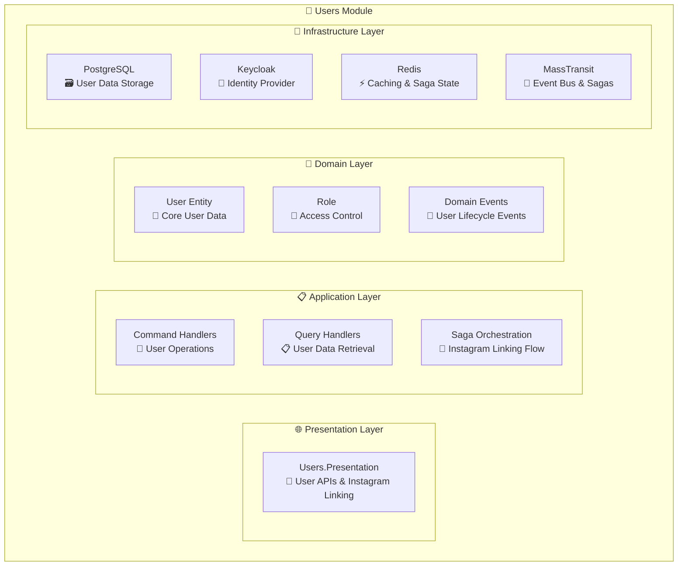
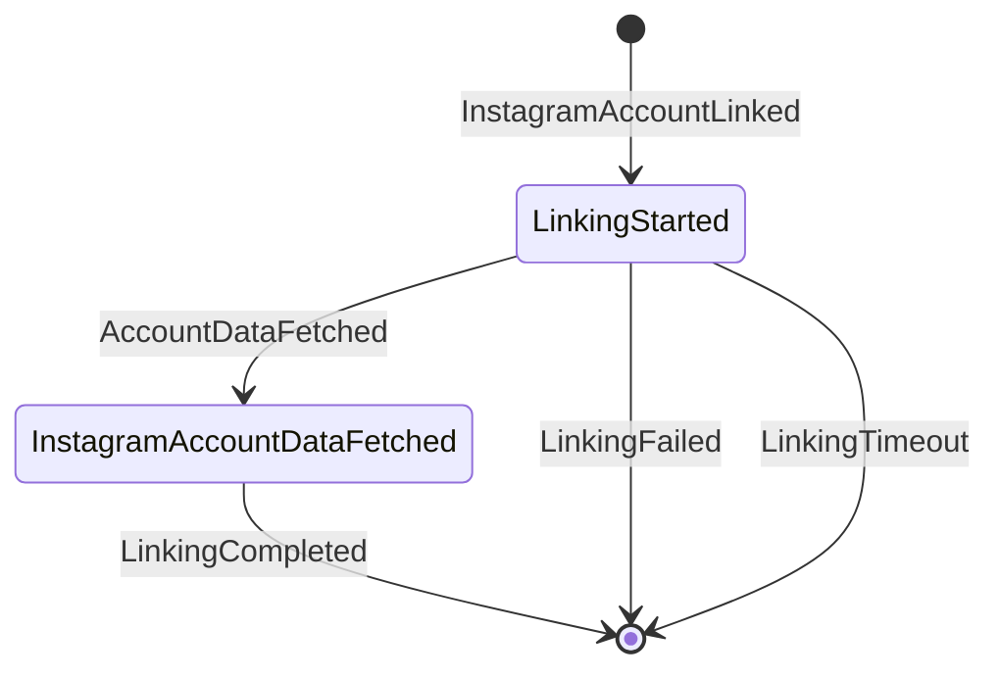

# 👥 Users Module

<div align="center">

*Identity and Access Management for the Lanka Platform*

**"Authentication is the foundation of trust in any digital platform"**

[](.)
[](.)
[](.)

</div>

---

## 🎯 **Module Overview**

The Users Module provides **identity management**, **authentication**, **authorization**, and **user profile management** for the Lanka platform. It handles user registration, login, profile management, and integrates with Keycloak as the identity provider. The module also manages Instagram account linking through sophisticated saga orchestration.

### **🏗️ Current Architecture**



---

## 🎯 **Currently Implemented Features**

### **🔐 Authentication & Authorization**
- ✅ **User Registration**: Account creation with Keycloak integration
- ✅ **User Login**: Authentication with JWT tokens
- ✅ **User Logout**: Session termination
- ✅ **Role-based Access Control**: Member role assignment
- ✅ **User Permissions**: Permission-based authorization

### **👤 Profile Management**
- ✅ **Basic Profile Management**: Name, email, birth date
- ✅ **User Updates**: Profile information updates
- ✅ **Account Deletion**: Complete user removal with cleanup

### **🔗 Instagram Integration**
- ✅ **Instagram Account Linking**: OAuth-based Instagram connection
- ✅ **Saga Orchestration**: Complex state machine for linking flow
- ✅ **Access Token Renewal**: Instagram token refresh workflow
- ✅ **Linking Status Tracking**: Redis-based operation status
- ✅ **Failure Handling**: Timeout and error recovery

> **Deep Dive:** See the [Instagram Linking Walkthrough](../../walkthroughs/instagram-linking.md) for a complete trace of this flow, including OAuth 2.0 concepts, saga orchestration, and cross-module communication.

---

## 🏛️ **Domain Model**

### **🎯 Core Entities**

#### **User**
```csharp
public class User : Entity<UserId>
{
    public FirstName FirstName { get; private set; }
    public LastName LastName { get; private set; }
    public Email Email { get; private set; }
    public BirthDate BirthDate { get; private set; }
    public string IdentityId { get; private set; }
    public DateTimeOffset? InstagramAccountLinkedOnUtc { get; set; }
    public IReadOnlyCollection<Role> Roles { get; }
    
    // Methods: Create, Update, Delete, LinkInstagramAccount, etc.
}
```

#### **Role**
```csharp
public enum Role
{
    Member = 1
}
```

---

## 📨 **Domain Events**

### **🎯 Currently Implemented**

| Event | Trigger | Purpose |
|-------|---------|---------|
| `UserCreatedDomainEvent` | User registration | Publish user registered integration event |
| `UserDeletedDomainEvent` | User deletion | Cleanup across modules |
| `UserLoggedInDomainEvent` | User login | Track login activity |
| `InstagramAccountLinkedDomainEvent` | Instagram linking initiated | Start linking saga |
| `InstagramAccessRenewedDomainEvent` | Token renewal | Update access tokens |

---

## 🚀 **Application Layer**

### **📋 Commands**

#### **User Management**
- ✅ `RegisterUserCommand` - Create new user account
- ✅ `LoginUserCommand` - Authenticate user
- ✅ `LogoutUserCommand` - Terminate user session
- ✅ `UpdateUserCommand` - Update user profile
- ✅ `DeleteUserCommand` - Remove user account

#### **Instagram Integration**
- ✅ `LinkInstagramAccountCommand` - Initiate Instagram linking
- ✅ `FinishInstagramLinkingCommand` - Complete Instagram linking

### **🔍 Queries**

#### **User Data**
- ✅ `GetUserQuery` - Retrieve user information
- ✅ `GetUserPermissionsQuery` - Get user permissions

---

## 🔄 **Integration Events**

### **📤 Published Events**

| Event | Trigger | Consumers |
|-------|---------|-----------|
| `UserRegisteredIntegrationEvent` | User created | Analytics (activity tracking) |
| `UserLoggedInIntegrationEvent` | User login | Analytics (login tracking) |
| `UserDeletedIntegrationEvent` | User deleted | All modules (cleanup) |
| `InstagramAccountLinkingStartedIntegrationEvent` | Instagram linking | Analytics (account fetching) |
| `InstagramAccountLinkingCompletedIntegrationEvent` | Linking completed | Analytics (completion) |
| `InstagramAccountLinkingFailureCleanedUpIntegrationEvent` | Linking failed | Analytics (cleanup) |

### **📥 Consumed Events**

| Event | Source | Purpose |
|-------|--------|---------|
| `BloggerUpdatedIntegrationEvent` | Campaigns | Update user profile data |
| `InstagramAccountDataFetchedIntegrationEvent` | Analytics | Complete linking process |
| `InstagramLinkingFailedIntegrationEvent` | Analytics | Handle linking failures |

---

## 🔧 **Infrastructure**

### **🗄️ Data Storage**

#### **PostgreSQL (User Data)**
- `users` - Core user information
- Standard outbox/inbox tables for event processing

#### **Redis (Caching & State)**
- Instagram linking operation status
- Saga state management
- Session caching

### **🔗 External Integrations**

#### **Keycloak Identity Provider**
- **User Registration**: Account creation in Keycloak
- **Authentication**: JWT token generation and validation
- **External Account Linking**: Instagram OAuth integration
- **User Management**: Profile updates and deletion

### **🎭 Saga Orchestration**

#### **Instagram Linking Saga**


**States:**
- **LinkingStarted**: Instagram OAuth initiated
- **InstagramAccountDataFetched**: Account data retrieved from Analytics
- **Completed**: Linking successful
- **Failed**: Error or timeout occurred

---

## 📊 **Data Flow**

### **🔄 User Registration**
1. User submits registration form
2. `RegisterUserCommand` processed
3. User created in Keycloak
4. User entity created in database
5. `UserCreatedDomainEvent` raised
6. `UserRegisteredIntegrationEvent` published
7. Analytics module tracks new user

### **🔗 Instagram Linking Flow**
1. User initiates Instagram linking
2. `LinkInstagramAccountCommand` creates operation status
3. `InstagramAccountLinkedDomainEvent` starts saga
4. Saga publishes `InstagramAccountLinkingStartedIntegrationEvent`
5. Analytics module fetches Instagram data
6. `InstagramAccountDataFetchedIntegrationEvent` received
7. Saga completes and publishes completion event
8. User's Instagram account is linked in Keycloak

---

## 🛡️ **Security**

### **🔒 Authentication**
- **JWT Tokens**: Secure token-based authentication
- **Keycloak Integration**: Enterprise-grade identity management
- **Role-based Access**: Permission-based authorization

### **🔑 Data Protection**
- **User Isolation**: Data scoped to authenticated users
- **Secure Deletion**: Complete cleanup on account removal
- **External Account Security**: Secure Instagram OAuth flow

---

## 📋 **API Endpoints**

### **User Management**
- `POST /users/register` - User registration
- `POST /users/login` - User authentication
- `POST /users/logout` - User logout
- `GET /users/me` - Get current user
- `PUT /users/me` - Update user profile
- `DELETE /users/me` - Delete user account

### **Instagram Integration**
- `POST /users/instagram/link` - Start Instagram linking
- `GET /users/instagram/status` - Get linking status

---

## 🚀 **Future Enhancements**

*The following features are planned but not yet implemented:*

### **🔐 Advanced Authentication**
- **Multi-factor Authentication**: SMS/Email verification
- **Social Login**: Additional OAuth providers
- **Password Policies**: Advanced security requirements

### **👤 Enhanced Profile Management**
- **User Preferences**: Detailed preference settings
- **Profile Pictures**: Avatar upload and management
- **Privacy Controls**: Granular privacy settings

### **🔔 Notification System**
- **Email Notifications**: Account-related emails
- **Push Notifications**: Mobile app notifications
- **Notification Preferences**: User-controlled settings

### **📊 Advanced Features**
- **User Analytics**: Detailed usage tracking
- **Account Recovery**: Advanced recovery options
- **Audit Logging**: Comprehensive activity logs

---

## 🔧 **Configuration**

### **Keycloak Settings**
```json
{
  "Users": {
    "Keycloak": {
      "Authority": "https://keycloak.lanka.com/realms/lanka",
      "ClientId": "lanka-api",
      "ClientSecret": "your-client-secret"
    }
  }
}
```

### **Instagram OAuth**
```json
{
  "Users": {
    "Instagram": {
      "ClientId": "your-instagram-app-id",
      "ClientSecret": "your-instagram-app-secret",
      "RedirectUri": "https://lanka.com/auth/instagram/callback"
    }
  }
}
```
