# 👥 Users Module

<div align="center">

*Identity and Access Management for the Lanka Platform*

**"Authentication is the foundation of trust in any digital platform"**

[](.)
[](.)
[](.)

</div>

---

## 🎯 **Module Overview**

The Users Module is the foundational module of the Lanka platform, responsible for **identity management**, **authentication**, **authorization**, and **user profile management**. It serves as the primary entry point for all user-related operations and integrates with external identity providers like Instagram and Keycloak.

### **🏗️ Architecture**

```mermaid
graph TB
    subgraph "👥 Users Module"
        subgraph "🌐 Presentation Layer"
            UP[Users.Presentation<br/>🚪 User APIs & Endpoints]
        end
        
        subgraph "📋 Application Layer"
            UA[Users.Application<br/>🎯 Use Cases & Business Logic]
            UQ[Query Handlers<br/>📊 Read Operations]
            UC[Command Handlers<br/>✏️ Write Operations]
        end
        
        subgraph "💎 Domain Layer"
            USER[User Entity<br/>👤 Aggregate Root]
            VO[Value Objects<br/>💎 Email, Names, BirthDate]
            DE[Domain Events<br/>⚡ User Lifecycle Events]
            REPO[IUserRepository<br/>🔍 Repository Interface]
        end
        
        subgraph "🔧 Infrastructure Layer"
            IMPL[Repository Implementation<br/>🗃️ EF Core & PostgreSQL]
            EXT[External Services<br/>🔗 Keycloak & Instagram]
            INBOX[Inbox Pattern<br/>📥 Event Processing]
            OUTBOX[Outbox Pattern<br/>📤 Event Publishing]
        end
    end
    
    subgraph "🌐 External Systems"
        KC[Keycloak<br/>🔐 Identity Provider]
        IG[Instagram API<br/>📱 Social Media Integration]
        DB[(PostgreSQL<br/>🗃️ User Data)]
        MB[(RabbitMQ<br/>📮 Message Bus)]
    end
    
    UP --> UA
    UA --> UQ & UC
    UQ & UC --> USER & VO & DE
    USER --> REPO
    REPO --> IMPL
    IMPL --> DB
    EXT --> KC & IG
    OUTBOX --> MB
    MB --> INBOX
    
    classDef moduleStyle fill:#e1f5fe,stroke:#01579b,stroke-width:2px
    classDef infraStyle fill:#f3e5f5,stroke:#4a148c,stroke-width:2px
    classDef dataStyle fill:#e8f5e8,stroke:#1b5e20,stroke-width:2px
    
    class UP,UA,UQ,UC,USER,VO,DE,REPO,IMPL,EXT,INBOX,OUTBOX moduleStyle
    class KC,IG,MB infraStyle
    class DB dataStyle
```



---

## 🎭 **Domain Model**

### **🏛️ Core Aggregates & Entities**

<table>
<tr>
<td width="50%">

#### **👤 User (Aggregate Root)**
The central entity representing a platform user.

**Key Properties:**
- `UserId` - Unique identifier
- `FirstName` - User's first name
- `LastName` - User's last name  
- `Email` - User's email address
- `BirthDate` - Date of birth
- `IdentityId` - External identity provider ID
- `InstagramAccountLinkedOnUtc` - Instagram linking timestamp
- `Roles` - Collection of user roles

**Key Operations:**
- `Create()` - Factory method for user creation
- `LinkInstagramAccount()` - Links Instagram account
- `RenewInstagramAccess()` - Renews Instagram access token
- `AddRole()` / `RemoveRole()` - Role management

</td>
<td width="50%">

#### **💎 Value Objects**

**📧 Email**
- Validates email format
- Ensures uniqueness constraints
- Immutable structure

**🎭 FirstName / LastName**
- Length validation (1-100 characters)
- Trims whitespace
- Prevents empty values

**🎂 BirthDate**
- Age validation (13+ years)
- Date format validation
- Business rule enforcement

**🛡️ Role & Permission**
- Hierarchical role structure
- Permission-based access control
- Immutable security model

</td>
</tr>
</table>

### **⚡ Domain Events**

The Users module publishes several domain events for internal and cross-module communication:

| Event | Purpose | Triggered By |
|-------|---------|--------------|
| `UserCreatedDomainEvent` | User registration completed | User creation |
| `UserDeletedDomainEvent` | User account deletion | User deletion |
| `UserLoggedInDomainEvent` | User authentication | Login process |
| `InstagramAccountLinkedDomainEvent` | Instagram integration | Account linking |
| `InstagramAccessRenewedDomainEvent` | Token refresh | Access renewal |

---

## 🎯 **Use Cases & Features**

### **🔐 Authentication & Authorization**

<table>
<tr>
<td width="50%">

#### **🚪 Authentication Flow**
1. **OAuth2 Integration** with Keycloak
2. **JWT Token** generation and validation
3. **Role-based access** control
4. **Session management** with Redis
5. **Multi-factor authentication** support

#### **🔑 Key Commands**
- `RegisterUserCommand` - New user registration
- `LoginUserCommand` - User authentication
- `RefreshTokenCommand` - Token refresh
- `LogoutUserCommand` - Session termination

</td>
<td width="50%">

#### **👤 Profile Management**
1. **Personal information** management
2. **Preference settings** configuration
3. **Instagram account** linking
4. **Data privacy** controls
5. **Account deletion** with cleanup

#### **📊 Key Queries**
- `GetUserProfileQuery` - Retrieve user profile
- `GetUserPermissionsQuery` - Fetch user permissions
- `GetUserRolesQuery` - Get assigned roles
- `GetInstagramStatusQuery` - Check Instagram linking

</td>
</tr>
</table>

### **🔗 Instagram Integration**


---

## 🔧 **Technical Implementation**

### **🗃️ Database Schema**

```sql
-- Users table (Aggregate Root)
CREATE TABLE Users (
    Id UUID PRIMARY KEY,
    FirstName VARCHAR(100) NOT NULL,
    LastName VARCHAR(100) NOT NULL,
    Email VARCHAR(255) NOT NULL UNIQUE,
    BirthDate DATE NOT NULL,
    IdentityId VARCHAR(255) NOT NULL UNIQUE,
    InstagramAccountLinkedOnUtc TIMESTAMPTZ,
    CreatedOnUtc TIMESTAMPTZ NOT NULL,
    ModifiedOnUtc TIMESTAMPTZ
);

-- User Roles (Many-to-Many)
CREATE TABLE UserRoles (
    UserId UUID NOT NULL REFERENCES Users(Id),
    Role VARCHAR(50) NOT NULL,
    PRIMARY KEY (UserId, Role)
);

-- Outbox Events
CREATE TABLE UsersModuleOutboxMessages (
    Id UUID PRIMARY KEY,
    Type VARCHAR(255) NOT NULL,
    Content JSONB NOT NULL,
    OccurredOnUtc TIMESTAMPTZ NOT NULL,
    ProcessedOnUtc TIMESTAMPTZ,
    Error TEXT
);

-- Inbox Events  
CREATE TABLE UsersModuleInboxMessages (
    Id UUID PRIMARY KEY,
    Type VARCHAR(255) NOT NULL,
    Content JSONB NOT NULL,
    OccurredOnUtc TIMESTAMPTZ NOT NULL,
    ProcessedOnUtc TIMESTAMPTZ,
    Error TEXT
);
```

---

## 🔄 **Integration & Communication**

### **📤 Published Events**

The Users module publishes these integration events for other modules:

<table>
<tr>
<td width="50%">

#### **User Lifecycle Events**
- `UserCreatedIntegrationEvent`
  - New user registration
  - Triggers profile creation in other modules
  
- `UserDeletedIntegrationEvent`
  - User account deletion
  - Triggers cleanup in other modules

- `UserLoggedInIntegrationEvent`
  - User authentication events
  - Triggers activity tracking

</td>
<td width="50%">

#### **Instagram Integration Events**
- `InstagramAccountLinkedIntegrationEvent`
  - Instagram account connection
  - Triggers analytics data collection
  
- `InstagramAccessRenewedIntegrationEvent`
  - Access token refresh
  - Maintains data synchronization

</td>
</tr>
</table>

### **📥 Consumed Events**

The Users module currently operates independently and doesn't consume events from other modules, maintaining its role as the foundational authentication layer.

---

## 🛡️ **Security & Compliance**

### **🔐 Security Features**

<table>
<tr>
<td width="50%">

#### **Authentication Security**
- **OAuth2 & OpenID Connect** standards
- **JWT tokens** with expiration
- **Refresh token** rotation
- **Rate limiting** for auth endpoints
- **Account lockout** after failed attempts

#### **Data Protection**
- **GDPR compliance** with data deletion
- **PII encryption** for sensitive data
- **Audit logging** for all operations
- **Data minimization** principles

</td>
<td width="50%">

#### **Authorization Controls**
- **Role-based access control** (RBAC)
- **Permission granularity** for features
- **Resource-level permissions**
- **Hierarchical roles** structure
- **Dynamic permission** checking

#### **Infrastructure Security**
- **Database encryption** at rest
- **TLS encryption** in transit
- **Secret management** with Azure Key Vault
- **Input validation** and sanitization

</td>
</tr>
</table>

### **🏛️ Compliance Features**

- **GDPR Right to be forgotten** - Complete user data deletion
- **Data portability** - Export user data in standard formats
- **Consent management** - Track and manage user permissions
- **Audit trails** - Complete activity logging for compliance

---

## 🧪 **Testing Strategy**

### **📊 Test Coverage**

<table>
<tr>
<td width="33%">

#### **🔬 Unit Tests**
- **Domain model** validation
- **Business logic** testing
- **Value object** behavior
- **Domain event** publishing
- **Error handling** scenarios

**Coverage:** 95%+

</td>
<td width="33%">

#### **🔗 Integration Tests**
- **API endpoint** testing
- **Database operations**
- **External service** integration
- **Event publishing/consuming**
- **Authentication flows**

**Coverage:** 90%+

</td>
<td width="33%">

#### **🏗️ Architecture Tests**
- **Layer dependencies**
- **Module boundaries**
- **Naming conventions**
- **Design pattern** compliance
- **Security constraints**

**Coverage:** 100%

</td>
</tr>
</table>

### **🎯 Key Test Scenarios**

```csharp
// Domain Model Testing
[Test]
public void User_Create_ShouldRaiseUserCreatedDomainEvent()
{
    // Arrange
    var firstName = FirstName.Create("John").Value;
    var lastName = LastName.Create("Doe").Value;
    var email = Email.Create("john.doe@example.com").Value;
    var birthDate = BirthDate.Create(new DateOnly(1990, 1, 1)).Value;
    
    // Act
    var user = User.Create(firstName, lastName, email, birthDate, "identity-123");
    
    // Assert
    user.Value.GetDomainEvents()
        .Should().ContainSingle()
        .Which.Should().BeOfType<UserCreatedDomainEvent>();
}

// Integration Testing
[Test]
public async Task RegisterUser_ShouldCreateUserAndPublishEvent()
{
    // Arrange
    var command = new RegisterUserCommand(
        "John", "Doe", "john.doe@example.com", 
        new DateOnly(1990, 1, 1), "identity-123");
    
    // Act
    var result = await Sender.Send(command);
    
    // Assert
    result.IsSuccess.Should().BeTrue();
    // Verify user created in database
    // Verify integration event published
}
```

---

## 📊 **Performance & Monitoring**

### **⚡ Performance Characteristics**

<table>
<tr>
<td width="50%">

#### **🚀 Performance Metrics**
- **Authentication**: < 200ms response time
- **Profile queries**: < 100ms response time
- **Instagram linking**: < 5s end-to-end
- **User registration**: < 500ms response time

#### **📈 Scalability**
- **Horizontal scaling** through stateless design
- **Database connection pooling**
- **Redis caching** for sessions
- **Rate limiting** for protection

</td>
<td width="50%">

#### **📊 Monitoring & Observability**
- **OpenTelemetry** distributed tracing
- **Custom metrics** for business KPIs
- **Health checks** for dependencies
- **Structured logging** with Serilog

#### **🚨 Alerting**
- **Authentication failures** spike detection
- **Database connection** issues
- **External service** downtime
- **Performance degradation** alerts

</td>
</tr>
</table>

---

## 🚀 **Development Guidelines**

### **📝 Adding New Features**

1. **Start with Domain** - Define entities, value objects, and domain events
2. **Add Use Cases** - Create commands/queries in Application layer
3. **Implement Infrastructure** - Add repository implementations and external integrations
4. **Expose APIs** - Create endpoints in Presentation layer
5. **Add Tests** - Unit, integration, and architecture tests
6. **Update Documentation** - Keep this guide current

### **🔄 Common Patterns**

<table>
<tr>
<td width="50%">

#### **Command Pattern**
```csharp
public sealed record RegisterUserCommand(
    string FirstName,
    string LastName, 
    string Email,
    DateOnly BirthDate,
    string IdentityId) : ICommand<UserId>;
```

#### **Query Pattern**
```csharp
public sealed record GetUserProfileQuery(
    UserId UserId) : IQuery<UserProfileResponse>;
```

</td>
<td width="50%">

#### **Domain Event Pattern**
```csharp
public sealed record UserCreatedDomainEvent(
    UserId UserId,
    Email Email,
    DateTimeOffset OccurredOnUtc) : DomainEvent;
```

#### **Result Pattern**
```csharp
public static Result<User> Create(
    FirstName firstName,
    LastName lastName,
    Email email,
    BirthDate birthDate,
    string identityId)
{
    // Validation and creation logic
}
```

</td>
</tr>
</table>

---

## 🔗 **Related Documentation**

<table>
<tr>
<td width="50%">

### **📚 Core Concepts**
- [🏛️ Aggregate Root](../../catalog-of-terms/aggregate-root/) - Understanding aggregates
- [🎭 Entity](../../catalog-of-terms/entity/) - Entity design patterns
- [💎 Value Object](../../catalog-of-terms/value-object/) - Immutable descriptors
- [⚡ Domain Event](../../catalog-of-terms/domain-event/) - Event modeling

</td>
<td width="50%">

### **🔧 Implementation Guides**
- [🔄 CQRS](../../catalog-of-terms/cqrs/) - Command Query separation
- [📤 Outbox Pattern](../../catalog-of-terms/outbox-pattern/) - Reliable event publishing
- [📥 Inbox Pattern](../../catalog-of-terms/inbox-pattern/) - Idempotent processing
- [✅ Result Pattern](../../catalog-of-terms/result-pattern/) - Error handling

</td>
</tr>
</table>

---

## 🎯 **Quick Actions**

<div align="center">

[](../../../src/Modules/Users/)
[](../../../src/Modules/Users/Lanka.Modules.Users.Presentation/)
[](../../../test/)
[](../../architecture/)

</div>

---

<div align="center">

*"Security is not a product, but a process."* 

**- Bruce Schneier**

**Build with confidence! 🔐**

</div>

