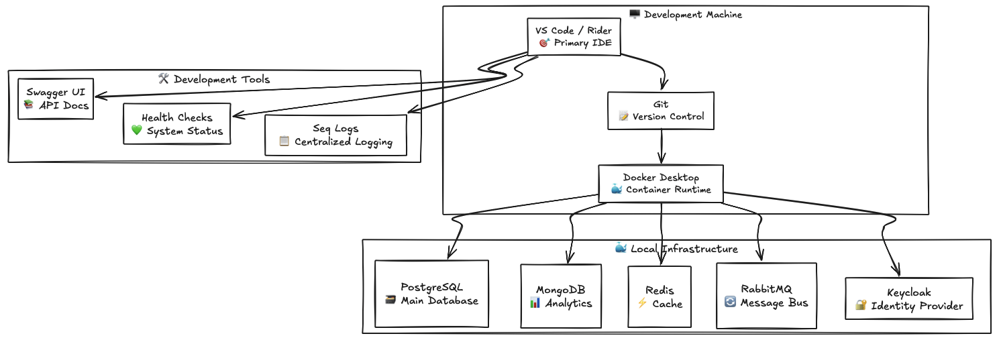
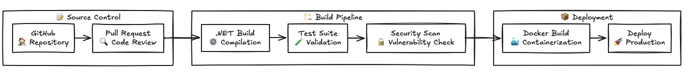
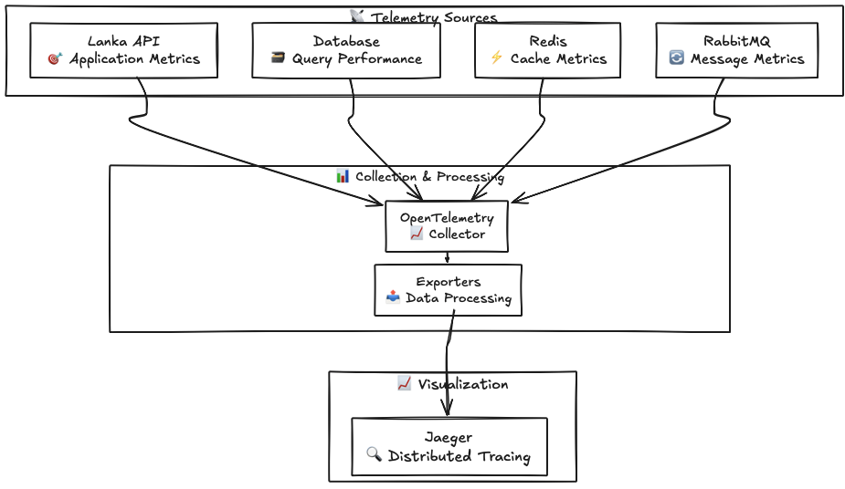

# 🛠️ Lanka Development Tools

<div align="center">

*Your complete toolkit for developing, debugging, and deploying Lanka*

**"Great developers use great tools"**

</div>

---

## 🎯 **Tools Overview**

Lanka comes with a comprehensive set of tools and utilities to make development productive and enjoyable. From local development to production monitoring, we've got you covered!

---

## 🚀 **Development Tools**

<table>
<tr>
<td width="50%">

### **🔧 Core Development**
- [🧪 **Testing Tools**](../development/faq.md#-testing-issues) - Unit, integration, and performance testing
- [🐛 **Debugging Utilities**](../development/faq.md#-debugging-problems) - Advanced debugging and profiling
- [📊 **Database Tools**](../development/faq.md#-database--migrations) - Migration management and data tools

### **🎨 Frontend Development**
- [🖥️ **Angular 20 Guide**](../frontend/README.md) - Build, lint, and test commands

</td>
<td width="50%">

### **🔄 DevOps & Deployment**
- [🐳 **Docker & Local Infra**](../development/development-setup.md#-container-infrastructure-setup) - Container management and orchestration
- [📊 **Telemetry**](telemetry/) - Observability and tracing

### **🌐 Infrastructure**
- [🔄 **Message Bus**](messaging/) - RabbitMQ management and monitoring
- [📡 **API Gateway**](gateway/) - Routing and load balancing
- [📊 **Telemetry**](telemetry/) - OpenTelemetry and distributed tracing

</td>
</tr>
</table>

---

## 🎪 **Tool Categories**

### **🏗️ Local Development Environment**



### **🔄 CI/CD Pipeline**



---

## 🎯 **Quick Tool Access**

### **🌐 Local Development URLs**

| Service | URL | Purpose |
|---------|-----|---------|
| 🏠 **Lanka API** | http://localhost:4307 | Main application API |
| 💚 **Health Checks** | http://localhost:4307/healthz | System health status |
| 🚪 **Gateway** | http://localhost:4308 | API gateway entrypoint |
| 🐰 **RabbitMQ Management** | http://localhost:15672 | Message queue admin |
| 🔐 **Keycloak Admin** | http://localhost:18080/admin | Identity provider |
| 📋 **Seq Logs** | http://localhost:8081 | Centralized logging |
| 🔭 **Jaeger UI** | http://localhost:16686 | Distributed tracing |
| 📈 **Kibana** | http://localhost:5601 | Search/analytics UI |

### **🗃️ Database Connections**

| Database | Connection String | Usage |
|----------|------------------|-------|
| 🐘 **PostgreSQL** | `Host=localhost;Port=5432;Database=lanka_dev;Username=postgres;Password=postgres` | Primary database |
| 🍃 **MongoDB** | `mongodb://localhost:27017/lanka_analytics` | Analytics data |
| ⚡ **Redis** | `localhost:6379` | Caching & sessions |

---

## 🧰 **Essential Tool Setup**

### **🎯 Visual Studio Code Extensions**

```json
{
  "recommendations": [
    "ms-dotnettools.csharp",
    "ms-dotnettools.vscode-dotnet-runtime",
    "bradlc.vscode-tailwindcss",
    "esbenp.prettier-vscode",
    "ms-vscode.vscode-typescript-next",
    "ms-vscode-remote.remote-containers",
    "ms-azuretools.vscode-docker",
    "humao.rest-client",
    "redhat.vscode-yaml"
  ]
}
```

### **🔧 JetBrains Rider Plugins**

- **Docker** - Container management
- **Database Tools** - PostgreSQL/MongoDB support
- **GitToolBox** - Enhanced Git integration
- **HTTP Client** - API testing
- **Sequence Diagram** - Code flow visualization

### **🐳 Docker Desktop Configuration**

```yaml
# docker-compose.yml - Key services for development
version: '3.8'
services:
  postgres:
    image: postgres:17.6
    environment:
      POSTGRES_DB: lanka_dev
      POSTGRES_USER: postgres
      POSTGRES_PASSWORD: postgres
    ports:
      - "5432:5432"
    
  mongodb:
    image: mongo:8.0
    ports:
      - "27017:27017"
    
  redis:
    image: redis:8.2
    ports:
      - "6379:6379"
    
  rabbitmq:
    image: rabbitmq:3.13-management-alpine
    ports:
      - "5672:5672"
      - "15672:15672"
    
  keycloak:
    image: quay.io/keycloak/keycloak:26.4
    environment:
      KEYCLOAK_ADMIN: admin
      KEYCLOAK_ADMIN_PASSWORD: admin
    ports:
      - "18080:8080"

  seq:
    image: datalust/seq:2024
    environment:
      ACCEPT_EULA: Y
    ports:
      - "8081:80"
```

---

## 🧪 **Testing Tools**

### **🎯 Unit Testing Stack**

- **xUnit** - Primary testing framework
- **FluentAssertions** - Readable assertions
- **NSubstitute** - Mocking framework
- **Bogus** - Fake data generation

### **🔄 Integration Testing**

- **TestContainers** - Database testing with Docker
- **WebApplicationFactory** - API integration tests
- **Custom Test Fixtures** - Module-specific testing

### **📊 Performance Testing**

- **BenchmarkDotNet** - Micro-benchmarking
- **NBomber** - Load testing framework
- **dotMemory** - Memory profiling

---

## 📊 **Monitoring & Observability**

### **🎭 OpenTelemetry Stack**



### **📋 Logging Strategy**

- **Serilog** - Structured logging framework
- **Seq** - Log aggregation and search
- **Application Insights** - Production telemetry
- **Custom Enrichers** - Context-aware logging

---

## 🔒 **Security & Compliance Tools**

### **🛡️ Security Scanning**

- **SonarQube** - Code quality analysis
- **OWASP Dependency Check** - Known vulnerability detection
- **GitGuardian** - Secret scanning

### **🔐 Authentication & Authorization**

- **Keycloak** - Identity and access management
- **OAuth2/OIDC** - Standard authentication flows
- **JWT Tokens** - Stateless authentication
- **Role-Based Access Control** - Fine-grained permissions

---

## 🎨 **Code Quality Tools**

### **📏 Code Analysis**

```xml
<!-- Directory.Build.props - Code analysis configuration -->
<PropertyGroup>
  <AnalysisLevel>latest</AnalysisLevel>
  <AnalysisMode>All</AnalysisMode>
  <TreatWarningsAsErrors>true</TreatWarningsAsErrors>
  <CodeAnalysisTreatWarningsAsErrors>true</CodeAnalysisTreatWarningsAsErrors>
  <EnforceCodeStyleInBuild>true</EnforceCodeStyleInBuild>
</PropertyGroup>
```

### **🎯 Code Formatting**

- **EditorConfig** - Consistent code style
- **Prettier** - Frontend code formatting
- **StyleCop** - C# style rules

---

## 📚 **Tool Documentation**

Each tool category has detailed documentation:

- **🔧 Development Setup** - see [Development Setup](../development/development-setup.md)
- **🧪 Testing Guidance** - see [FAQ: Testing Issues](../development/faq.md#-testing-issues)
- **📊 Telemetry & Monitoring** - see [Telemetry](telemetry/README.md)
- **🔒 Security & Auth** - see [Gateway](gateway/README.md) and project appsettings
- **🐳 Messaging & Infra** - see [Messaging](messaging/README.md)

---

## 🤝 **Contributing New Tools**

Help us expand our toolkit:

### **Proposing New Tools**

1. **Evaluate Need** - Does it solve a real development pain point?
2. **Research Options** - Compare alternatives and trade-offs
3. **Create RFC** - Document the proposal with examples
4. **Team Review** - Get feedback from other developers
5. **Document Integration** - Add setup and usage guides

### **Tool Evaluation Criteria**

- **📈 Value** - Significant improvement to developer experience
- **🔧 Integration** - Works well with existing toolchain
- **📚 Documentation** - Clear setup and usage instructions
- **👥 Adoption** - Team consensus on benefits
- **💰 Cost** - Reasonable licensing and maintenance costs

---

<div align="center">

*"Tools amplify your talent. The better your tools, the more you can achieve."*

**Happy Tooling! 🛠️**

</div>
