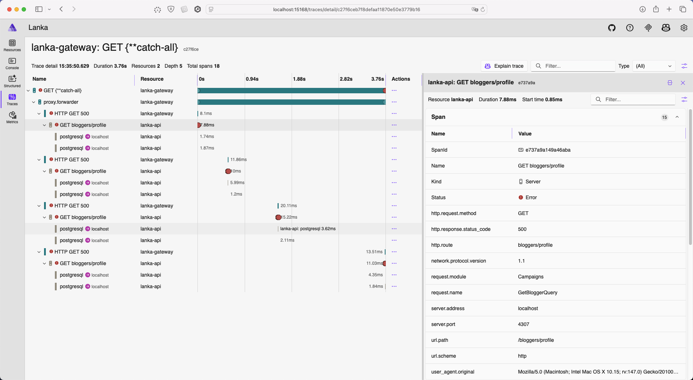

# Distributed Tracing

> **Note:** Lanka previously used Jaeger as a standalone trace visualization tool, configured via `docker-compose.yml`. After adopting .NET Aspire, Jaeger was replaced by the **Aspire Dashboard**, which provides distributed trace visualization alongside structured logs and metrics in a single UI.

## How Tracing Works Now

All trace instrumentation is configured in **ServiceDefaults** (`src/Api/Lanka.ServiceDefaults/Extensions.cs`). Traces are exported via OTLP to the Aspire Dashboard, which launches automatically when running the AppHost.

For full details on the tracing setup, see:

* [OpenTelemetry Integration](../open-telemetry/README.md) — instrumentation configuration
* [Orchestration & Observability Walkthrough](../../../walkthroughs/aspire-orchestration.md#how-telemetry-reaches-the-dashboard) — how OTLP export works

## Trace Correlation with Logs

The `LogContextTraceLoggingMiddleware` adds the current `TraceId` to the Serilog log context, linking every log entry to its parent trace:

```csharp
using Serilog.Context;

public Task Invoke(HttpContext context)
{
    string traceId = Activity.Current?.TraceId.ToString();

    using (LogContext.PushProperty("TraceId", traceId))
    {
        return next.Invoke(context);
    }
}
```

In the Aspire Dashboard, this correlation is built-in — clicking a log entry navigates directly to the trace waterfall view showing the full request flow (Gateway → API → database → cache → response).

## Viewing Traces

1. Start the AppHost: `dotnet run --project src/Api/Lanka.AppHost`
2. Open the Aspire Dashboard URL from the console output
3. Navigate to the **Traces** tab
4. Select a trace to see the waterfall timeline with nested spans


