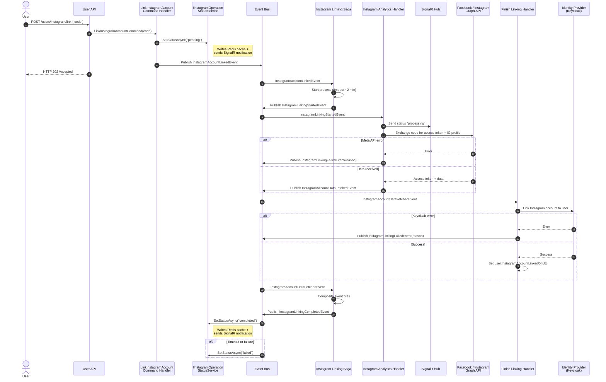

# Instagram Account Linking Walkthrough

<div align="center">

*A comprehensive guide to the multi-step saga that links a user's Instagram account, covering OAuth 2.0, event-driven architecture, and distributed workflow orchestration*

</div>

---

## Table of Contents

1. [Overview](#overview)
2. [Prerequisites: Understanding OAuth 2.0](#prerequisites-understanding-oauth-20)
3. [The Complete Flow](#the-complete-flow)
4. [Phase 1: OAuth Authorization](#phase-1-oauth-authorization)
5. [Phase 2: Backend Processing](#phase-2-backend-processing)
6. [Phase 3: Saga Orchestration](#phase-3-saga-orchestration)
7. [Phase 4: Instagram Data Fetching](#phase-4-instagram-data-fetching)
8. [Phase 5: Identity Linking](#phase-5-identity-linking)
9. [Error Handling and Timeouts](#error-handling-and-timeouts)
10. [Token Storage and Refresh](#token-storage-and-refresh)
11. [Status Management](#status-management)
12. [Key Lessons](#key-lessons)

---

## Overview

This walkthrough documents one of the most complex flows in Lanka: linking a user's Instagram account to their profile. The process demonstrates several architectural patterns working together:

- **OAuth 2.0 Authorization Code Flow** with external APIs
- **Saga orchestration** using MassTransit state machines
- **Cross-module communication** via integration events
- **Real-time status updates** through SignalR
- **Distributed state management** with timeouts and error handling

Understanding this flow requires knowledge of how OAuth 2.0 works, so we begin there.

---

## Prerequisites: Understanding OAuth 2.0

### What is OAuth 2.0?

OAuth 2.0 is an authorization framework that allows third-party applications to access user resources without exposing credentials. Instead of sharing passwords, users grant limited access through tokens.

**Key participants:**

| Role | In Our Context |
|------|----------------|
| **Resource Owner** | The user who owns the Instagram account |
| **Client** | Lanka application (our backend) |
| **Authorization Server** | Facebook/Instagram OAuth server |
| **Resource Server** | Instagram Graph API |

### The Authorization Code Flow

Instagram uses the **Authorization Code Flow**, which is the most secure OAuth flow for server-side applications. It works in three phases:

```
┌─────────────────────────────────────────────────────────────────────────────┐
│                        OAuth 2.0 Authorization Code Flow                    │
├─────────────────────────────────────────────────────────────────────────────┤
│                                                                             │
│  1. AUTHORIZATION REQUEST                                                   │
│     User clicks "Connect Instagram" → Browser redirects to Instagram        │
│     URL: https://www.instagram.com/oauth/authorize?                         │
│          client_id=APP_ID&                                                  │
│          redirect_uri=https://lanka.app/callback&                           │
│          scope=instagram_basic,instagram_manage_insights&                   │
│          response_type=code                                                 │
│                                                                             │
│  2. USER GRANTS PERMISSION                                                  │
│     User sees Instagram's permission screen → Clicks "Allow"                │
│     Instagram redirects to: https://lanka.app/callback?code=AUTH_CODE       │
│                                                                             │
│  3. TOKEN EXCHANGE (Server-to-Server)                                       │
│     Lanka backend sends AUTH_CODE to Instagram → Receives ACCESS_TOKEN      │
│     POST https://api.instagram.com/oauth/access_token                       │
│     Body: { client_id, client_secret, code, redirect_uri, grant_type }      │
│                                                                             │
│  4. API ACCESS                                                              │
│     Lanka uses ACCESS_TOKEN to fetch user's Instagram data                  │
│                                                                             │
└─────────────────────────────────────────────────────────────────────────────┘
```

### What is the Authorization Code?

The **authorization code** is a short-lived, single-use token that proves the user granted permission. It has several security properties:

- **Short-lived:** Typically expires in 10 minutes
- **Single-use:** Can only be exchanged for an access token once
- **Bound to client:** Only the registered application can exchange it
- **Transmitted via browser:** Passed through the redirect URL

The code itself is opaque — a random string like `AQDvCav2nNz...`. It contains no user information.

### What is the Callback Page?

The **callback page** (also called redirect URI) is where Instagram sends the user after they grant permission. This page:

1. Receives the authorization code from the URL query parameter
2. Sends the code to the backend API
3. Shows the user a "linking in progress" status
4. Updates when linking completes or fails

**Example callback URL:**
```
https://lanka.app/auth/instagram/callback?code=AQDvCav2nNz...
```

The callback page is registered with Instagram during app configuration. Instagram will only redirect to registered URLs — this prevents attackers from intercepting authorization codes.

### Why Not Send the Token Directly?

You might wonder: why the two-step process? Why doesn't Instagram just return the access token to the browser?

**Security reasons:**

1. **Tokens are sensitive:** Access tokens grant API access. Exposing them in browser URLs or history is risky.
2. **Client secret required:** Token exchange requires the client secret, which must never be exposed to browsers.
3. **Server verification:** The backend can verify the exchange succeeded before trusting the user has Instagram access.

---

## The Complete Flow

### Sequence Diagram



---

## Phase 1: OAuth Authorization

### Step 1.1: User Initiates Connection

The user clicks "Connect Instagram" in the client application. The client constructs an authorization URL and redirects the browser:

```
https://www.instagram.com/oauth/authorize
  ?client_id=YOUR_APP_ID
  &redirect_uri=https://lanka.app/auth/instagram/callback
  &scope=instagram_basic,instagram_manage_insights,pages_show_list
  &response_type=code
  &state=random_csrf_token
```

**Parameters explained:**

| Parameter | Purpose |
|-----------|---------|
| `client_id` | Identifies the Lanka application to Instagram |
| `redirect_uri` | Where to send the user after authorization (must match registered URI) |
| `scope` | Permissions requested (basic profile, insights, linked Facebook pages) |
| `response_type=code` | Request an authorization code (not a token directly) |
| `state` | CSRF protection — client generates this, verifies it on callback |

### Step 1.2: User Grants Permission

Instagram displays a permission screen showing what data Lanka is requesting access to. The user reviews and clicks "Allow" (or "Deny").

If allowed, Instagram redirects to:

```
https://lanka.app/auth/instagram/callback
  ?code=AQDvCav2nNz...
  &state=random_csrf_token
```

### Step 1.3: Callback Page Processing

The callback page (Angular component) performs several tasks:

1. **Verify state parameter** — Prevents CSRF attacks
2. **Extract authorization code** — From URL query parameter
3. **Send code to backend** — POST to `/users/link-instagram`
4. **Show loading state** — User sees "Linking your account..."
5. **Listen for updates** — Via SignalR for real-time status

```typescript
// Simplified callback component logic
ngOnInit() {
  const code = this.route.snapshot.queryParams['code'];
  const state = this.route.snapshot.queryParams['state'];

  // Verify state matches what we sent
  if (state !== sessionStorage.getItem('instagram_oauth_state')) {
    this.error = 'Invalid state parameter';
    return;
  }

  // Send code to backend
  this.linkingService.linkInstagram(code).subscribe({
    next: () => this.status = 'linking',
    error: (err) => this.error = err.message
  });

  // Listen for real-time updates
  this.signalR.on('InstagramLinkingStatus', (status) => {
    this.status = status;
  });
}
```

---

## Phase 2: Backend Processing

### Step 2.1: Endpoint Receives Code

**File:** `src/Modules/Users/Lanka.Modules.Users.Presentation/Users/LinkInstagram.cs`

```csharp
public sealed class LinkInstagram : UsersEndpointBase, IEndpoint
{
    public void MapEndpoint(IEndpointRouteBuilder app)
    {
        app.MapPost("users/link-instagram", async (
            LinkInstagramRequest request,
            ISender sender,
            CancellationToken ct) =>
        {
            var command = new LinkInstagramAccountCommand(request.Code);
            Result result = await sender.Send(command, ct);
            return result.Match(Results.Accepted, ApiResults.Problem);
        })
        .RequireAuthorization()
        .WithTags(Tags.Users);
    }
}
```

**Design decision:** The endpoint returns `202 Accepted`, not `200 OK`. This signals to the client that the request was received but processing continues asynchronously. The actual linking involves external API calls and cross-module coordination that could fail or take time.

### Step 2.2: Command Handler Orchestrates Initial Processing

**File:** `src/Modules/Users/Lanka.Modules.Users.Application/Instagram/Link/LinkInstagramAccountCommandHandler.cs`

```csharp
internal sealed class LinkInstagramAccountCommandHandler
    : ICommandHandler<LinkInstagramAccountCommand>
{
    private readonly IUserRepository _userRepository;
    private readonly IUserContext _userContext;
    private readonly IIdentityProviderService _identityProviderService;
    private readonly IInstagramOperationStatusService _statusService;
    private readonly IUnitOfWork _unitOfWork;

    public async Task<Result> Handle(
        LinkInstagramAccountCommand request,
        CancellationToken cancellationToken)
    {
        // 1. Retrieve current authenticated user
        User user = await _userRepository.GetByIdAsync(
            new UserId(_userContext.GetUserId()), cancellationToken);

        // 2. Check if Instagram account already linked in Keycloak
        bool isLinked = await _identityProviderService
            .IsExternalAccountLinkedAsync(user!.IdentityId, ProviderName.Instagram, cancellationToken);
        if (isLinked)
            return Result.Failure(IdentityProviderErrors.ExternalIdentityProviderAlreadyLinked);

        // 3. Prevent concurrent linking attempts — only block if actively in progress
        InstagramOperationStatus existingStatus = await _statusService.GetStatusAsync(
            user.Id.Value, InstagramOperationType.Linking, cancellationToken);

        bool isActivelyInProgress = existingStatus.Status is
            InstagramOperationStatuses.Pending or InstagramOperationStatuses.Processing;

        if (isActivelyInProgress)
            return Result.Failure(InstagramLinkingRepositoryErrors.AlreadyLinking);

        // 4. Set pending status (writes Redis cache + sends SignalR notification)
        await _statusService.SetStatusAsync(
            user.Id.Value,
            InstagramOperationType.Linking,
            InstagramOperationStatuses.Pending,
            "Instagram linking started",
            cancellationToken: cancellationToken);

        // 5. Raise domain event — this triggers the saga
        user.LinkInstagramAccount(request.Code);

        // 6. Persist changes (outbox pattern ensures event is published)
        await _unitOfWork.SaveChangesAsync(cancellationToken);

        return Result.Success();
    }
}
```

**Key design decisions:**

1. **`IInstagramOperationStatusService`:** A centralized service that encapsulates both Redis cache writes and SignalR notifications. This replaces the previous pattern of injecting `ICacheService` + `INotificationService` separately, ensuring they always stay in sync.

2. **Status-aware duplicate prevention:** Instead of `_cacheService.ExistsAsync()` which returned `true` for any cached value (including `failed`), we now check the actual status. Only `pending` or `processing` operations block retries — a `failed` or `completed` status allows the user to try again.

3. **Domain event triggers saga:** Rather than calling the saga directly, we raise a domain event. This maintains loose coupling and uses the outbox pattern for reliable delivery.

### Step 2.3: Domain Event Raised

**File:** `src/Modules/Users/Lanka.Modules.Users.Domain/Users/User.cs`

```csharp
public void LinkInstagramAccount(string code)
{
    RaiseDomainEvent(new InstagramAccountLinkedDomainEvent(
        this.Id,
        this.Email.Value,
        code));
}
```

The domain event contains:
- `UserId` — Who is linking
- `Email` — Used for development mock service resolution
- `Code` — The authorization code to exchange

### Step 2.4: Domain Event Handler Publishes Integration Event

**File:** `src/Modules/Users/Lanka.Modules.Users.Application/Instagram/Link/InstagramAccountLinkedDomainEventHandler.cs`

```csharp
internal sealed class InstagramAccountLinkedDomainEventHandler
    : DomainEventHandler<InstagramAccountLinkedDomainEvent>
{
    public override async Task Handle(
        InstagramAccountLinkedDomainEvent domainEvent,
        CancellationToken ct)
    {
        await _eventBus.PublishAsync(
            new InstagramAccountLinkedIntegrationEvent(
                domainEvent.Id,
                domainEvent.OccurredOnUtc,
                domainEvent.UserId.Value,
                domainEvent.Email,
                domainEvent.Code),
            ct);
    }
}
```

**Pattern:** Domain events stay within the module boundary. Integration events cross module boundaries. The domain event handler bridges these two worlds.

---

## Phase 3: Saga Orchestration

### What is a Saga?

A **saga** is a design pattern for managing long-running, distributed transactions. Instead of a single atomic transaction, a saga breaks the process into steps, each with potential compensating actions if something fails.

In Lanka, we use MassTransit's state machine implementation — a finite state machine that tracks progress and handles events.

### Step 3.1: Saga State Machine

**File:** `src/Modules/Users/Lanka.Modules.Users.Presentation/LinkInstagramSaga/LinkInstagramSaga.cs`

```csharp
public sealed class LinkInstagramSaga : MassTransitStateMachine<LinkInstagramState>
{
    // States
    public State LinkingStarted { get; private set; } = null!;
    public State InstagramAccountDataFetched { get; private set; } = null!;

    // Events
    public Event<InstagramAccountLinkedIntegrationEvent> InstagramAccountLinked { get; private set; } = null!;
    public Event<InstagramAccountDataFetchedIntegrationEvent> InstagramAccountDataFetched { get; private set; } = null!;
    public Event<InstagramLinkingFailedIntegrationEvent> InstagramLinkingFailed { get; private set; } = null!;

    // Scheduled timeout
    public Schedule<LinkInstagramState, LinkingTimedOut> LinkingTimeout { get; private set; } = null!;

    // Composite event (fires when all required events received)
    public Event InstagramLinkingCompleted { get; private set; } = null!;

    public LinkInstagramSaga()
    {
        // Track state in this property
        InstanceState(x => x.CurrentState);

        // Configure event correlation — how events find their saga instance
        Event(() => InstagramAccountLinked, x => x.CorrelateById(m => m.Message.UserId));
        Event(() => InstagramAccountDataFetched, x => x.CorrelateById(m => m.Message.UserId));
        Event(() => InstagramLinkingFailed, x => x.CorrelateById(m => m.Message.UserId));

        // Configure 2-minute timeout
        Schedule(() => LinkingTimeout, x => x.TimeoutTokenId, cfg =>
        {
            cfg.Delay = TimeSpan.FromMinutes(2);
            cfg.Received = x => x.CorrelateById(m => m.Message.UserId);
        });

        // === STATE TRANSITIONS ===

        // Initial state: waiting for linking to start
        Initially(
            When(InstagramAccountLinked)
                .Then(ctx => ctx.Saga.StartedAt = DateTime.UtcNow)
                .Schedule(LinkingTimeout, ctx => new LinkingTimedOut(ctx.Saga.CorrelationId))
                .Publish(ctx => new InstagramAccountLinkingStartedIntegrationEvent(
                    ctx.Message.Id,
                    ctx.Message.OccurredOnUtc,
                    ctx.Message.UserId,
                    ctx.Message.Email,
                    ctx.Message.Code))
                .TransitionTo(LinkingStarted));

        // LinkingStarted state: waiting for Analytics to fetch data
        During(LinkingStarted,
            When(InstagramAccountDataFetched)
                .Unschedule(LinkingTimeout)  // Cancel the timeout
                .TransitionTo(InstagramAccountDataFetched));

        // Composite event: triggered when all data fetching is complete
        CompositeEvent(
            () => InstagramLinkingCompleted,
            x => x.LinkingCompletedStatus,
            InstagramAccountDataFetched);

        // When composite event fires, publish completion and finalize
        DuringAny(
            When(InstagramLinkingCompleted)
                .Publish(ctx => new InstagramAccountLinkingCompletedIntegrationEvent(
                    Guid.NewGuid(),
                    DateTime.UtcNow,
                    ctx.Saga.CorrelationId))
                .Finalize());

        // Handle failures at any point
        DuringAny(
            When(InstagramLinkingFailed)
                .Unschedule(LinkingTimeout)
                .Publish(ctx => new InstagramAccountLinkingFailureCleanedUpIntegrationEvent(
                    Guid.NewGuid(),
                    DateTime.UtcNow,
                    ctx.Saga.CorrelationId,
                    ctx.Message.Reason))
                .Finalize());

        // Handle timeout
        DuringAny(
            When(LinkingTimeout.Received)
                .Publish(ctx => new InstagramAccountLinkingFailureCleanedUpIntegrationEvent(
                    Guid.NewGuid(),
                    DateTime.UtcNow,
                    ctx.Saga.CorrelationId,
                    "Timeout"))
                .Finalize());

        // Delete saga instance when finalized
        SetCompletedWhenFinalized();
    }
}
```

### Step 3.2: Saga State Persistence

**File:** `src/Modules/Users/Lanka.Modules.Users.Presentation/LinkInstagramSaga/LinkInstagramState.cs`

```csharp
public sealed class LinkInstagramState : SagaStateMachineInstance
{
    public Guid CorrelationId { get; set; }  // UserId
    public string CurrentState { get; set; } = null!;
    public int LinkingCompletedStatus { get; set; }  // Bit flags for composite event
    public DateTime StartedAt { get; set; }
    public Guid? TimeoutTokenId { get; set; }  // For scheduled timeout
}
```

The saga state is persisted to the database, allowing the process to survive application restarts.

### Why Use a Saga Here?

1. **Long-running process:** Token exchange and API calls can take seconds
2. **Multiple participants:** Users module, Analytics module, external APIs
3. **Failure handling:** Any step could fail; we need coordinated cleanup
4. **Timeout management:** External APIs might not respond
5. **State tracking:** Know where we are in the process

---

## Phase 4: Instagram Data Fetching

### Step 4.1: Analytics Module Receives Signal

**File:** `src/Modules/Analytics/Lanka.Modules.Analytics.Presentation/Users/InstagramAccountLinkingStartedIntegrationEventHandler.cs`

```csharp
internal sealed class InstagramAccountLinkingStartedIntegrationEventHandler
    : IntegrationEventHandler<InstagramAccountLinkingStartedIntegrationEvent>
{
    private const string StatusProcessing = "processing";

    private readonly ISender _sender;
    private readonly IEventBus _eventBus;
    private readonly IInstagramUserContext? _instagramUserContext;
    private readonly INotificationService _notificationService;

    public override async Task Handle(
        InstagramAccountLinkingStartedIntegrationEvent integrationEvent,
        CancellationToken cancellationToken = default)
    {
        // Set email context for mock service resolution (development)
        _instagramUserContext?.SetEmail(integrationEvent.Email);

        string userId = integrationEvent.UserId.ToString();

        // Send "processing" notification via SignalR before starting the command.
        // Note: We don't write to cache here to avoid cross-module type dependency issues.
        // The cache is managed by the Users module; SignalR provides real-time updates.
        await _notificationService.SendInstagramLinkingStatusAsync(
            userId, StatusProcessing, "Fetching Instagram account data...", cancellationToken);

        Result result = await _sender.Send(
            new FetchInstagramAccountDataCommand(
                integrationEvent.UserId,
                integrationEvent.Email,
                integrationEvent.Code),
            cancellationToken);

        // If fetching fails, notify the saga
        if (result.IsFailure)
        {
            await _eventBus.PublishAsync(
                new InstagramLinkingFailedIntegrationEvent(
                    integrationEvent.Id,
                    integrationEvent.OccurredOnUtc,
                    integrationEvent.UserId,
                    result.Error.Description),
                cancellationToken);
        }
    }
}
```

**Design decision:** The Analytics module sends a `"processing"` SignalR notification directly (via `INotificationService`) before beginning the actual API calls. This gives the frontend an intermediate status update — the user sees `pending → processing → completed/failed` instead of jumping from `pending` to the final state. The Analytics module intentionally does not write to the Redis cache here to avoid a cross-module dependency on the Users module's `IInstagramOperationStatusService`.

### Step 4.2: Token Exchange with Facebook/Instagram

**File:** `src/Modules/Analytics/Lanka.Modules.Analytics.Application/Instagram/FetchAccountData/FetchInstagramAccountDataCommandHandler.cs`

```csharp
internal sealed class FetchInstagramAccountDataCommandHandler
    : ICommandHandler<FetchInstagramAccountDataCommand>
{
    public async Task<Result> Handle(
        FetchInstagramAccountDataCommand command,
        CancellationToken ct)
    {
        // === STEP 1: Exchange authorization code for access token ===
        Result<FacebookTokenResponse> tokenResult = await _facebookService
            .GetAccessTokenAsync(command.Code, ct);

        if (tokenResult.IsFailure)
            return Result.Failure(tokenResult.Error);

        FacebookTokenResponse token = tokenResult.Value;

        // === STEP 2: Fetch user profile from Instagram API ===
        Result<InstagramUserInfo> userInfoResult = await _instagramAccountsService
            .GetUserInfoAsync(token.AccessToken, ct);

        if (userInfoResult.IsFailure)
            return Result.Failure(userInfoResult.Error);

        InstagramUserInfo userInfo = userInfoResult.Value;

        // === STEP 3: Create domain entities ===
        InstagramAccount account = userInfo.CreateInstagramAccount(
            command.UserId,
            command.Email);

        Token tokenEntity = Token.Create(
            command.UserId,
            token.AccessToken,
            token.ExpiresAtUtc,
            account.Id);

        // === STEP 4: Persist to database ===
        _instagramAccountRepository.Insert(account);
        _tokenRepository.Insert(tokenEntity);

        await _unitOfWork.SaveChangesAsync(ct);

        return Result.Success();
    }
}
```

### Step 4.3: The Token Exchange API Call

**What happens in `GetAccessTokenAsync`:**

```csharp
public async Task<Result<FacebookTokenResponse>> GetAccessTokenAsync(
    string code,
    CancellationToken ct)
{
    var request = new HttpRequestMessage(HttpMethod.Post,
        "https://api.instagram.com/oauth/access_token");

    request.Content = new FormUrlEncodedContent(new Dictionary<string, string>
    {
        ["client_id"] = _options.AppId,
        ["client_secret"] = _options.AppSecret,  // Server-side only!
        ["grant_type"] = "authorization_code",
        ["redirect_uri"] = _options.RedirectUri,
        ["code"] = code
    });

    var response = await _httpClient.SendAsync(request, ct);

    if (!response.IsSuccessStatusCode)
    {
        var error = await response.Content.ReadAsStringAsync(ct);
        return Result.Failure<FacebookTokenResponse>(
            InstagramErrors.TokenExchangeFailed(error));
    }

    var tokenResponse = await response.Content
        .ReadFromJsonAsync<FacebookTokenResponse>(ct);

    return Result.Success(tokenResponse);
}
```

**Token response contains:**
```json
{
  "access_token": "IGQVJYeUF...",
  "user_id": 17841400000000000
}
```

### Step 4.4: Fetching Instagram Profile Data

With the access token, we can call the Instagram Graph API:

```csharp
public async Task<Result<InstagramUserInfo>> GetUserInfoAsync(
    string accessToken,
    CancellationToken ct)
{
    var url = $"https://graph.instagram.com/me" +
              $"?fields=id,username,account_type,media_count,followers_count" +
              $"&access_token={accessToken}";

    var response = await _httpClient.GetAsync(url, ct);

    if (!response.IsSuccessStatusCode)
        return Result.Failure<InstagramUserInfo>(InstagramErrors.ProfileFetchFailed);

    var profile = await response.Content.ReadFromJsonAsync<InstagramUserInfo>(ct);
    return Result.Success(profile);
}
```

### Step 4.5: Domain Event Triggers Completion

When `InstagramAccount.Create()` is called, it raises a domain event:

```csharp
public static InstagramAccount Create(
    UserId userId,
    string email,
    string providerId,
    string username,
    int followersCount,
    int mediaCount)
{
    var account = new InstagramAccount(
        new InstagramAccountId(Guid.NewGuid()),
        userId,
        email,
        providerId,
        username,
        followersCount,
        mediaCount,
        DateTimeOffset.UtcNow);

    account.RaiseDomainEvent(new InstagramAccountDataFetchedDomainEvent(
        account.Id,
        account.UserId,
        account.Username,
        account.FollowersCount,
        account.MediaCount,
        account.ProviderId));

    return account;
}
```

The domain event handler publishes an integration event, which the saga receives.

---

## Phase 5: Identity Linking

### Step 5.1: Saga Triggers Identity Linking

When the saga receives `InstagramAccountDataFetchedIntegrationEvent`, it transitions states. The Users module also receives this event to finish the linking.

**File:** `src/Modules/Users/Lanka.Modules.Users.Presentation/Analytics/InstagramAccountDataFetchedIntegrationEventHandler.cs`

```csharp
internal sealed class InstagramAccountDataFetchedIntegrationEventHandler
    : IntegrationEventHandler<InstagramAccountDataFetchedIntegrationEvent>
{
    public override async Task Handle(
        InstagramAccountDataFetchedIntegrationEvent integrationEvent,
        CancellationToken ct)
    {
        var command = new FinishInstagramLinkingCommand(
            integrationEvent.UserId,
            integrationEvent.Username,
            integrationEvent.ProviderId);

        Result result = await _sender.Send(command, ct);

        if (result.IsFailure)
        {
            await _eventBus.PublishAsync(
                new InstagramLinkingFailedIntegrationEvent(
                    Guid.NewGuid(),
                    DateTime.UtcNow,
                    integrationEvent.UserId,
                    result.Error.Code),
                ct);
        }
    }
}
```

### Step 5.2: Linking External Identity in Keycloak

**File:** `src/Modules/Users/Lanka.Modules.Users.Application/Instagram/FinishLinking/FinishInstagramLinkingCommandHandler.cs`

```csharp
internal sealed class FinishInstagramLinkingCommandHandler
    : ICommandHandler<FinishInstagramLinkingCommand>
{
    public async Task<Result> Handle(
        FinishInstagramLinkingCommand command,
        CancellationToken ct)
    {
        // Retrieve user
        User? user = await _userRepository.GetAsync(
            new UserId(command.UserId), ct);

        if (user is null)
            return Result.Failure(UserErrors.NotFound(command.UserId));

        // Link Instagram identity in Keycloak
        // This creates a federated identity link
        await _identityProviderService.LinkExternalAccountToUserAsync(
            user.IdentityId,
            provider: "instagram",
            externalUserId: command.ProviderId,
            externalUsername: command.Username,
            ct);

        // Update user record
        user.FinishInstagramLinking();

        await _unitOfWork.SaveChangesAsync(ct);

        return Result.Success();
    }
}
```

**What Keycloak linking does:**

The Keycloak API call creates a federated identity link:

```http
POST /admin/realms/{realm}/users/{userId}/federated-identity/instagram
Content-Type: application/json

{
  "identityProvider": "instagram",
  "userId": "17841400000000000",
  "userName": "user_instagram_handle"
}
```

This allows:
- Looking up users by their Instagram ID
- Preventing the same Instagram account from being linked to multiple Lanka users
- Future: Potential Instagram login flow

### Step 5.3: Saga Completion

When the saga receives confirmation that data fetching completed, it:

1. Cancels the timeout timer
2. Publishes `InstagramAccountLinkingCompletedIntegrationEvent`
3. Finalizes (deletes saga instance)

### Step 5.4: User Notification

**File:** `src/Modules/Users/Lanka.Modules.Users.Presentation/InstagramNotifications/InstagramAccountLinkingCompletedIntegrationEventHandler.cs`

```csharp
internal sealed class InstagramAccountLinkingCompletedIntegrationEventHandler
    : IntegrationEventHandler<InstagramAccountLinkingCompletedIntegrationEvent>
{
    private readonly IInstagramOperationStatusService _statusService;

    public InstagramAccountLinkingCompletedIntegrationEventHandler(
        IInstagramOperationStatusService statusService)
    {
        _statusService = statusService;
    }

    public override async Task Handle(
        InstagramAccountLinkingCompletedIntegrationEvent integrationEvent,
        CancellationToken cancellationToken = default)
    {
        await _statusService.SetStatusAsync(
            integrationEvent.UserId,
            InstagramOperationType.Linking,
            InstagramOperationStatuses.Completed,
            "Instagram account linked successfully",
            completedAt: DateTime.UtcNow,
            cancellationToken: cancellationToken);
    }
}
```

The `IInstagramOperationStatusService.SetStatusAsync` call atomically updates the Redis cache and sends the SignalR notification. The client receives the notification and updates the UI to show "Connected".

---

## Error Handling and Timeouts

### Timeout Scenario

If Analytics doesn't respond within 2 minutes:

1. Saga's scheduled timeout fires
2. `LinkingTimedOut` event is received
3. Saga publishes `InstagramAccountLinkingFailureCleanedUpIntegrationEvent`
4. Cache status updated to "Failed"
5. User notified via SignalR

### API Failure Scenario

If Instagram API call fails:

1. `FetchInstagramAccountDataCommandHandler` returns `Result.Failure`
2. Event handler publishes `InstagramLinkingFailedIntegrationEvent`
3. Saga receives failure event, cancels timeout
4. Saga publishes cleanup event and finalizes
5. User sees failure status

### Keycloak Failure Scenario

If Keycloak linking fails:

1. `FinishInstagramLinkingCommandHandler` returns `Result.Failure`
2. Event handler publishes `InstagramLinkingFailedIntegrationEvent`
3. Saga handles failure same as above

### Concurrent Request Prevention

If user clicks "Connect" multiple times:

1. First request sets Redis cache with `"pending"` status via `IInstagramOperationStatusService`
2. Subsequent requests call `GetStatusAsync()`, find `"pending"` or `"processing"` status
3. Return `InstagramLinkingRepositoryErrors.AlreadyLinking` immediately
4. Original flow continues unaffected

**Important:** Only `"pending"` and `"processing"` statuses block retries. If a previous attempt `"failed"`, the user can try again without waiting for the 10-minute cache TTL to expire.

---

## Token Storage and Refresh

### Token Entity Structure

**File:** `src/Modules/Analytics/Lanka.Modules.Analytics.Domain/Tokens/Token.cs`

```csharp
public class Token : Entity<TokenId>
{
    public UserId UserId { get; init; }
    public AccessToken AccessToken { get; private set; }  // Encrypted value object
    public DateTimeOffset ExpiresAtUtc { get; private set; }
    public InstagramAccountId InstagramAccountId { get; init; }

    public void Refresh(AccessToken newToken, DateTimeOffset newExpiry)
    {
        AccessToken = newToken;
        ExpiresAtUtc = newExpiry;
    }
}
```

**Security note:** Access tokens are stored encrypted. The `AccessToken` value object handles encryption/decryption transparently.

### Background Token Refresh

Instagram access tokens are long-lived (60 days) but need periodic refresh. A Quartz.NET background job handles this:

**File:** `src/Modules/Analytics/Lanka.Modules.Analytics.Infrastructure/BackgroundJobs/UpdateAccount/UpdateInstagramAccountsJob.cs`

```csharp
public class UpdateInstagramAccountsJob : IJob
{
    public async Task Execute(IJobExecutionContext context)
    {
        // Get accounts not updated recently
        var accounts = await _repository.GetAccountsNeedingRefresh(
            thresholdDays: _options.RenewalThresholdInDays,
            batchSize: _options.BatchSize);

        foreach (var account in accounts)
        {
            // Rate limiting
            await _rateLimiter.AcquireAsync();

            try
            {
                // Get stored token
                var token = await _tokenRepository
                    .GetByUserIdAsync(account.UserId);

                // Fetch fresh data from Instagram
                var userInfo = await _instagramService
                    .GetUserInfoAsync(token.AccessToken.Value);

                // Update account metrics
                account.Update(
                    userInfo.FollowersCount,
                    userInfo.MediaCount);
            }
            catch (Exception ex)
            {
                _logger.LogWarning(ex,
                    "Failed to refresh account {AccountId}",
                    account.Id);
            }
        }

        await _unitOfWork.SaveChangesAsync();
    }
}
```

---

## Status Management

### The `IInstagramOperationStatusService` Abstraction

A centralized service introduced to eliminate duplication across handlers. Every handler that previously injected both `ICacheService` and `INotificationService` now uses a single `IInstagramOperationStatusService`.

**File:** `src/Modules/Users/Lanka.Modules.Users.Application/Instagram/IInstagramOperationStatusService.cs`

```csharp
public interface IInstagramOperationStatusService
{
    /// Updates status in Redis cache and sends SignalR notification atomically.
    Task SetStatusAsync(
        Guid userId, string operationType, string status, string? message,
        DateTime? startedAt = null, DateTime? completedAt = null,
        CancellationToken cancellationToken = default);

    /// Gets current status from cache. Returns "not_found" if no operation is in progress.
    Task<InstagramOperationStatus> GetStatusAsync(
        Guid userId, string operationType, CancellationToken cancellationToken = default);

    /// Generates the cache key: "instagram_{operationType}_status_{userId}"
    static string GetCacheKey(Guid userId, string operationType) =>
        $"instagram_{operationType}_status_{userId}";
}
```

**Implementation** (`InstagramOperationStatusService`):
- **`SetStatusAsync`**: Writes an `InstagramOperationStatus` record to Redis (10-minute TTL), then dispatches a SignalR notification to the user's group based on `operationType` (`"linking"` or `"renewal"`)
- **`GetStatusAsync`**: Reads from Redis. Returns a non-null `InstagramOperationStatus` with `Status = "not_found"` when no cached entry exists (avoids null propagation)

### The `InstagramOperationStatus` Model

```csharp
public sealed record InstagramOperationStatus(
    string OperationType, // "linking" or "renewal"
    string Status,        // "not_found", "pending", "processing", "completed", "failed"
    string? Message = null,
    DateTime? StartedAt = null,
    DateTime? CompletedAt = null
);
```

Status lifecycle: `not_found → pending → processing → completed | failed`

### Status Query: Linking Status with Keycloak Fallback

The `GetInstagramLinkingStatusQueryHandler` uses a three-tier lookup to determine if a user's Instagram is linked:

**File:** `src/Modules/Users/Lanka.Modules.Users.Application/Instagram/GetLinkingStatus/GetInstagramLinkingStatusQueryHandler.cs`

```csharp
public async Task<Result<InstagramOperationStatus>> Handle(
    GetInstagramLinkingStatusQuery request, CancellationToken cancellationToken)
{
    Guid userId = _userContext.GetUserId();
    User? user = await _userRepository.GetByIdAsync(new UserId(userId), cancellationToken);

    // Tier 1: Check the database field
    if (user.InstagramAccountLinkedOnUtc.HasValue)
        return await SetAndReturnCompletedStatusAsync(userId, ...);

    // Tier 2: Fallback — check Keycloak for external identity link
    bool isLinkedInKeycloak = await _identityProviderService
        .IsExternalAccountLinkedAsync(user.IdentityId, ProviderName.Instagram, cancellationToken);

    if (isLinkedInKeycloak)
    {
        // Backfill the missing DB field so future checks are fast
        user.InstagramAccountLinkedOnUtc = DateTimeOffset.UtcNow;
        await _unitOfWork.SaveChangesAsync(cancellationToken);
        return await SetAndReturnCompletedStatusAsync(userId, ...);
    }

    // Tier 3: Check Redis cache for an in-progress operation
    return await _statusService.GetStatusAsync(userId, InstagramOperationType.Linking, cancellationToken);
}
```

**Why three tiers?**

1. **`InstagramAccountLinkedOnUtc`** (DB) — Fastest check, set by `FinishInstagramLinkingCommandHandler` during saga completion
2. **Keycloak** — Authoritative source of truth for external identity links. Handles edge cases where the DB field wasn't properly persisted (e.g., the linking completed but the field was lost due to a race condition or a prior bug)
3. **Redis cache** — Captures in-progress operations (`pending`, `processing`) and recently completed/failed operations

The Keycloak fallback also **backfills** `InstagramAccountLinkedOnUtc` so future checks hit tier 1 directly.

### SignalR Hub: Automatic Group Management

**File:** `src/Common/Lanka.Common.Infrastructure/Notifications/SignalRNotificationService.cs`

```csharp
[Authorize]
public sealed class InstagramHub : Hub
{
    public override async Task OnConnectedAsync()
    {
        string? userId = Context.User?.FindFirst("sub")?.Value;
        if (!string.IsNullOrEmpty(userId))
        {
            await Groups.AddToGroupAsync(Context.ConnectionId, $"user_{userId}");
        }
        await base.OnConnectedAsync();
    }

    public override async Task OnDisconnectedAsync(Exception? exception)
    {
        string? userId = Context.User?.FindFirst("sub")?.Value;
        if (!string.IsNullOrEmpty(userId))
        {
            await Groups.RemoveFromGroupAsync(Context.ConnectionId, $"user_{userId}");
        }
        await base.OnDisconnectedAsync(exception);
    }
}
```

**Design decision:** Group management is automatic — the hub reads the `sub` claim from the JWT on connect/disconnect. The client no longer needs to explicitly call `JoinUserGroup`/`LeaveUserGroup` hub methods. This eliminates a race condition where SignalR notifications could be missed if the client connected but hadn't yet joined its group.

---

## Integration Events Summary

| Event | Publisher | Consumers | Purpose |
|-------|-----------|-----------|---------|
| `InstagramAccountLinkedIntegrationEvent` | Users | Saga | Linking initiated |
| `InstagramAccountLinkingStartedIntegrationEvent` | Saga | Analytics | Signal to fetch data |
| `InstagramAccountDataFetchedIntegrationEvent` | Analytics | Saga, Users | Data fetching complete |
| `InstagramLinkingFailedIntegrationEvent` | Analytics, Users | Saga | Something failed |
| `InstagramAccountLinkingCompletedIntegrationEvent` | Saga | Users | Everything succeeded |
| `InstagramAccountLinkingFailureCleanedUpIntegrationEvent` | Saga | Users | Cleanup after failure |

---

## Key Lessons

### 1. OAuth Requires Server-Side Processing

The authorization code flow keeps secrets server-side. Never expose `client_secret` to browsers.

### 2. Sagas Simplify Complex Coordination

Without the state machine, tracking progress across modules and handling timeouts would require custom state management code scattered across handlers.

### 3. Events Provide Loose Coupling

Users and Analytics modules don't call each other directly. They only know about shared event contracts. This makes the system more maintainable and testable.

### 4. Always Plan for Failure

External APIs fail. Networks timeout. Every step has error handling, and the saga has explicit failure states.

### 5. Real-Time Feedback Improves UX

SignalR notifications keep users informed. Without them, users would need to poll or refresh to see status changes.

### 6. Test the Failure Paths

The happy path was straightforward. Making timeout and error handling robust required most of the development effort.

### 7. Centralize Cross-Cutting Concerns

The `IInstagramOperationStatusService` abstraction was born from a pattern where every handler had near-identical code: construct a cache key, write to Redis, send a SignalR notification. Extracting this into a service eliminated bugs (inconsistent cache keys, forgotten notifications) and made all handlers simpler.

### 8. Use Multiple Sources of Truth Defensively

The linking status query uses a three-tier lookup (DB → Keycloak → Redis cache). Distributed systems can have inconsistent state — relying on a single source risks false negatives. The Keycloak fallback with DB backfill ensures self-healing behavior.

---

## Files Reference

| Component | File |
|-----------|------|
| Endpoint | `src/Modules/Users/.../Presentation/Users/LinkInstagram.cs` |
| Command | `src/Modules/Users/.../Application/Instagram/Link/LinkInstagramAccountCommand.cs` |
| Command Handler | `src/Modules/Users/.../Application/Instagram/Link/LinkInstagramAccountCommandHandler.cs` |
| Status Service Interface | `src/Modules/Users/.../Application/Instagram/IInstagramOperationStatusService.cs` |
| Status Service Implementation | `src/Modules/Users/.../Infrastructure/Instagram/InstagramOperationStatusService.cs` |
| Status Model | `src/Modules/Users/.../Application/Instagram/Models/InstagramOperationStatus.cs` |
| Linking Status Query Handler | `src/Modules/Users/.../Application/Instagram/GetLinkingStatus/GetInstagramLinkingStatusQueryHandler.cs` |
| Domain Event | `src/Modules/Users/.../Domain/Users/DomainEvents/InstagramAccountLinkedDomainEvent.cs` |
| Saga | `src/Modules/Users/.../Presentation/LinkInstagramSaga/LinkInstagramSaga.cs` |
| Saga State | `src/Modules/Users/.../Presentation/LinkInstagramSaga/LinkInstagramState.cs` |
| Analytics Handler | `src/Modules/Analytics/.../Presentation/Users/InstagramAccountLinkingStartedIntegrationEventHandler.cs` |
| Fetch Command | `src/Modules/Analytics/.../Application/Instagram/FetchAccountData/FetchInstagramAccountDataCommand.cs` |
| Token Entity | `src/Modules/Analytics/.../Domain/Tokens/Token.cs` |
| Finish Handler | `src/Modules/Users/.../Application/Instagram/FinishLinking/FinishInstagramLinkingCommandHandler.cs` |
| Completion Handler | `src/Modules/Users/.../Presentation/InstagramNotifications/InstagramAccountLinkingCompletedIntegrationEventHandler.cs` |
| Failure Handler | `src/Modules/Users/.../Presentation/InstagramNotifications/InstagramAccountLinkingFailureCleanedUpIntegrationEventHandler.cs` |
| SignalR Hub | `src/Common/Lanka.Common.Infrastructure/Notifications/SignalRNotificationService.cs` |

---

<div align="center">

*This flow demonstrates how modular monolith patterns handle real-world complexity while maintaining clean module boundaries and providing a robust user experience.*

</div>
